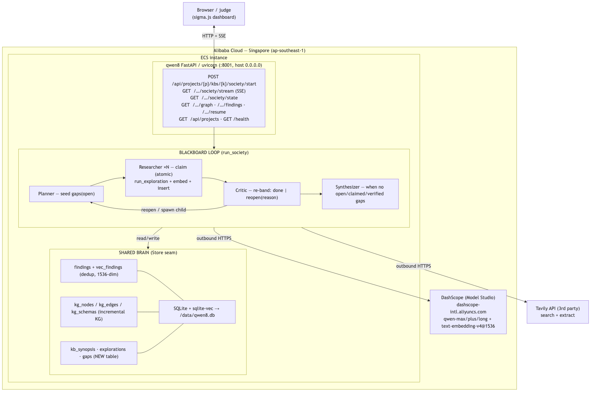

# 8queens — Agent Society with a Shared Brain

Open-domain deep-research **agent society**: role-specialized Qwen agents
(Planner / Researcher×N / Critic / Synthesizer) collaborate not by passing
messages but by reading and writing a single **shared brain** — a deduplicated,
embedded findings store plus an incremental knowledge graph. The brain's own
coverage signal (`rich` / `sparse` / `gap`) is the coordination medium: a
blackboard. Researchers atomically claim the worst-covered open gap, run a
`plan→search→crawl→extract→merge` pipeline over Tavily, and write findings back;
a Critic re-bands each gap; a Synthesizer writes a cited report when coverage is
`rich`. Runs as a containerized FastAPI service on Alibaba Cloud ECS (Singapore),
consuming Qwen exclusively through DashScope's OpenAI-compatible endpoint.

**Track:** Agent Society. **License:** AGPL-3.0.

## Architecture



## Proof of Alibaba Cloud

Qwen is consumed via DashScope (Model Studio), Alibaba's managed model service:

- [`queens8/core/clients/ai_gateway.py`](queens8/core/clients/ai_gateway.py) — the single
  LLM seam (`structured_completion` / `text_completion`) over DashScope's
  OpenAI-compatible endpoint.
- [`queens8/core/config.py`](queens8/core/config.py) — DashScope base URL + Qwen
  model defaults (`qwen-max`/`qwen-plus`/`qwen-flash`/`qwen-long`,
  `text-embedding-v4@1536`).
- [`Dockerfile`](Dockerfile) + [`deploy/run.sh`](deploy/run.sh) — build for
  `linux/amd64`, push to ACR, run on ECS (Singapore, ap-southeast-1).

## Run locally

```bash
pip install -e .[local]
cp .env.example .env   # fill AI_GATEWAY_API_KEY (DashScope key), AI_GATEWAY_BASE_URL,
                       # TAVILY_API_KEY, QUEENS8_DB_PATH, QUEENS8_SOCIETY_SECRET
uvicorn queens8.api.main:app --host 0.0.0.0 --port 8001
```

Then start a run (the write route is gated by `X-Society-Secret`):

```bash
curl -H 'X-Society-Secret: <secret>' \
  http://127.0.0.1:8001/api/projects/demo/kbs/demo/society/start \
  -d '{"topic":"What is the stablecoin regulatory landscape in 2026?"}'
```

Stream the society live (named SSE frames): open
`GET /api/projects/demo/kbs/demo/society/stream?run_id=<run_id>` or point the
sigma.js dashboard at this host.

## Frontend (sigma.js dashboard)

```bash
cd frontend && npm install && npm run dev
```

Point the dashboard at `http://localhost:8001` (or the ECS public IP) to visualise
the knowledge graph and findings as the society runs.

## Measured gain over a single-agent baseline

The society is benchmarked against the strongest single-agent baseline available:
this repo's own exploration pipeline (the same engine a society Researcher runs
per gap), applied once to the raw topic. Both runs use identical models, tools,
and an isolated KB each; both KBs are then probed with the same question set.
One captured run (`qwen-max`/`qwen-plus` + Tavily, topic: *the state of
open-weight LLMs in 2026*):

| Metric | Single agent | Society |
|---|---|---|
| Findings persisted | 133 | 336 |
| Probe coverage (7 probes) | 6 rich / 1 sparse | **7 rich / 0 sparse** |
| Mean band-1 hits per probe | 7.7 | 9.0 |
| Unique source domains | 12 | 5 |
| LLM calls | 15 | 51 |
| Wall time | 4m 47s | 9m 30s |

The society closes the coverage gap the single agent leaves (every probe rich,
+17% band-1 depth, 2.5× findings) at 3.4× the LLM calls; the single agent
retains an edge in source-domain breadth. Full method notes and per-probe data:
[`docs/baseline-compare.md`](docs/baseline-compare.md) /
[`.json`](docs/baseline-compare.json). Reproduce with:

```bash
python -m scripts.baseline_compare "<topic>" out.json
```

## Deploy to Alibaba Cloud ECS

```bash
ACR=<registry>/queens8 TAG=demo ECS_IP=<ip> ECS_USER=root \
ACR_USER=... ACR_PASSWORD=... \
DASHSCOPE_API_KEY=... TAVILY_API_KEY=... QUEENS8_SOCIETY_SECRET=... \
bash deploy/run.sh all
curl http://<ECS_PUBLIC_IP>/health   # {"status":"ok","backend":"sqlite"}
```

## Tests

```bash
pytest   # 77 tests passing
```

## License

AGPL-3.0 — see [`LICENSE`](LICENSE).
