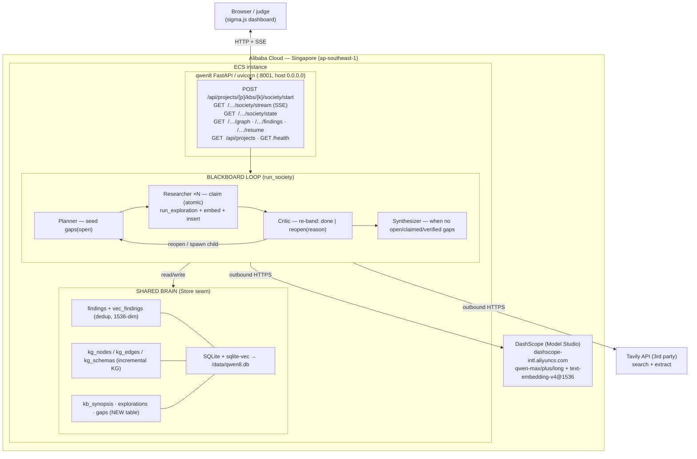

# qwen8 Agent Society Implementation Plan

> **For agentic workers:** REQUIRED SUB-SKILL: Use superpowers:subagent-driven-development (recommended) or superpowers:executing-plans to implement this plan task-by-task. Steps use checkbox (`- [ ]`) syntax for tracking.

**Goal:** Ship **qwen8** — an open-domain deep-research *agent society* over a shared, self-grading delapan brain, Qwen Cloud-native (DashScope) and deployed on Alibaba Cloud ECS — for the **Agent Society** track of the Global AI Hackathon Series with Qwen Cloud (submit by 2026-07-08; deadline 2026-07-09 2pm PT).

**Architecture:** Vendor (copy + rename `delapan.*`→`qwen8.*`) the deep-research engine (findings store, coverage banding, exploration pipeline, knowledge graph, MCP, loopback HTTP API) into a standalone AGPL-3.0 repo; add one new `society/` module — role-specialized Qwen agents (Planner / Researcher×N / Critic / Synthesizer) that coordinate through a `gaps` **blackboard** table whose coverage band (`rich`/`sparse`/`gap`) is the negotiation signal; expose `/society/*` (start + SSE stream + state) under the existing `/api/projects/{p}/kbs/{k}/` prefix; visualize the brain growing live in the adapted sigma.js dashboard.

**Tech Stack:** Python 3.11 · FastAPI + uvicorn · SQLite + sqlite-vec · the OpenAI SDK pointed at DashScope's OpenAI-compatible endpoint (Qwen models + `text-embedding-v4`@1536) · Tavily · MCP (FastMCP) · React 18 + Vite 6 + Zustand + sigma.js/graphology · Docker (linux/amd64) on Alibaba Cloud ECS (Singapore) · pytest.

## Global Constraints

*Every task's requirements implicitly include this section. Values are copied verbatim from the design spec (`docs/superpowers/specs/2026-06-22-qwen8-agent-society-design.md`).*

- **License / package:** AGPL-3.0; `[project] name = "qwen8"`, `packages = ["qwen8"]`. Repo root: `~/Repositories/8star/qwen8` (git already init'd, branch `main`).
- **Dependencies (allowlist):** `fastapi`, `uvicorn[standard]`, `httpx`, `openai`, `tavily-python`, `mcp`, `pydantic`, `pydantic-settings`, `pyyaml`; `[local] = ["sqlite-vec"]`. **NO** `langchain-core`/`langchain-anthropic`/`anthropic`/`supabase`/`asyncpg`/`pyjwt`/`argon2`. `jinja2` only if an import check proves a vendored module needs it. Author `pyproject.toml` FRESH (do not copy delapan's).
- **Config:** env prefix `QWEN8_`; nested overrides `QWEN8_<SECTION>__<FIELD>`. `.env`/`config.yaml` resolve to the qwen8 repo root. DB at `~/.qwen8/qwen8.db` (override `QWEN8_DB_PATH`). Precedence: defaults < `config.yaml` < env.
- **Provider (fast path):** `AI_GATEWAY_API_KEY=<DashScope key>`, `AI_GATEWAY_BASE_URL=https://dashscope-intl.aliyuncs.com/compatible-mode/v1` (Singapore/intl). `TAVILY_API_KEY` required (fail-fast, loud). `QWEN8_SOCIETY_SECRET` gates society write routes. `QWEN8_CORS_ORIGINS` injects the deployed origin.
- **Models:** Qwen-only **bare** names (no `provider/` prefix). Embeddings `text-embedding-v4` @ `dimensions=1536` — `_SCHEMA` is literal `float[1536]`; changing the dim = DROP+CREATE+re-embed. **Gates:** `grep -nE "anthropic/|openai/|google/|gpt-|claude-|gemini-" config.yaml` == 0; startup `assert "/" not in <resolved model name>`.
- **DashScope structured output:** `use_json_schema=False` (json_object mode only; system prompts must contain the literal word "json"); `reasoning_effort: null` on structured calls (thinking mode breaks json_object). `embed_batch` chunks ≤10 texts/call. Pin `exploration.search_mode: tavily` (never `auto`).
- **Demo defaults:** `n_researchers=2, max_rounds=3, max_attempts=1, spawn_budget=4`; KG extraction OFF; `max_llm_calls_per_run=120` — a **real** monotonic counter in `qwen8.core.clients.ai_gateway` (`reset_llm_calls()`/`llm_calls()`, incremented in both `structured_completion` and `text_completion`), not a round-count proxy.
- **Concurrency invariant (correctness-critical):** the atomic gap claim is a single `UPDATE gaps SET status='claimed' … WHERE id=(SELECT … WHERE status='open' … LIMIT 1)` arbitrated by `cursor.rowcount`, on one shared connection in one event-loop thread. **No `await` between the claim's read-modify and its `commit`.** Tests use file-backed temp DBs, **never `:memory:`**.
- **Isolation:** `grep -rE "from delapan|import delapan" qwen8/` == 0. Keep all vendored return-shape dict keys byte-identical across the `Store` seam + frontend contract.
- **HARD GATE (day-1, before vendoring effort is sunk):** the DashScope smoke test (success criterion 3) — the chosen bare aliases exist on `dashscope-intl`, `text-embedding-v4` returns 1536-dim, json_object works, and one mini run is token-measured against the §13.2 budget.
- **Deploy:** build images `linux/amd64` (Apple Silicon dev box). The FastAPI `main()` binds `127.0.0.1`; the Docker uvicorn CLI forces `--host 0.0.0.0`.
- **Process:** TDD (write the failing test first), frequent commits, one independently-testable deliverable per task.

## How to read this plan

Tasks are grouped into five milestone clusters, each with a prefixed ID so tasks can be claimed and reviewed independently:

| Cluster | Prefix | Milestones | Theme |
|---|---|---|---|
| Foundation | **F** | M-A1, M-A2, M0, M1 | Alibaba activation, ECS de-risk, repo scaffold, vendor the engine |
| Qwen + engine | **Q** | M2, M3 | DashScope cutover, SocietyConfig, smoke gate, engine end-to-end, freeze SSE schema |
| Society | **S** | M4, M5 | the new `society/` module: blackboard, roles, loop, termination (full TDD) |
| API + frontend | **A** | M6, M7a, M7b | `routes_society.py` (SSE), sigma.js client + live-viz |
| Deploy + submit | **D** | M8, M9, M10 | Dockerize, ECS deploy, replay mode, video, Devpost |

**Cross-task dependencies are referenced by exact symbol name** (function/class/route/event names), not by task number — so tasks can be read out of order. Critical path: **F → Q → S** (engine + society core), with **F1/F2 (Alibaba) running in parallel from day 1**; **A** runs against the frozen SSE schema (frozen in Q8) + the mock; **D8** is low-risk because **F2** already proved the deploy toolchain.

---
## Cluster F — Foundation (Alibaba account, deploy de-risk, repo scaffold, engine vendoring)

This cluster delivers everything the Researcher/Society/API/Frontend clusters consume: the live DashScope key, a proven deploy toolchain, the `qwen8` package skeleton, and the entire vendored delapan engine (Tiers 0–6) renamed to `qwen8.*`, re-pointed at DashScope, with the `gaps` table baked into `_SCHEMA`. Downstream clusters depend on the exact symbols defined here:

- **Package roots:** `qwen8`, `qwen8.core.config`, `qwen8.store`, `qwen8.core.clients.*`, `qwen8.core.agent.*`, `qwen8.core.exploration`, `qwen8.core.knowledge_graph.*`, `qwen8.mcp.*`, `qwen8.api.*`.
- **Store symbols Researcher/Society consume:** `SQLiteStore`, `get_store()`, `active_backend()`, `store.match_findings(kb_id, query_embedding, match_count, min_similarity, categories=None) -> list[dict]` (rows carry `similarity`), `store.insert_findings(rows) -> list[str]`, `store.create_exploration(org_id, kb_id, prompt) -> str`, `store.update_exploration(exploration_id, **patch)`, `store.get_finding(kb_id, finding_id) -> dict`, `store.count_findings(kb_id) -> int` (sync; exact uncapped count — consumed by S5's `run_society` for the `finding_count` delta), `store.list_findings(kb_id, category=None, limit=None) -> dict` (sync; returns `{"count", "findings"}` where each finding row omits `content`/`provenance` — consumed by D4's replay), `store.resolve_project(name, *, create) -> (org_id, project_id)`, `store.resolve_kb(org_id, project_id, name, *, create) -> kb_id`, `store.upsert_kg_nodes(kb_id, nodes)`, `store.upsert_kg_edges(kb_id, edges)`. Every store method runs synchronous `self._conn.execute(...)` with no thread offload; `self._conn` is one long-lived connection.
- **Engine symbols:** `run_exploration(prompt, *, exploration_id, project_id, kb_id, cfg, on_progress=None, on_narration=None, lens="explore") -> list[Finding]` (returns UNEMBEDDED `Finding` objects whose `.content` is a `dict`); `Finding` (fields `exploration_id, project_id, kb='default', category, title, content: dict, confidence, provenance, tags` — `exploration_id` AND `project_id` are required with no default, `kb` defaults to `'default'`); `band_findings(rows, cfg: TiersConfig) -> dict[int, list[dict]]`; `assess_coverage(bands, cfg: TiersConfig) -> "rich"|"sparse"|"gap"`; `select_preamble(query, *, store, kb_id, depth) -> (xml, Coverage)`.
- **LLM kill-switch counter:** `ai_gateway.reset_llm_calls() -> None` and `ai_gateway.llm_calls() -> int` — a module-level monotonic call counter in `qwen8/core/clients/ai_gateway.py`, incremented once at the top of BOTH `structured_completion` and `text_completion` (so it captures engine-internal calls too). S5's `run_society` calls `reset_llm_calls()` at start and tests `llm_calls() >= cfg.society.max_llm_calls_per_run` as the real per-run kill-switch (spec 6.3/7.5/13.2).
- **Render→embed→insert reference (Researcher mirrors verbatim):** `qwen8.mcp.server._render_content(content: Any) -> str` and `qwen8.mcp.server._normalize_provenance(provenance: Any) -> list[dict]`; `embed_batch(texts) -> list[list[float]]` (≤10/call chunking), `embed_text(text) -> list[float]`.
- **Config symbols:** `get_config() -> AppConfig`, `get_settings() -> Settings`, `AppConfig.tiers: TiersConfig`, `AppConfig.search: SearchConfig`, `AppConfig.exploration: ExplorationConfig`, `AppConfig.embedding: EmbeddingConfig`, `AppConfig.society: SocietyConfig` (added here). **`SocietyConfig` the pydantic class is added to `qwen8.core.config` here; the runtime `run_society(..., cfg: SocietyConfig, ...)` argument type and the role classes belong to the Society cluster.**
- **Gaps table:** the `gaps` table + `idx_gaps_kb_status` index live in `qwen8/store/sqlite.py::_SCHEMA` (DDL below). The Society cluster's `blackboard.py` writes/reads it via `store._conn`; no `ensure_gaps_schema` function exists.
- **API surface:** `qwen8.api.main:app` (FastAPI), `resolve_kb_or_404(project, kb) -> (TenantContext, Store)`, `TenantContext` (fields `user_id, org_id, project_id, kb_id, thread_id, access_token`). The Society/API cluster adds `routes_society.py` and registers it in `main.py`.

Repo root is `~/Repositories/8star/qwen8` (git already init'd on branch `main`; the spec doc is committed). All commands below assume that as CWD unless an absolute path is shown. Use `python -m venv` once at the top of F3 and reuse it.

---

### Task F1: Alibaba Cloud International account + Model Studio (DashScope-intl) activation + intl API key (M-A1)

**Tracked, non-code, day-1, runs in parallel with F3/F4+.** This is a HARD GATE for the entire Qwen-exclusive requirement and can block for days on real-name/billing verification — start it on day 1 before any vendoring effort is sunk.

**Files:** none (console + env). Records the key into the local `.env` created in F3 (do NOT commit `.env`).

**Interfaces:** Produces `DASHSCOPE_API_KEY` (a working `sk-...` intl key) + the confirmed base URL `https://dashscope-intl.aliyuncs.com/compatible-mode/v1`, consumed by F4 (config), F5 (clients), and every later cluster's `.env`.

- [ ] **Risk flag (do this first, day 1):** Note in the project tracker that real-name + billing verification for an Alibaba Cloud International account can block Model Studio activation for **days**. This task must be opened on day 1, in parallel with repo scaffolding (F3) and vendoring (F4+); do not serialize it after them.
- [ ] Create an Alibaba Cloud International account at `https://www.alibabacloud.com/` (International, NOT the `.cn` mainland console). Complete email verification.
- [ ] Add a payment method and complete identity/real-name verification. This is the step that can stall — submit it immediately.
- [ ] In the International console, switch the region selector to **Singapore (ap-southeast-1)** and open **Model Studio** at `https://dashscope-intl.console.aliyun.com/`. Click **Activate** / agree to the Model Studio terms.
- [ ] In Model Studio → **API-KEY**, mint a new API key (Singapore region). Copy the `sk-...` value. This is `DASHSCOPE_API_KEY`.
- [ ] **Verify the key authenticates against the intl models endpoint** (this is the task's pass gate):
  ```
  curl -s -H "Authorization: Bearer $DASHSCOPE_API_KEY" \
    https://dashscope-intl.aliyuncs.com/compatible-mode/v1/models | python -m json.tool
  ```
  Expected: HTTP 200 with a JSON `{"object":"list","data":[...]}` listing model ids. Confirm the bare aliases `qwen-max`, `qwen-plus`, `qwen-flash`, `qwen-long`, and `text-embedding-v4` appear in `data[].id` (or note the exact available names for the F4 config table). A 401/403 means the key is mainland-region or the URL is wrong — re-mint in Singapore.
- [ ] **Embedding dimension + batch smoke (gates the `float[1536]` schema lock-in in F4):**
  ```
  curl -s -H "Authorization: Bearer $DASHSCOPE_API_KEY" -H "Content-Type: application/json" \
    -d '{"model":"text-embedding-v4","input":["a","b","c"],"dimensions":1536}' \
    https://dashscope-intl.aliyuncs.com/compatible-mode/v1/embeddings \
    | python -c "import sys,json;d=json.load(sys.stdin);print(len(d['data']),len(d['data'][0]['embedding']))"
  ```
  Expected: `3 1536`. If `text-embedding-v4@1536` is unavailable, record it NOW — it forces the pre-decided fallback (DROP+CREATE the two `float[1536]` literals in `_SCHEMA` + re-embed) before F4 commits.
- [ ] Record `DASHSCOPE_API_KEY` and the confirmed base URL in a secure local note for use in F3's `.env`. (No commit — this task has no repo deliverable; its deliverable is a working key + the verified model/dim facts.)

---

### Task F2: Throwaway hello-world FastAPI container on ECS — de-risk the buildx + ACR + ECS + security-group toolchain (M-A2)

**Runs in parallel from week 1, before the real app exists**, so the M8 deploy is low-risk. The dev box is Apple Silicon; Alibaba runtimes are AMD64 — this proves the cross-arch build path end to end.

**Files:**
- Create `~/Repositories/8star/qwen8/deploy/hello/main.py` (throwaway; may be deleted after this task)
- Create `~/Repositories/8star/qwen8/deploy/hello/Dockerfile` (throwaway)

**Interfaces:** Produces a proven deploy recipe (ACR namespace name, ECS public IP, security-group rule) reused by the M8 deploy in the API/deploy cluster. No code symbols.

- [ ] Write the 10-line FastAPI app `deploy/hello/main.py`:
  ```python
  from fastapi import FastAPI

  app = FastAPI()


  @app.get("/health")
  def health() -> dict:
      return {"status": "ok"}
  ```
- [ ] Write `deploy/hello/Dockerfile`:
  ```dockerfile
  FROM python:3.11-slim
  WORKDIR /app
  RUN pip install --no-cache-dir fastapi "uvicorn[standard]"
  COPY main.py ./
  EXPOSE 8001
  CMD ["uvicorn", "main:app", "--host", "0.0.0.0", "--port", "8001"]
  ```
- [ ] Create an ACR (Container Registry) namespace in **ap-southeast-1** via the Alibaba console; create a repository `qwen8-hello`. Note the login registry host (e.g. `registry-intl.ap-southeast-1.aliyuncs.com`).
- [ ] **Build for linux/amd64 and push** (the cross-arch step that must be de-risked):
  ```
  docker buildx build --platform linux/amd64 \
    -t <registry-host>/<namespace>/qwen8-hello:smoke \
    --push ~/Repositories/8star/qwen8/deploy/hello
  ```
  Expected: a clean push with a `linux/amd64` manifest digest printed.
- [ ] Create a burstable ECS instance (`ecs.t6`/`ecs.e`-family, ~1–2 vCPU / 2 GB, Ubuntu 22.04, public IP) in **ap-southeast-1**. In the instance's security group, add an inbound rule allowing TCP **80** (or 8001) from your IP.
- [ ] SSH in, install Docker, `docker login` the ACR, `docker pull` the image, and run it:
  ```
  docker run -d --name hello -p 80:8001 <registry-host>/<namespace>/qwen8-hello:smoke
  ```
- [ ] **Verify (this is the pass gate):**
  ```
  curl -s -o /dev/null -w "%{http_code}\n" http://<ECS_PUBLIC_IP>/health
  ```
  Expected: `200`. Then `curl http://<ECS_PUBLIC_IP>/health` returns `{"status":"ok"}`.
- [ ] **Tear down to avoid burning credits:** `docker rm -f hello` on the instance, then STOP (not just stop-the-container — stop the ECS instance) until M8. Record the instance id, public IP, ACR host, and the security-group id for reuse.
- [ ] Commit the throwaway deploy files: `git checkout -b f2-deploy-smoke && git add deploy/hello && git commit -m "deploy: hello-world FastAPI container to de-risk amd64 buildx + ACR + ECS toolchain

Co-Authored-By: Claude Opus 4.8 <noreply@anthropic.com>"`

---

### Task F3: Scaffold the qwen8 repo — fresh pyproject.toml, LICENSE, .env.example, package dirs (M0)

**Files:**
- Create `~/Repositories/8star/qwen8/pyproject.toml`
- Create `~/Repositories/8star/qwen8/LICENSE` (AGPL-3.0)
- Create `~/Repositories/8star/qwen8/.env.example`
- Create `~/Repositories/8star/qwen8/.gitignore`
- Create `~/Repositories/8star/qwen8/qwen8/__init__.py`
- Create package dirs: `qwen8/core/`, `qwen8/core/clients/`, `qwen8/core/agent/`, `qwen8/core/exploration/`, `qwen8/core/knowledge_graph/`, `qwen8/store/`, `qwen8/society/`, `qwen8/api/`, `qwen8/mcp/`, `tests/`

**Interfaces:** Produces the importable package root `qwen8` and the `pip install -e .[local]` recipe consumed by every later task. Defines deps: `fastapi, uvicorn[standard], httpx, openai, tavily-python, mcp, pydantic, pydantic-settings, pyyaml` + `[local]=sqlite-vec`. Explicitly NO `langchain-core/langchain-anthropic/anthropic/supabase/asyncpg/pyjwt/argon2/jinja2`.

- [ ] Author `pyproject.toml` fresh (do NOT copy delapan's, which is keyed to `delapan` with required `anthropic`/langchain/cloud deps):
  ```toml
  [project]
  name = "qwen8"
  version = "0.1.0"
  description = "qwen8 — an agent society with a shared brain, on Qwen/DashScope."
  requires-python = ">=3.11"
  license = { text = "AGPL-3.0-or-later" }
  dependencies = [
    "pydantic>=2.12.5",
    "pydantic-settings>=2.12.0",
    "pyyaml>=6.0.3",
    "httpx>=0.28.1",
    "fastapi>=0.122.0",
    "uvicorn[standard]>=0.38.0",
    "openai>=2.30.0",
    "tavily-python>=0.7.23",
    "mcp>=1.16.0",
  ]

  [project.optional-dependencies]
  local = ["sqlite-vec>=0.1.6"]
  dev = ["pytest>=8.4.2", "pytest-asyncio>=1.3.0", "ruff>=0.12.0"]

  [build-system]
  requires = ["hatchling"]
  build-backend = "hatchling.build"

  [tool.hatch.build.targets.wheel]
  packages = ["qwen8"]

  [tool.ruff]
  line-length = 100

  [tool.pytest.ini_options]
  asyncio_mode = "auto"
  ```
- [ ] Write `LICENSE` with the full GNU AGPL-3.0 text. Fetch the canonical text (`curl -s https://www.gnu.org/licenses/agpl-3.0.txt -o ~/Repositories/8star/qwen8/LICENSE`) and verify it is non-empty and begins with `GNU AFFERO GENERAL PUBLIC LICENSE`.
- [ ] Write `.env.example`:
  ```
  # DashScope (Alibaba Model Studio, Singapore/intl). Fast path: the DashScope key
  # is fed to the AI_GATEWAY_* settings the openai-compat clients already read.
  AI_GATEWAY_API_KEY=sk-your-dashscope-intl-key
  AI_GATEWAY_BASE_URL=https://dashscope-intl.aliyuncs.com/compatible-mode/v1
  TAVILY_API_KEY=tvly-your-key
  QWEN8_DB_PATH=/data/qwen8.db
  QWEN8_SOCIETY_SECRET=change-me
  ```
- [ ] Write `.gitignore` covering `.env`, `__pycache__/`, `*.pyc`, `*.db`, `.venv/`, `build/`, `dist/`, `*.egg-info/`.
- [ ] Create the package dirs and empty `__init__.py` files:
  ```
  cd ~/Repositories/8star/qwen8
  mkdir -p qwen8/core/clients qwen8/core/agent qwen8/core/exploration qwen8/core/knowledge_graph qwen8/store qwen8/society qwen8/api qwen8/mcp tests
  ```
  Write `qwen8/__init__.py` with one line: `"""qwen8 — agent society with a shared brain."""`. Leave the subpackage `__init__.py` files to be created by the vendoring tasks (F4–F10), EXCEPT create an empty `tests/__init__.py` now so pytest discovery is clean.
- [ ] **Verify the install + import (M0 pass gate):**
  ```
  cd ~/Repositories/8star/qwen8 && python -m venv .venv && . .venv/bin/activate
  pip install -e .[local] && python -c "import qwen8; print('ok')"
  ```
  Expected: install succeeds, prints `ok`, and `pip list` shows NO `langchain`, `anthropic`, `supabase`, or `asyncpg`.
- [ ] Commit: `git checkout -b f3-scaffold && git add pyproject.toml LICENSE .env.example .gitignore qwen8/__init__.py tests/__init__.py && git commit -m "scaffold: fresh pyproject (qwen8, no langchain/anthropic/cloud), AGPL LICENSE, .env.example, package dirs

Co-Authored-By: Claude Opus 4.8 <noreply@anthropic.com>"`

---

### Task F4: Vendor Tier 0 — config + store seam (renames, Qwen defaults, SocietyConfig, gaps table, startup assertions) (M1)

**Files:**
- Create `~/Repositories/8star/qwen8/qwen8/core/__init__.py` (empty)
- Create `~/Repositories/8star/qwen8/qwen8/core/config.py` (vendored + edited from `delapan/core/config.py`)
- Create `~/Repositories/8star/qwen8/qwen8/store/__init__.py` (vendored + renamed from `delapan/store/__init__.py`)
- Create `~/Repositories/8star/qwen8/qwen8/store/base.py` (vendored verbatim except imports — but `base.py` has zero `delapan` imports, so it copies as-is)
- Create `~/Repositories/8star/qwen8/qwen8/store/sqlite.py` (vendored + edited from `delapan/store/sqlite.py`)
- Create `~/Repositories/8star/qwen8/config.yaml` (vendored + edited from `delapan-ai/backend/config.yaml`)
- Test `~/Repositories/8star/qwen8/tests/test_config_store_foundation.py`

**Interfaces:**
- Consumes: `DASHSCOPE_API_KEY` + base URL (from F1), the `qwen8` package root (from F3).
- Produces: `get_config() -> AppConfig`, `get_settings() -> Settings`, `SQLiteStore`, `get_store()`, `active_backend()`, `_default_db_path()`, `TiersConfig`, `SearchConfig`, `ExplorationConfig`, `EmbeddingConfig`, and the NEW `SocietyConfig` (pydantic class, `AppConfig.society` field). The `gaps` table + `idx_gaps_kb_status` index in `_SCHEMA`. Env override prefix is `QWEN8_`; db path is `~/.qwen8/qwen8.db` (or `QWEN8_DB_PATH`).

- [ ] Copy `delapan/core/config.py` → `qwen8/core/config.py`. Apply the config renames (5.3) and Qwen defaults (5.6). In the module docstring + `_env_overrides`, change `DLP_` references and set `_ENV_PREFIX = "QWEN8_"`. In `_config_path()`, change `os.getenv("DELAPAN_CONFIG_FILE")` → `os.getenv("QWEN8_CONFIG_FILE")`. In `Settings`, change the two backend aliases:
  ```python
  delapan_backend: str | None = Field(default=None, alias="QWEN8_BACKEND")
  delapan_db_path: str | None = Field(default=None, alias="QWEN8_DB_PATH")
  ```
  (Keep the attribute names; only the `alias=` values change — `store/__init__.py` reads via `_default_db_path`, not via these attrs, and `active_backend()` reads `QWEN8_BACKEND` from `os.getenv`, so the alias rename is what matters.) **Also rename the CORS alias so the deployed origin arrives via the qwen8-namespaced env var:** change the `cors_origins` field's `alias="CORS_ORIGINS"` → `alias="QWEN8_CORS_ORIGINS"` (keep the `NoDecode` annotation + the `_parse_cors_origins` validator unchanged — it already accepts a JSON array, a comma-separated string, or `*`). D1's `run.sh` passes `-e QWEN8_CORS_ORIGINS=<frontend/ECS origin or *>`; A1's `main.py` already builds `allow_origins` from `get_settings().cors_origins`, so the deployed origin flows in with no code change to the allow-list construction. The `.env` resolution `Path(__file__).resolve().parents[2] / ".env"` already lands on the qwen8 repo root once the file lives at `qwen8/core/config.py` (parents[2] = repo root) — leave it; the verify step confirms it.
- [ ] In `config.py`, change every model-name default to its Qwen value (5.6 table, verified against the live config.py field set):
  - `ExplorationConfig.planner_model = "qwen-flash"`, `.extraction_model = "qwen-plus"`, `.extraction_fallback_model = "qwen-flash"`, `.evaluation_model = "qwen-plus"`
  - `DeepenConfig.decompose_model = "qwen-plus"`, `.critic_model = "qwen-plus"`
  - `NarrationConfig.model = "qwen-flash"`
  - `KnowledgeGraphConfig.extraction_model = "qwen-max"`, `.extraction_fallback_model = "qwen-plus"`
  - `ConceptsConfig.extract_model = "qwen-plus"`
  - `SynopsisConfig.model = "qwen-flash"`
  - `OKFConfig.model = "qwen-plus"`
  - `EmbeddingConfig.model = "text-embedding-v4"` (leave `dim = 1536`)
  - `AgentConfig.model = "qwen-plus"`, `.fast_model = "qwen-flash"` (chat agent not vendored — inert, but keeps the grep gate clean)
- [ ] Add `SocietyConfig` to `config.py` (verbatim from spec 7.5) and wire it into `AppConfig`:
  ```python
  class SocietyConfig(BaseModel):
      planner_model: str = "qwen-max"
      critic_model: str = "qwen-max"
      synthesizer_model: str = "qwen-max"     # qwen-long is opt-in for huge contexts only
      temperature: float = 0.2
      reasoning_effort: str | None = None      # null — thinking mode breaks json_object
      n_researchers: int = 2                   # DEMO default
      max_rounds: int = 3                      # DEMO default
      max_attempts: int = 1                    # DEMO default
      spawn_budget: int = 4                    # global child-gap spawn cap
      synthesis_top_k_per_gap: int = 8         # cap findings fed to the Synthesizer
      kg_extraction_enabled: bool = False      # OFF for demo (most qwen-max-hungry)
      max_llm_calls_per_run: int = 120         # per-run kill-switch (graceful stop)
  ```
  In `AppConfig`, add the field: `society: SocietyConfig = Field(default_factory=SocietyConfig)`.
- [ ] Copy `delapan/store/base.py` → `qwen8/store/base.py` verbatim (it has zero `delapan` imports; nothing to rename).
- [ ] Copy `delapan/store/sqlite.py` → `qwen8/store/sqlite.py`. Edit `_default_db_path()`:
  ```python
  def _default_db_path() -> str:
      """``QWEN8_DB_PATH`` if set, else ``~/.qwen8/qwen8.db`` (dir created)."""
      env = os.environ.get("QWEN8_DB_PATH")
      if env:
          return env
      home = Path.home() / ".qwen8"
      home.mkdir(parents=True, exist_ok=True)
      return str(home / "qwen8.db")
  ```
- [ ] **Add the `gaps` table + index to `_SCHEMA`** in `qwen8/store/sqlite.py` (append inside the `_SCHEMA` triple-quoted string, after the `kg_schemas` block, before the closing `"""`):
  ```sql
  CREATE TABLE IF NOT EXISTS gaps (
    id          TEXT PRIMARY KEY,
    kb_id       TEXT NOT NULL,
    project_id  TEXT NOT NULL,
    parent_id   TEXT,
    question    TEXT NOT NULL,
    reason      TEXT,
    status      TEXT NOT NULL DEFAULT 'open'
                CHECK (status IN ('open','claimed','verified','done','dead')),
    owner       TEXT,
    coverage    TEXT,
    band1_hits  INTEGER NOT NULL DEFAULT 0,
    attempts    INTEGER NOT NULL DEFAULT 0,
    finding_ids TEXT,
    created_at  TEXT NOT NULL,
    updated_at  TEXT NOT NULL
  );
  CREATE INDEX IF NOT EXISTS idx_gaps_kb_status ON gaps(kb_id, status, coverage);
  ```
- [ ] Rename the `delapan` imports in `qwen8/store/__init__.py` (`from delapan.store.base import Store` → `from qwen8.store.base import Store`; `from delapan.store.sqlite import SQLiteStore, _default_db_path` → `from qwen8.store.sqlite import ...`; the lazy `from delapan.core.config import get_settings` → `from qwen8.core.config import get_settings`; the lazy `from delapan.store.supabase import SupabaseStore` → `from qwen8.store.supabase import SupabaseStore` — this stays a dangling lazy import that is never reached when cloud is unconfigured, per 5.4). Also change `os.getenv("DELAPAN_BACKEND")` → `os.getenv("QWEN8_BACKEND")` in `active_backend()`.
- [ ] Copy `delapan-ai/backend/config.yaml` → `qwen8/config.yaml`. Set EVERY model name to its Qwen value (mirror the 5.6 table so no source can resurrect a non-Qwen slug); set `exploration.search_mode: tavily` (NOT `auto`); set `reasoning_effort: null` in every section that feeds a structured call (`exploration`, `deepen`, `knowledge_graph`, and the new `society`); change the header comment's `DLP_` override examples to `QWEN8_` and `DELAPAN_CONFIG_FILE` to `QWEN8_CONFIG_FILE`. Set `embedding.model: text-embedding-v4` and `embedding.dim: 1536`. Append a `society:` block mirroring `SocietyConfig` defaults.
- [ ] Add the **startup assertions** (5.3 / criterion 10). Append to `qwen8/core/config.py` a module-level helper and call it from a place every entrypoint reaches — add it as a function `assert_qwen8_runtime()` and call it at the bottom of `get_config()` is wrong (cache); instead define it standalone for `api/main.py` and tests to call:
  ```python
  def assert_qwen8_runtime() -> None:
      """Fail fast if the running process would read delapan's config/db or a non-Qwen model."""
      from qwen8.store import _default_db_path as _ddp  # local import avoids cycle
      assert _ENV_PREFIX == "QWEN8_", f"env prefix not renamed: {_ENV_PREFIX}"
      db_path = _ddp()
      assert ".qwen8" in db_path, f"db_path not qwen8-scoped: {db_path}"
      cfg = get_config()
      model_fields = [
          cfg.exploration.planner_model, cfg.exploration.extraction_model,
          cfg.exploration.extraction_fallback_model, cfg.exploration.evaluation_model,
          cfg.deepen.decompose_model, cfg.deepen.critic_model,
          cfg.narration.model, cfg.knowledge_graph.extraction_model,
          cfg.knowledge_graph.extraction_fallback_model, cfg.concepts.extract_model,
          cfg.synopsis.model, cfg.okf.model, cfg.embedding.model,
          cfg.agent.model, cfg.agent.fast_model,
          cfg.society.planner_model, cfg.society.critic_model, cfg.society.synthesizer_model,
      ]
      for name in model_fields:
          assert "/" not in name, f"non-Qwen gateway slug leaked: {name!r}"
  ```
- [ ] Write the failing test `tests/test_config_store_foundation.py` FIRST (real TDD for the new behavior — gaps schema, SocietyConfig, Qwen defaults, startup assertions):
  ```python
  import os
  import sqlite3
  import tempfile

  from qwen8.core.config import SocietyConfig, _ENV_PREFIX, assert_qwen8_runtime, get_config
  from qwen8.store.sqlite import SQLiteStore


  def test_env_prefix_renamed():
      assert _ENV_PREFIX == "QWEN8_"


  def test_society_config_defaults():
      cfg = get_config().society
      assert isinstance(cfg, SocietyConfig)
      assert cfg.n_researchers == 2 and cfg.max_rounds == 3 and cfg.max_attempts == 1
      assert cfg.spawn_budget == 4 and cfg.max_llm_calls_per_run == 120


  def test_qwen_model_defaults_have_no_slash():
      cfg = get_config()
      assert cfg.embedding.model == "text-embedding-v4"
      assert "/" not in cfg.exploration.planner_model


  def test_gaps_table_in_schema():
      with tempfile.TemporaryDirectory() as d:
          store = SQLiteStore(os.path.join(d, "t.db"))
          cols = {r[1] for r in store._conn.execute("PRAGMA table_info(gaps)").fetchall()}
          assert {"id", "kb_id", "project_id", "question", "status", "coverage",
                  "band1_hits", "attempts", "finding_ids"} <= cols
          store.close()


  def test_startup_assertions_pass(monkeypatch, tmp_path):
      monkeypatch.setenv("QWEN8_DB_PATH", str(tmp_path / "qwen8.db"))
      get_config.cache_clear()
      assert_qwen8_runtime()  # must not raise
  ```
- [ ] Run it, expect FAIL (modules import but assertions/behaviour not yet wired if any step missed):
  ```
  cd ~/Repositories/8star/qwen8 && . .venv/bin/activate && python -m pytest tests/test_config_store_foundation.py -q
  ```
  Expected before edits land: `ModuleNotFoundError: No module named 'qwen8.core.config'` or `AttributeError`/`AssertionError`. After all edits above: implement is done by the steps; re-run.
- [ ] Run again, expect PASS:
  ```
  cd ~/Repositories/8star/qwen8 && . .venv/bin/activate && python -m pytest tests/test_config_store_foundation.py -q
  ```
  Expected: `4 passed` (or all tests green).
- [ ] **Vendor gates:** confirm zero residual delapan imports in the Tier-0 files and zero non-Qwen slugs in config.yaml:
  ```
  grep -rE "from delapan|import delapan" qwen8/core/config.py qwen8/store/ ; echo "exit=$?"
  grep -nE "anthropic/|openai/|google/|gpt-|claude-|gemini-" config.yaml ; echo "exit=$?"
  ```
  Expected: the lazy `from qwen8.store.supabase` line is the ONLY `supabase` reference (no `from delapan`); both greps print no matching lines (exit=1).
- [ ] Commit: `git checkout -b f4-tier0-config-store && git add qwen8/core/config.py qwen8/core/__init__.py qwen8/store config.yaml tests/test_config_store_foundation.py && git commit -m "vendor Tier 0: config+store renamed to qwen8; Qwen model defaults; SocietyConfig; gaps table in _SCHEMA; startup assertions

Co-Authored-By: Claude Opus 4.8 <noreply@anthropic.com>"`

---

### Task F5: Vendor Tier 1 — clients (ai_gateway, embeddings with ≤10 chunking, tavily) (M1)

**Files:**
- Create `~/Repositories/8star/qwen8/qwen8/core/clients/__init__.py` (docstring-only, renamed)
- Create `~/Repositories/8star/qwen8/qwen8/core/clients/ai_gateway.py` (vendored + renamed)
- Create `~/Repositories/8star/qwen8/qwen8/core/clients/embeddings.py` (vendored + renamed + ≤10 chunking)
- Create `~/Repositories/8star/qwen8/qwen8/core/clients/tavily.py` (vendored + renamed)
- Test `~/Repositories/8star/qwen8/tests/test_embed_batch_chunking.py`
- Test `~/Repositories/8star/qwen8/tests/test_llm_call_counter.py` (LLM kill-switch counter)

**Interfaces:**
- Consumes: `qwen8.core.config.get_settings`, `qwen8.core.config.get_config` (from F4).
- Produces: `structured_completion(*, model, response_format, system, user, temperature=0.0, fallback_model=None, use_json_schema=True, max_tokens=None, reasoning_effort=None) -> T`; `text_completion(*, model, system, user, temperature=0.0, max_tokens=None) -> str`; `embed_text(text) -> list[float]`; `embed_batch(texts) -> list[list[float]]` (now ≤10/call chunked); `tavily.search(query, *, max_results, search_depth) -> list[dict]`; `tavily.extract(urls, *, search_depth="advanced") -> dict[str,str]`; the LLM kill-switch counter `reset_llm_calls() -> None` / `llm_calls() -> int` (module-level, incremented at the top of BOTH `structured_completion` and `text_completion`). **`ai_gateway.py` is the Alibaba-Cloud-proof code file** (it builds `AsyncOpenAI(base_url=DashScope)`).

- [ ] Copy `delapan/core/clients/__init__.py` → `qwen8/core/clients/__init__.py`; in the docstring drop the `anthropic` bullet (that client is not vendored) and leave the rest (it has no `delapan` import statements, only prose).
- [ ] Copy `delapan/core/clients/ai_gateway.py` → `qwen8/core/clients/ai_gateway.py`; rename `from delapan.core.config import get_settings` → `from qwen8.core.config import get_settings`. The strict-vs-prompt routing needs no edit — `use_json_schema=False` is passed by callers (the society roles + the engine config), and the strict path already falls through to `_parse_prompt_json` on a `json_schema` 400. Leave `gateway_client()` reading `s.ai_gateway_api_key` + `s.ai_gateway_base_url` (the fast path feeds the DashScope key/URL into those settings).
- [ ] **Add the LLM kill-switch counter to `qwen8/core/clients/ai_gateway.py`** (the real `max_llm_calls_per_run` enforcement S5 depends on — spec 6.3/7.5). Add a module-level counter + accessors near the top (after the `T = TypeVar(...)` line), and increment it once at the FIRST line of BOTH `text_completion` and `structured_completion` so it captures engine-internal calls (extractor, planner, evaluator, narrator) as well as society-role calls:
  ```python
  _LLM_CALLS = 0


  def reset_llm_calls() -> None:
      """Zero the per-run LLM-call counter (called by run_society at start)."""
      global _LLM_CALLS
      _LLM_CALLS = 0


  def llm_calls() -> int:
      """Monotonic count of structured_completion + text_completion calls since reset."""
      return _LLM_CALLS
  ```
  Then add `global _LLM_CALLS; _LLM_CALLS += 1` as the FIRST statement inside both `async def text_completion(...)` and `async def structured_completion(...)` (before any `await`).
- [ ] Write the failing TDD test `tests/test_llm_call_counter.py` for the counter (mock `gateway_client()` so no network/key is needed; proves both entry points increment and `reset_llm_calls()` zeroes it):
  ```python
  import qwen8.core.clients.ai_gateway as ag
  from pydantic import BaseModel


  class _Tiny(BaseModel):
      ok: bool


  async def test_counter_increments_on_both_paths(monkeypatch):
      ag.reset_llm_calls()
      assert ag.llm_calls() == 0

      async def _fake_text(*a, **k):
          return "hi"

      async def _fake_struct(*a, **k):
          return _Tiny(ok=True)

      # Stub the two parse helpers so neither path touches the network.
      monkeypatch.setattr(ag, "_attempt", _fake_struct)  # structured_completion body
      monkeypatch.setattr(ag, "text_completion", ag.text_completion)  # keep real wrapper

      # text_completion: mock the client so the single create() call returns content.
      class _Msg:
          content = "hi"

      class _Choice:
          message = _Msg()

      class _Comp:
          choices = [_Choice()]

      class _Chat:
          async def create(self, **kw):
              return _Comp()

      class _Client:
          chat = type("C", (), {"completions": _Chat()})()

      monkeypatch.setattr(ag, "gateway_client", lambda: _Client())
      await ag.text_completion(model="qwen-flash", system="s", user="u")
      assert ag.llm_calls() == 1
      await ag.structured_completion(model="qwen-plus", response_format=_Tiny,
                                     system="s", user="u", use_json_schema=False)
      assert ag.llm_calls() == 2
      ag.reset_llm_calls()
      assert ag.llm_calls() == 0
  ```
  Run it (expect FAIL before the counter lands: `AttributeError: module ... has no attribute 'reset_llm_calls'`), then PASS after:
  ```
  cd ~/Repositories/8star/qwen8 && . .venv/bin/activate && python -m pytest tests/test_llm_call_counter.py -q
  ```
  Expected after the edit: `1 passed`. (Adjust the `_attempt` stub to match the vendored `structured_completion` body — the load-bearing assertion is that the `+= 1` fires once per call on both entry points; if `structured_completion` delegates differently, stub whatever it awaits so no network is hit.)
- [ ] Copy `delapan/core/clients/embeddings.py` → `qwen8/core/clients/embeddings.py`; rename `from delapan.core.config import get_config, get_settings` → `from qwen8.core.config import ...`. **Edit `embed_batch` to slice into ≤10-text groups** (the verified current code sends the whole list in one `create()` call):
  ```python
  async def embed_batch(texts: Sequence[str]) -> list[list[float]]:
      """Embed multiple texts, chunked to ≤10 per DashScope call, in input order."""
      if not texts:
          return []
      emb = get_config().embedding
      client = _get_client()
      out: list[list[float]] = []
      for i in range(0, len(texts), 10):
          group = [t[: emb.input_char_cap] for t in texts[i : i + 10]]
          resp = await client.embeddings.create(model=emb.model, input=group, dimensions=emb.dim)
          out.extend(d.embedding for d in sorted(resp.data, key=lambda d: d.index))
      return out
  ```
- [ ] Copy `delapan/core/clients/tavily.py` → `qwen8/core/clients/tavily.py`; rename `from delapan.core.config import get_settings` → `from qwen8.core.config import get_settings`. (No other edit — it lazily imports `AsyncTavilyClient`.)
- [ ] Write the failing test `tests/test_embed_batch_chunking.py` (TDD for the new chunking — mock the client so no network/key is needed):
  ```python
  import qwen8.core.clients.embeddings as emb_mod


  class _FakeData:
      def __init__(self, index, embedding):
          self.index = index
          self.embedding = embedding


  class _FakeResp:
      def __init__(self, n_offset, n):
          self.data = [_FakeData(i, [float(n_offset + i)] * 4) for i in range(n)]


  class _FakeEmbeddings:
      def __init__(self):
          self.calls = []

      async def create(self, *, model, input, dimensions):
          self.calls.append(len(input))
          return _FakeResp(sum(self.calls[:-1]), len(input))


  class _FakeClient:
      def __init__(self):
          self.embeddings = _FakeEmbeddings()


  async def test_embed_batch_chunks_at_10(monkeypatch):
      fake = _FakeClient()
      monkeypatch.setattr(emb_mod, "_get_client", lambda: fake)
      out = await emb_mod.embed_batch([f"t{i}" for i in range(25)])
      assert len(out) == 25
      assert fake.embeddings.calls == [10, 10, 5]  # ≤10 per call, input order preserved
  ```
- [ ] Run it, expect FAIL: `cd ~/Repositories/8star/qwen8 && . .venv/bin/activate && python -m pytest tests/test_embed_batch_chunking.py -q` → before the chunking edit, `assert fake.embeddings.calls == [10, 10, 5]` fails with `[25]`.
- [ ] After the chunking edit lands, run again, expect PASS: same command → `1 passed`.
- [ ] **Import smoke + vendor gate:**
  ```
  cd ~/Repositories/8star/qwen8 && . .venv/bin/activate
  python -c "import qwen8.core.clients.ai_gateway, qwen8.core.clients.embeddings, qwen8.core.clients.tavily; print('ok')"
  grep -rE "from delapan|import delapan" qwen8/core/clients/ ; echo "exit=$?"
  ```
  Expected: prints `ok`; grep prints no lines (exit=1).
- [ ] Commit: `git checkout -b f5-tier1-clients && git add qwen8/core/clients tests/test_embed_batch_chunking.py tests/test_llm_call_counter.py && git commit -m "vendor Tier 1: ai_gateway/embeddings/tavily renamed to qwen8; embed_batch ≤10-per-call chunking; LLM kill-switch counter (reset_llm_calls/llm_calls)

Co-Authored-By: Claude Opus 4.8 <noreply@anthropic.com>"`

---

### Task F6: Vendor Tier 2 — agent state + synopsis (langchain drop) + preamble (M1)

**Files:**
- Create `~/Repositories/8star/qwen8/qwen8/core/agent/__init__.py` (empty, like the source)
- Create `~/Repositories/8star/qwen8/qwen8/core/agent/state.py` (vendored; chat-only types may be trimmed)
- Create `~/Repositories/8star/qwen8/qwen8/core/agent/synopsis.py` (vendored + `_build` rewired off langchain)
- Create `~/Repositories/8star/qwen8/qwen8/core/agent/preamble.py` (vendored + renamed)
- Test `~/Repositories/8star/qwen8/tests/test_synopsis_rewire.py`

**Interfaces:**
- Consumes: `qwen8.core.clients.ai_gateway.text_completion` (from F5), `qwen8.core.clients.embeddings.embed_text` (from F5), `qwen8.core.config.{SynopsisConfig, TiersConfig, get_config}` (from F4), `qwen8.store.{Store, get_store}` (from F4).
- Produces: `TenantContext` (dataclass: `user_id, org_id, project_id, kb_id, thread_id, access_token`); `load_synopsis(store, kb_id)`, `maybe_rebuild_synopsis(kb_id, *, org_id=None, store=None)`, `schedule_rebuild(kb_id, *, org_id=None, store=None)`; `band_findings(rows, cfg) -> dict[int, list[dict]]`, `assess_coverage(bands, cfg) -> Coverage`, `render_preamble(...)`, `select_preamble(query, *, store, kb_id, depth) -> (xml, Coverage)`, `Coverage`, `Depth`.

- [ ] Copy `delapan/core/agent/__init__.py` → `qwen8/core/agent/__init__.py` (empty file).
- [ ] Copy `delapan/core/agent/state.py` → `qwen8/core/agent/state.py` verbatim (it has zero `delapan` imports). Keep `TenantContext` (needed by api/ + KG builder); the chat-only `Message`/`MessagePart`/`StreamEvent`/`SlashInvocation` are dead weight but harmless — leave them to minimize churn (no vendored module imports them).
- [ ] Copy `delapan/core/agent/preamble.py` → `qwen8/core/agent/preamble.py`; rename the three `delapan` imports: `from delapan.core.agent.synopsis import load_synopsis` → `from qwen8.core.agent.synopsis import load_synopsis`; `from delapan.core.clients.embeddings import embed_text` → `from qwen8...`; `from delapan.core.config import TiersConfig, get_config` → `from qwen8...`; `from delapan.store import Store` → `from qwen8.store import Store`.
- [ ] Copy `delapan/core/agent/synopsis.py` → `qwen8/core/agent/synopsis.py`. **Drop the langchain coupling (5.5):** delete `from delapan.core.clients.anthropic import chat_model` (line 17); rename `from delapan.core.config import SynopsisConfig, get_config` → `from qwen8...` and `from delapan.store import Store, get_store` → `from qwen8...`; add `from qwen8.core.clients.ai_gateway import text_completion`. Rewrite `_build` to use `text_completion` and keep the existing bracket-extraction parse:
  ```python
  async def _build(findings: list[dict], cfg: SynopsisConfig) -> list[dict]:
      text = await text_completion(
          model=cfg.model,
          system="You summarize a knowledge base into a compact orientation spine.",
          user=_build_prompt(findings, cfg),
      )
      try:
          data = json.loads(text[text.find("[") : text.rfind("]") + 1])
          return [e for e in data if isinstance(e, dict)][: cfg.max_entries]
      except (ValueError, json.JSONDecodeError):
          logger.warning("synopsis JSON parse failed; len=%d", len(text))
          return []
  ```
  (Keep `_build_prompt` unchanged — it already instructs "Return ONLY JSON: a list of objects".)
- [ ] Write the failing test `tests/test_synopsis_rewire.py` (TDD for the rewire — mock `text_completion` so no key/network is needed; this proves the langchain path is gone and the parse still works):
  ```python
  import qwen8.core.agent.synopsis as syn
  from qwen8.core.config import get_config


  async def test_build_uses_text_completion_not_langchain(monkeypatch):
      captured = {}

      async def fake_text_completion(*, model, system, user, **kw):
          captured["model"] = model
          return 'prose before [{"topic": "X", "gloss": "g"}] prose after'

      monkeypatch.setattr(syn, "text_completion", fake_text_completion)
      out = await syn._build([{"title": "t", "category": "c"}], get_config().synopsis)
      assert out == [{"topic": "X", "gloss": "g"}]
      assert captured["model"] == get_config().synopsis.model  # qwen-flash


  def test_no_langchain_import():
      import inspect

      src = inspect.getsource(syn)
      assert "chat_model" not in src
      assert "langchain" not in src and "anthropic" not in src
  ```
- [ ] Run it, expect FAIL: `cd ~/Repositories/8star/qwen8 && . .venv/bin/activate && python -m pytest tests/test_synopsis_rewire.py -q` → before the rewire, `ImportError` on `from delapan...` or `AttributeError: module ... has no attribute 'text_completion'`.
- [ ] After the rewire lands, run again, expect PASS: same command → `2 passed`.
- [ ] **DashScope synopsis smoke test (M1 verify — do NOT mark done on import alone, per 5.5).** With a real `.env` (DashScope key from F1), confirm `maybe_rebuild_synopsis` writes a `kb_synopsis` row on DashScope. Write a throwaway script `/tmp/syn_smoke.py`:
  ```python
  import asyncio, os, tempfile
  os.environ.setdefault("QWEN8_DB_PATH", os.path.join(tempfile.mkdtemp(), "qwen8.db"))
  from qwen8.store import get_store
  from qwen8.core.agent.synopsis import maybe_rebuild_synopsis

  async def main():
      store = get_store()
      oid, pid = store.resolve_project("smoke", create=True)
      kb = store.resolve_kb(oid, pid, "smoke", create=True)
      ids = await store.insert_findings([
          {"kb_id": kb, "title": f"Fact {i}", "content": f"body {i}", "category": "snapshot",
           "confidence": 0.9, "tags": [], "provenance": []} for i in range(20)
      ])
      # force a rebuild: 20 >= rebuild_delta (15) and no prior row
      await maybe_rebuild_synopsis(kb, org_id=oid, store=store)
      row = store.load_synopsis(kb)
      print("synopsis row:", bool(row), "entries:", len(row["content"]) if row else 0)

  asyncio.run(main())
  ```
  Run: `cd ~/Repositories/8star/qwen8 && . .venv/bin/activate && set -a && . ./.env && set +a && python /tmp/syn_smoke.py`. Expected: `synopsis row: True entries: <1..6>` (a non-empty `kb_synopsis` row produced via DashScope `text_completion`). (Note: findings here have NO embedding, which is fine — synopsis reads titles/categories, not vectors.)
- [ ] **Import smoke + vendor gate:**
  ```
  cd ~/Repositories/8star/qwen8 && . .venv/bin/activate
  python -c "import qwen8.core.agent.state, qwen8.core.agent.synopsis, qwen8.core.agent.preamble; print('ok')"
  grep -rE "from delapan|import delapan" qwen8/core/agent/ ; echo "exit=$?"
  ```
  Expected: prints `ok`; grep prints no lines (exit=1).
- [ ] Commit: `git checkout -b f6-tier2-agent && git add qwen8/core/agent tests/test_synopsis_rewire.py && git commit -m "vendor Tier 2: agent state/preamble renamed; synopsis._build rewired off langchain to ai_gateway.text_completion

Co-Authored-By: Claude Opus 4.8 <noreply@anthropic.com>"`

---

### Task F7: Vendor Tier 3 — exploration pipeline (models, merger, planner, extractor, evaluator, narrator, engine, deepen) (M1)

**Files:**
- Create all of `~/Repositories/8star/qwen8/qwen8/core/exploration/`: `__init__.py`, `models.py`, `merger.py`, `planner.py`, `extractor.py`, `evaluator.py`, `narrator.py`, `engine.py`, `deepen.py` (vendored + renamed from the matching `delapan/core/exploration/` files)

**Interfaces:**
- Consumes: `qwen8.core.clients.{tavily, ai_gateway}` (F5), `qwen8.core.config.{ExplorationConfig, DeepenConfig, get_config}` (F4).
- Produces: `run_exploration(prompt, *, exploration_id, project_id, kb_id, cfg, on_progress=None, on_narration=None, lens="explore") -> list[Finding]` (returns UNEMBEDDED findings; `Finding.content` is a `dict`; `Finding.project_id` required); `ingest_pages`; `Finding`, `ExplorationPlan`, `RawFinding`, `SearchQuery`, `Source` (re-exported from `qwen8.core.exploration`); `run_deepen` (the disclosed single-agent precursor; the society loop does NOT call it).

- [ ] Copy every file in `delapan/core/exploration/` to `qwen8/core/exploration/` (9 files: `__init__.py`, `models.py`, `merger.py`, `planner.py`, `extractor.py`, `evaluator.py`, `narrator.py`, `engine.py`, `deepen.py`).
- [ ] Rename all `delapan` imports → `qwen8` across the copied files in one mechanical pass:
  ```
  cd ~/Repositories/8star/qwen8 && \
  grep -rl "delapan" qwen8/core/exploration/ | while read f; do \
    python - "$f" <<'PY'
  import sys,io
  p=sys.argv[1]
  s=io.open(p,encoding="utf-8").read()
  s=s.replace("from delapan.","from qwen8.").replace("import delapan.","import qwen8.")
  io.open(p,"w",encoding="utf-8").write(s)
  PY
  done
  ```
  (`models.py` and `merger.py` are pure — they may have no `delapan` import; the loop simply skips them.)
- [ ] **Import smoke + vendor gate (mechanical-vendoring verify — the spec's own gate):**
  ```
  cd ~/Repositories/8star/qwen8 && . .venv/bin/activate
  python -c "from qwen8.core.exploration import run_exploration, ingest_pages, Finding, ExplorationPlan, SearchQuery, Source; print('ok')"
  python -c "from qwen8.core.exploration.deepen import run_deepen; print('deepen ok')"
  grep -rE "from delapan|import delapan" qwen8/core/exploration/ ; echo "exit=$?"
  ```
  Expected: prints `ok` then `deepen ok`; grep prints no lines (exit=1).
- [ ] **Signature assertion (downstream contract the Researcher depends on):** confirm `run_exploration` requires `project_id` (no default) and `Finding.content` is a `dict`:
  ```
  cd ~/Repositories/8star/qwen8 && . .venv/bin/activate && python - <<'PY'
  import inspect
  from qwen8.core.exploration import run_exploration, Finding
  sig = inspect.signature(run_exploration)
  p = sig.parameters["project_id"]
  assert p.default is inspect.Parameter.empty, "project_id must be required"
  assert Finding.model_fields["content"].annotation is dict, "Finding.content must be dict"
  print("signature contract ok")
  PY
  ```
  Expected: `signature contract ok`.
- [ ] Commit: `git checkout -b f7-tier3-exploration && git add qwen8/core/exploration && git commit -m "vendor Tier 3: exploration pipeline (engine/planner/extractor/evaluator/merger/narrator/deepen) renamed to qwen8

Co-Authored-By: Claude Opus 4.8 <noreply@anthropic.com>"`

---

### Task F8: Vendor Tier 4 — knowledge graph (models, extractor, schema, service, builder) (M1)

**Files:**
- Create all of `~/Repositories/8star/qwen8/qwen8/core/knowledge_graph/`: `__init__.py`, `models.py`, `extractor.py`, `schema.py`, `service.py`, `builder.py` (vendored + renamed)

**Interfaces:**
- Consumes: `qwen8.core.clients.ai_gateway` (F5), `qwen8.core.config.{KnowledgeGraphConfig, get_config}` (F4), `qwen8.core.agent.state.TenantContext` (F6), `qwen8.store.{Store, get_store}` (F4).
- Produces: `read_graph(store, kb_id, focus=None, depth, node_cap, edge_cap)`, `kg_stats`, `kg_schema_view`, `get_kg_intent`/`set_kg_intent`, `kg_digest`, `focus_subgraph` (pure reads from `service.py`); `build_graph`, `schedule_kg_update(ctx, finding_ids, *, store=None)` (fire-and-forget, no-op without an approved intent schema — KG OFF for demo); `KGNodeExtract`, `KGEdgeExtract`, `KGExtraction` (`models.py`).

- [ ] Copy every file in `delapan/core/knowledge_graph/` to `qwen8/core/knowledge_graph/` (6 files: `__init__.py`, `models.py`, `extractor.py`, `schema.py`, `service.py`, `builder.py`).
- [ ] Rename all `delapan` imports → `qwen8` across the copied files with the same mechanical pass:
  ```
  cd ~/Repositories/8star/qwen8 && \
  grep -rl "delapan" qwen8/core/knowledge_graph/ | while read f; do \
    python - "$f" <<'PY'
  import sys,io
  p=sys.argv[1]
  s=io.open(p,encoding="utf-8").read()
  s=s.replace("from delapan.","from qwen8.").replace("import delapan.","import qwen8.")
  io.open(p,"w",encoding="utf-8").write(s)
  PY
  done
  ```
- [ ] **Import smoke + vendor gate:**
  ```
  cd ~/Repositories/8star/qwen8 && . .venv/bin/activate
  python -c "from qwen8.core.knowledge_graph.service import read_graph, kg_stats, kg_schema_view; print('svc ok')"
  python -c "from qwen8.core.knowledge_graph.builder import build_graph, schedule_kg_update; print('builder ok')"
  python -c "from qwen8.core.knowledge_graph.models import KGNodeExtract, KGEdgeExtract, KGExtraction; print('models ok')"
  grep -rE "from delapan|import delapan" qwen8/core/knowledge_graph/ ; echo "exit=$?"
  ```
  Expected: prints `svc ok`, `builder ok`, `models ok`; grep prints no lines (exit=1).
- [ ] Commit: `git checkout -b f8-tier4-kg && git add qwen8/core/knowledge_graph && git commit -m "vendor Tier 4: knowledge_graph (service/builder/extractor/schema/models) renamed to qwen8

Co-Authored-By: Claude Opus 4.8 <noreply@anthropic.com>"`

---

### Task F9: Vendor Tier 5 — MCP interface (banner, tenancy, server with FastMCP('qwen8'), no deepen tool) (M1)

**Files:**
- Create `~/Repositories/8star/qwen8/qwen8/mcp/__init__.py` (empty, like source)
- Create `~/Repositories/8star/qwen8/qwen8/mcp/banner.py` (vendored + renamed banner string)
- Create `~/Repositories/8star/qwen8/qwen8/mcp/tenancy.py` (vendored + renamed)
- Create `~/Repositories/8star/qwen8/qwen8/mcp/server.py` (vendored + renamed; `FastMCP('qwen8')`; `qwen8_*` tools)

**Interfaces:**
- Consumes: `qwen8.core.agent.preamble.{Depth, select_preamble}` (F6), `qwen8.core.agent.synopsis.maybe_rebuild_synopsis` (F6), `qwen8.core.clients.embeddings.{embed_batch, embed_text}` (F5), `qwen8.core.exploration.run_exploration` (F7), `qwen8.core.knowledge_graph.builder.schedule_kg_update` (F8), `qwen8.store.get_store` (F4), `qwen8.core.agent.state.TenantContext` (F6).
- Produces: `qwen8.mcp.server._render_content(content: Any) -> str` and `qwen8.mcp.server._normalize_provenance(provenance: Any) -> list[dict]` — **the canonical render→embed→insert helpers the Researcher mirrors**; `qwen8.mcp.tenancy.{resolve_tenant, resolve_store}`; `FastMCP('qwen8')` with tools `qwen8_resume`/`qwen8_search`/`qwen8_explore`/`qwen8_projects`.

- [ ] Copy `delapan/mcp/__init__.py` → `qwen8/mcp/__init__.py` (empty).
- [ ] Copy `delapan/mcp/banner.py` → `qwen8/mcp/banner.py`; rename the banner constant `DELAPAN_BANNER` → `QWEN8_BANNER` and edit the wordmark text/docstring to say `qwen8` (drop the delapan-specific prose). Keep it a single module-level string.
- [ ] Copy `delapan/mcp/tenancy.py` → `qwen8/mcp/tenancy.py`; rename `from delapan.core.agent.state import TenantContext` → `from qwen8...`, `from delapan.core.config import get_settings` → `from qwen8...`, the lazy `from delapan.store import active_backend, get_store` → `from qwen8.store import ...` (two sites: in `resolve_tenant` and `resolve_store`), and the lazy cloud-only `from delapan.core.clients.supabase import service_client` → `from qwen8.core.clients.supabase import service_client` (stays a dangling lazy import never reached locally, per 5.4).
- [ ] Copy `delapan/mcp/server.py` → `qwen8/mcp/server.py`; rename all `delapan` imports → `qwen8`. Change `mcp = FastMCP("delapan")` → `mcp = FastMCP("qwen8")`. Rename the four tool functions `delapan_resume`/`delapan_search`/`delapan_explore`/`delapan_projects` → `qwen8_resume`/`qwen8_search`/`qwen8_explore`/`qwen8_projects` and update the import `from .banner import DELAPAN_BANNER` → `from .banner import QWEN8_BANNER` plus its one use inside `qwen8_resume` (`"banner": QWEN8_BANNER`). **Do NOT add a `deepen` MCP tool** (out of MVP scope per Tier 5 / 6.2). Keep `_render_content` and `_normalize_provenance` verbatim — they are the Researcher's render reference.
- [ ] **Import smoke + vendor gate:**
  ```
  cd ~/Repositories/8star/qwen8 && . .venv/bin/activate
  python -c "import qwen8.mcp.server, qwen8.mcp.tenancy, qwen8.mcp.banner; print('ok')"
  python -c "from qwen8.mcp.server import _render_content, _normalize_provenance, mcp; assert mcp.name == 'qwen8'; print('mcp name ok')"
  python -c "from qwen8.mcp.banner import QWEN8_BANNER; print('banner ok')"
  grep -rE "from delapan|import delapan" qwen8/mcp/ ; echo "exit=$?"
  grep -rn "FastMCP(\"delapan\")\|delapan_resume\|delapan_explore\|DELAPAN_BANNER" qwen8/mcp/ ; echo "exit=$?"
  ```
  Expected: `ok`, `mcp name ok`, `banner ok`; both greps print no lines (exit=1).
- [ ] **Render helper contract check** (the Researcher relies on `_render_content` turning a dict into a markdown body and a single-key string-value dict into the bare string):
  ```
  cd ~/Repositories/8star/qwen8 && . .venv/bin/activate && python - <<'PY'
  from qwen8.mcp.server import _render_content, _normalize_provenance
  assert _render_content({"summary": "hello"}) == "hello"           # single str value → bare
  assert "**Detail**" in _render_content({"detail": "x", "more": "y"})
  assert _normalize_provenance([{"url": "u"}])[0]["accessed_at"]     # stamps accessed_at
  print("render contract ok")
  PY
  ```
  Expected: `render contract ok`.
- [ ] Commit: `git checkout -b f9-tier5-mcp && git add qwen8/mcp && git commit -m "vendor Tier 5: MCP server/tenancy/banner renamed to qwen8; FastMCP('qwen8'); qwen8_* tools; no deepen tool

Co-Authored-By: Claude Opus 4.8 <noreply@anthropic.com>"`

---

### Task F10: Vendor Tier 6 — loopback HTTP api/ (deps, health, routes_*, main) with _missing_keys edit + concept_doc deletion (M1)

**Files:**
- Create `~/Repositories/8star/qwen8/qwen8/api/__init__.py` (empty)
- Create `~/Repositories/8star/qwen8/qwen8/api/deps.py` (vendored + renamed)
- Create `~/Repositories/8star/qwen8/qwen8/api/health.py` (vendored + renamed)
- Create `~/Repositories/8star/qwen8/qwen8/api/routes_projects.py` (vendored + renamed)
- Create `~/Repositories/8star/qwen8/qwen8/api/routes_findings.py` (vendored + renamed)
- Create `~/Repositories/8star/qwen8/qwen8/api/routes_kg.py` (vendored + renamed; **concept_doc import + `/concept-doc` handler PHYSICALLY DELETED**)
- Create `~/Repositories/8star/qwen8/qwen8/api/routes_explore.py` (vendored + renamed; **`_missing_keys()` edited to drop OPENAI_API_KEY**)
- Create `~/Repositories/8star/qwen8/qwen8/api/main.py` (vendored + renamed; FastAPI title `qwen8`)
- Test `~/Repositories/8star/qwen8/tests/test_api_app_boots.py`

**Interfaces:**
- Consumes: every Tier 0–5 symbol above. Specifically `qwen8.api.deps.resolve_kb_or_404`, `qwen8.mcp.tenancy.{resolve_tenant, resolve_store}` (F9), `qwen8.core.knowledge_graph.service.{read_graph, kg_schema_view}` (F8), `qwen8.core.exploration.run_exploration` (F7), `qwen8.mcp.server`-style render helpers (mirrored locally in `routes_explore.py`), `qwen8.store.active_backend` (F4).
- Produces: `qwen8.api.main:app` (FastAPI, title `qwen8`); `resolve_kb_or_404(project, kb) -> (TenantContext, Store)`; `GET /health`, `GET /api/projects`, the `/api/projects/{p}/kbs/{k}/{graph,findings,synopsis,resume,explore}` routes. **The Society/API cluster adds `routes_society.py` and registers it in this `main.py`.** `_missing_keys()` now requires only `(AI_GATEWAY_API_KEY)+(TAVILY_API_KEY)`. There is NO `/concept-doc` route and NO `concept_doc` import.

- [ ] Copy `delapan/api/__init__.py`, `deps.py`, `health.py`, `routes_projects.py`, `routes_findings.py`, `routes_explore.py`, `routes_kg.py`, `main.py` into `qwen8/api/`.
- [ ] Rename all `delapan` imports → `qwen8` across the copied api files with the mechanical pass:
  ```
  cd ~/Repositories/8star/qwen8 && \
  grep -rl "delapan" qwen8/api/ | while read f; do \
    python - "$f" <<'PY'
  import sys,io
  p=sys.argv[1]
  s=io.open(p,encoding="utf-8").read()
  s=s.replace("from delapan.","from qwen8.").replace("import delapan.","import qwen8.")
  io.open(p,"w",encoding="utf-8").write(s)
  PY
  done
  ```
- [ ] **Edit `qwen8/api/routes_explore.py` `_missing_keys()`** (drop `OPENAI_API_KEY`, per 5.4 — the DashScope fast path never sets it, so the unedited route would emit `missing required keys: OPENAI_API_KEY` and run nothing). Replace the function body:
  ```python
  def _missing_keys() -> list[str]:
      """Credentials the pipeline needs end-to-end (search + LLM/DashScope + embeddings)."""
      s = get_settings()
      required = (
          ("TAVILY_API_KEY", s.tavily_api_key),
          ("AI_GATEWAY_API_KEY", s.ai_gateway_api_key),
      )
      return [name for name, value in required if not value]
  ```
- [ ] **Physically delete the `concept_doc` coupling from `qwen8/api/routes_kg.py`** (the top-level import at line 26 would crash app startup because `concept_doc.py` is NOT vendored, per 5.4 / Section 10). Remove the line `from qwen8.core.agent.concept_doc import synthesize_concept_doc` (it became `qwen8.` after the rename pass) AND delete the entire `@router.post("/nodes/{node_id}/concept-doc")` handler function `concept_doc(...)` (the spec's lines 164–178 of the source). Also remove the now-unused `from fastapi.responses import JSONResponse` import IF no other handler in the file uses `JSONResponse` (verify with `grep -n JSONResponse qwen8/api/routes_kg.py` after deletion; the read/mutation handlers return plain dicts, so it should be removable).
- [ ] **Edit `qwen8/api/main.py`** — rename the FastAPI title only (the Society/API cluster will register `routes_society` and extend `cors_origins` later; do the minimal F-cluster edit now): change `app = FastAPI(title="delapan (open-core)")` → `app = FastAPI(title="qwen8")`. Leave CORS as-is (already allows `localhost:5173`/`127.0.0.1:5173` + `cors_origins`) and leave `main()` binding `127.0.0.1` (the Dockerfile's uvicorn CLI forces `--host 0.0.0.0`, per 9.1). Do NOT register a society router here — that file does not exist in this cluster.
- [ ] Write the failing test `tests/test_api_app_boots.py` (the load-bearing M1 check: the app must IMPORT without the `concept_doc` crash, and `_missing_keys` must not require OPENAI):
  ```python
  def test_app_imports_without_concept_doc_crash():
      import qwen8.api.main as m
      assert m.app.title == "qwen8"


  def test_no_concept_doc_route():
      import qwen8.api.main as m
      paths = {r.path for r in m.app.routes}
      assert not any("concept-doc" in p for p in paths)


  def test_missing_keys_does_not_require_openai(monkeypatch):
      import qwen8.api.routes_explore as rx
      from qwen8.core.config import get_settings

      get_settings.cache_clear()
      monkeypatch.setenv("AI_GATEWAY_API_KEY", "k")
      monkeypatch.setenv("TAVILY_API_KEY", "t")
      monkeypatch.delenv("OPENAI_API_KEY", raising=False)
      get_settings.cache_clear()
      assert rx._missing_keys() == []  # OPENAI not required
  ```
- [ ] Run it, expect FAIL: `cd ~/Repositories/8star/qwen8 && . .venv/bin/activate && python -m pytest tests/test_api_app_boots.py -q` → before the edits, importing `qwen8.api.main` raises `ModuleNotFoundError: No module named 'qwen8.core.agent.concept_doc'` (the top-level import in routes_kg.py).
- [ ] After the deletions/edits land, run again, expect PASS: same command → `3 passed`.
- [ ] **Full-package import smoke + the two M1 vendor gates (criterion 1, 2):**
  ```
  cd ~/Repositories/8star/qwen8 && . .venv/bin/activate
  python -c "import qwen8.api.main, qwen8.core.exploration, qwen8.store, qwen8.core.knowledge_graph; print('full import ok')"
  grep -rE "from delapan|import delapan" qwen8/ ; echo "delapan-import exit=$?"
  grep -nE "anthropic/|openai/|google/|gpt-|claude-|gemini-" config.yaml ; echo "config-grep exit=$?"
  ```
  Expected: `full import ok`; the delapan grep prints no lines (`delapan-import exit=1` — zero residual import hits across the whole `qwen8/` tree, the only `supabase` refs being the never-reached lazy imports which contain no `delapan`); the config grep prints no lines (`config-grep exit=1`).
- [ ] **Startup-assertion smoke (criterion 10):** with the venv active and `QWEN8_DB_PATH` set, run `python -c "from qwen8.core.config import assert_qwen8_runtime; assert_qwen8_runtime(); print('runtime asserts pass')"`. Expected: `runtime asserts pass`.
- [ ] Commit: `git checkout -b f10-tier6-api && git add qwen8/api tests/test_api_app_boots.py && git commit -m "vendor Tier 6: api/ renamed to qwen8; _missing_keys drops OPENAI; concept_doc import+route physically deleted; FastAPI title qwen8

Co-Authored-By: Claude Opus 4.8 <noreply@anthropic.com>"`
## Cluster Q — Qwen cutover + engine end-to-end (M2, M3)

> **Cluster preconditions (delivered by the M0/M1 vendoring cluster, not by this cluster).** Before any task here runs, the `qwen8/` python package must already exist as a vendored copy of the delapan engine with imports renamed `delapan.*` → `qwen8.*`, the env prefix renamed `DLP_` → `QWEN8_`, the db-path renamed to `~/.qwen8/qwen8.db` (`QWEN8_DB_PATH`), the `concept_doc` import deleted, `synopsis._build` rewired off langchain, and the `gaps` table baked into `store/sqlite.py::_SCHEMA`. This cluster does the *Qwen value cutover* (M2) and the *engine-on-Qwen end-to-end proof* (M3) on top of that vendored tree.
>
> The qwen8 repo root is `~/Repositories/8star/qwen8` (already `git init`-ed; only `docs/` exists at cluster start). All paths below are absolute under that root. Run every `python`/`pytest`/`grep` command from the repo root (`cd ~/Repositories/8star/qwen8` is implied for the displayed commands; in practice invoke with absolute paths since the shell cwd resets between calls). `pytest` is a dev dependency installed via `pip install -e '.[local]'` plus `pip install pytest pytest-asyncio` — install both before the first TDD task if absent: `python -m pip install pytest pytest-asyncio`.

### Task Q1: config.yaml + config.py defaults — every model name to its Qwen value

**Files:**
- Modify: `~/Repositories/8star/qwen8/config.yaml`
- Modify: `~/Repositories/8star/qwen8/qwen8/core/config.py`

**Interfaces:**
- Consumes: nothing from other Q tasks.
- Produces: a `config.yaml` and `config.py` whose every model field resolves to a Qwen bare name; `exploration.search_mode == "tavily"`; every structured-output `reasoning_effort` is `null`/`None`. Downstream tasks (`embed_batch` chunking Q2, `SocietyConfig` Q4, the engine end-to-end Q7) load `get_config()` and rely on these values.

**Steps:**

- [ ] Read the current vendored `~/Repositories/8star/qwen8/qwen8/core/config.py` to confirm the section classes and their model defaults are still the delapan values (`ExplorationConfig.planner_model = "anthropic/claude-sonnet-4.6"`, `EmbeddingConfig.model = "text-embedding-3-small"`, `ExplorationConfig.search_mode = "auto"`, etc.). These are the literals you will replace.

- [ ] In `~/Repositories/8star/qwen8/qwen8/core/config.py`, change the `AgentConfig` model defaults to Qwen (inert — chat agent not vendored — but keeps the grep gate clean):
  - `model: str = "claude-sonnet-4-6"` → `model: str = "qwen-plus"`
  - `fast_model: str = "claude-haiku-4-5"` → `fast_model: str = "qwen-flash"`

- [ ] In `SynopsisConfig`, change `model: str = "claude-haiku-4-5"` → `model: str = "qwen-flash"`.

- [ ] In `ExplorationConfig`, change the model defaults and search mode:
  - `planner_model: str = "anthropic/claude-sonnet-4.6"` → `planner_model: str = "qwen-flash"`
  - `extraction_model: str = "anthropic/claude-sonnet-4.6"` → `extraction_model: str = "qwen-plus"`
  - `extraction_fallback_model: str = "openai/gpt-5.4-mini"` → `extraction_fallback_model: str = "qwen-flash"`
  - `evaluation_model: str = "anthropic/claude-sonnet-4.6"` → `evaluation_model: str = "qwen-plus"`
  - `search_mode: str = "auto"` → `search_mode: str = "tavily"`

- [ ] In `NarrationConfig`, change `model: str = "google/gemini-2.5-flash"` → `model: str = "qwen-flash"`.

- [ ] In `OKFConfig`, change `model: str = "anthropic/claude-sonnet-4.6"` → `model: str = "qwen-plus"` (concept-doc route dropped; inert).

- [ ] In `DeepenConfig`, change both:
  - `decompose_model: str = "anthropic/claude-sonnet-4.6"` → `decompose_model: str = "qwen-plus"`
  - `critic_model: str = "anthropic/claude-sonnet-4.6"` → `critic_model: str = "qwen-plus"`

- [ ] In `EmbeddingConfig`, change `model: str = "text-embedding-3-small"` → `model: str = "text-embedding-v4"` (leave `dim: int = 1536` unchanged — already correct).

- [ ] In `KnowledgeGraphConfig`, change both:
  - `extraction_model: str = "anthropic/claude-sonnet-4.6"` → `extraction_model: str = "qwen-max"` (KG off for demo)
  - `extraction_fallback_model: str = "openai/gpt-5.4-mini"` → `extraction_fallback_model: str = "qwen-plus"`

- [ ] In `ConceptsConfig`, change `extract_model: str = "anthropic/claude-sonnet-4.6"` → `extract_model: str = "qwen-plus"`.

- [ ] Now rewrite `~/Repositories/8star/qwen8/config.yaml` to mirror those Qwen names exactly and pin the structured-output knobs. Set the `agent`, `synopsis`, `exploration`, `narration`, `okf`, `deepen`, `embedding`, `knowledge_graph`, `concepts` sections to their Qwen values. The load-bearing keys (set each verbatim):
  ```yaml
  agent:
    model: qwen-plus
    fast_model: qwen-flash
  synopsis:
    model: qwen-flash
  exploration:
    planner_model: qwen-flash
    extraction_model: qwen-plus
    extraction_fallback_model: qwen-flash
    evaluation_model: qwen-plus
    reasoning_effort: null            # thinking mode breaks json_object
    search_mode: tavily               # never 'auto' — fail closed to Tavily
  narration:
    model: qwen-flash
  okf:
    model: qwen-plus
  deepen:
    decompose_model: qwen-plus
    critic_model: qwen-plus
    reasoning_effort: null
  embedding:
    model: text-embedding-v4
    dim: 1536
  knowledge_graph:
    extraction_model: qwen-max
    extraction_fallback_model: qwen-plus
    reasoning_effort: null
  concepts:
    extract_model: qwen-plus
  ```
  Keep every non-model knob (temperatures, `search_depth`, `max_pages`, caps, the `prompts:` block, etc.) exactly as the vendored file already has them — only model names, `search_mode`, and `reasoning_effort` change in this task.

- [ ] Run the judge grep gate against `config.yaml` — it MUST return zero hits:
  ```bash
  grep -nE "anthropic/|openai/|google/|gpt-|claude-|gemini-|text-embedding-3" ~/Repositories/8star/qwen8/config.yaml; echo "exit=$?"
  ```
  Expected output: no matching lines printed, and `exit=1` (grep found nothing). If any line prints, a non-Qwen slug survived — fix it and rerun.

- [ ] Load the config and assert every resolved model name is a Qwen bare name (no `/`) and the two pinned knobs are set:
  ```bash
  python -c "
  from qwen8.core.config import get_config
  c = get_config()
  names = [
      c.agent.model, c.agent.fast_model, c.synopsis.model,
      c.exploration.planner_model, c.exploration.extraction_model,
      c.exploration.extraction_fallback_model, c.exploration.evaluation_model,
      c.narration.model, c.okf.model, c.deepen.decompose_model, c.deepen.critic_model,
      c.embedding.model, c.knowledge_graph.extraction_model,
      c.knowledge_graph.extraction_fallback_model, c.concepts.extract_model,
  ]
  for n in names:
      assert '/' not in n, f'non-Qwen slug survived: {n}'
  assert c.embedding.model == 'text-embedding-v4', c.embedding.model
  assert c.embedding.dim == 1536, c.embedding.dim
  assert c.exploration.search_mode == 'tavily', c.exploration.search_mode
  print('config OK:', names)
  "
  ```
  Expected: prints `config OK: [...]` with all-Qwen names; no `AssertionError`.

- [ ] Commit:
  ```bash
  git -C ~/Repositories/8star/qwen8 add config.yaml qwen8/core/config.py
  git -C ~/Repositories/8star/qwen8 commit -m "M2: cut every model name to its Qwen value; pin search_mode=tavily, reasoning_effort=null

Co-Authored-By: Claude Opus 4.8 <noreply@anthropic.com>"
  ```

---

### Task Q2: embed_batch ≤10-per-call chunking

**Files:**
- Modify: `~/Repositories/8star/qwen8/qwen8/core/clients/embeddings.py`
- Create: `~/Repositories/8star/qwen8/tests/test_embed_batch_chunking.py`

**Interfaces:**
- Consumes: `get_config().embedding` (`.model`, `.dim`, `.input_char_cap`) from config.py (Qwen values set by Q1).
- Produces: `embed_batch(texts: Sequence[str]) -> list[list[float]]` — now slices `texts` into groups of ≤10, calls `embeddings.create` once per group, and concatenates results in input order. This is the contract the Researcher's render→embed path (Q7 and the society cluster) depends on: ANY batch size returns exactly `len(texts)` vectors in input order.

**Steps:**

- [ ] Read the current `~/Repositories/8star/qwen8/qwen8/core/clients/embeddings.py` to confirm `embed_batch` still sends the whole list in ONE `client.embeddings.create(...)` call with `input=[t[:emb.input_char_cap] for t in texts]` and returns `[d.embedding for d in sorted(resp.data, key=lambda d: d.index)]` (the vendored copy of the delapan source).

- [ ] Write the failing test at `~/Repositories/8star/qwen8/tests/test_embed_batch_chunking.py`:
  ```python
  from __future__ import annotations

  import pytest

  import qwen8.core.clients.embeddings as embmod


  class _FakeData:
      def __init__(self, index: int, embedding: list[float]) -> None:
          self.index = index
          self.embedding = embedding


  class _FakeResp:
      def __init__(self, data: list[_FakeData]) -> None:
          self.data = data


  class _FakeEmbeddings:
      def __init__(self, recorder: list[int]) -> None:
          self._recorder = recorder

      async def create(self, *, model: str, input, dimensions: int) -> _FakeResp:
          # `input` is a list of strings for this batch; record its length and
          # return one deterministic vector per text, in shuffled .index order to
          # prove the caller re-sorts by index.
          n = len(input)
          self._recorder.append(n)
          data = [_FakeData(i, [float(self._recorder_total() + i)]) for i in range(n)]
          # shuffle so the function under test must sort by .index
          data = list(reversed(data))
          return _FakeResp(data)

      def _recorder_total(self) -> int:
          return sum(self._recorder[:-1]) if self._recorder else 0


  class _FakeClient:
      def __init__(self, recorder: list[int]) -> None:
          self.embeddings = _FakeEmbeddings(recorder)


  @pytest.mark.asyncio
  async def test_embed_batch_chunks_at_10_and_preserves_order(monkeypatch):
      recorder: list[int] = []
      fake = _FakeClient(recorder)
      monkeypatch.setattr(embmod, "_get_client", lambda: fake)

      texts = [f"text-{i}" for i in range(25)]
      out = await embmod.embed_batch(texts)

      # 25 texts at ≤10/call → 3 create() calls of sizes 10, 10, 5.
      assert recorder == [10, 10, 5]
      # 25 vectors back, one per input.
      assert len(out) == 25
      # input order preserved across chunks (each chunk re-sorted by .index, then
      # chunks concatenated in slice order): first vector of each chunk is index 0.
      assert out[0] == [0.0]
      assert out[10] == [10.0]
      assert out[20] == [20.0]


  @pytest.mark.asyncio
  async def test_embed_batch_empty_returns_empty(monkeypatch):
      recorder: list[int] = []
      monkeypatch.setattr(embmod, "_get_client", lambda: _FakeClient(recorder))
      assert await embmod.embed_batch([]) == []
      assert recorder == []
  ```

- [ ] Run the test and confirm it FAILS (current single-call `embed_batch` records `[25]`, not `[10, 10, 5]`):
  ```bash
  python -m pytest ~/Repositories/8star/qwen8/tests/test_embed_batch_chunking.py -q
  ```
  Expected: `test_embed_batch_chunks_at_10_and_preserves_order` FAILS with `assert [25] == [10, 10, 5]` (the empty-batch test passes). Output ends roughly `1 failed, 1 passed`.

- [ ] Implement the chunk loop. Replace the body of `embed_batch` in `~/Repositories/8star/qwen8/qwen8/core/clients/embeddings.py` so it slices into groups of ≤10 and concatenates in input order:
  ```python
  async def embed_batch(texts: Sequence[str]) -> list[list[float]]:
      """Embed multiple texts. DashScope's text-embedding-v4 caps each call at
      10 inputs, so slice into ≤10 groups and concatenate in input order."""
      if not texts:
          return []
      emb = get_config().embedding
      client = _get_client()
      _BATCH = 10
      out: list[list[float]] = []
      for start in range(0, len(texts), _BATCH):
          group = texts[start : start + _BATCH]
          resp = await client.embeddings.create(
              model=emb.model,
              input=[t[: emb.input_char_cap] for t in group],
              dimensions=emb.dim,  # pin output dim
          )
          # Preserve input order within the group.
          out.extend(d.embedding for d in sorted(resp.data, key=lambda d: d.index))
      return out
  ```

- [ ] Run the test again and confirm it PASSES:
  ```bash
  python -m pytest ~/Repositories/8star/qwen8/tests/test_embed_batch_chunking.py -q
  ```
  Expected: `2 passed`.

- [ ] Commit:
  ```bash
  git -C ~/Repositories/8star/qwen8 add qwen8/core/clients/embeddings.py tests/test_embed_batch_chunking.py
  git -C ~/Repositories/8star/qwen8 commit -m "M2: chunk embed_batch at ≤10 inputs/call (DashScope text-embedding-v4 cap)

Co-Authored-By: Claude Opus 4.8 <noreply@anthropic.com>"
  ```

---

### Task Q3: use_json_schema=False on hot structured paths

**Files:**
- Modify: `~/Repositories/8star/qwen8/qwen8/core/exploration/planner.py`
- Modify: `~/Repositories/8star/qwen8/qwen8/core/exploration/extractor.py`
- Create: `~/Repositories/8star/qwen8/tests/test_json_object_mode.py`

**Interfaces:**
- Consumes: `structured_completion(*, model, response_format, system, user, temperature=0.0, fallback_model=None, use_json_schema=True, max_tokens=None, reasoning_effort=None) -> T` from `qwen8.core.clients.ai_gateway` (vendored as-is; `_attempt` branches on `use_json_schema` — `False` goes straight to `_parse_prompt_json`, which appends `"Return ONLY a single JSON object ..."` to the system message, satisfying DashScope's `json_object` requirement that the prompt contain the word `json`).
- Produces: planner + extractor call sites that pass `use_json_schema=False`, skipping the doomed `json_schema` round-trip on DashScope (DashScope OpenAI-compat supports `response_format={"type":"json_object"}` only — the strict `json_schema` path 400s and falls through, wasting one call per invocation). The society `roles.py` (Critic/Planner/Synthesizer in the society cluster) follows the same `use_json_schema=False` rule per spec 6.2.

**Steps:**

- [ ] Grep the vendored planner + extractor for their `structured_completion(` call sites and inspect whether `use_json_schema` is passed:
  ```bash
  grep -n "structured_completion\|use_json_schema" ~/Repositories/8star/qwen8/qwen8/core/exploration/planner.py ~/Repositories/8star/qwen8/qwen8/core/exploration/extractor.py
  ```
  Note each call's argument set. The extractor already passes `use_json_schema=False` in delapan (its `content` is a free-form `dict`); the planner passes the default `True`. Verify the actual state in the vendored tree — only ADD the kwarg where it is missing or `True`.

- [ ] Write the failing contract test at `~/Repositories/8star/qwen8/tests/test_json_object_mode.py` that asserts the hot paths never hit the strict `json_schema` branch (by spying that `_parse_json_schema` is never awaited when those call sites run their structured calls). Because directly driving the real planner/extractor needs network, the test instead asserts the *source* passes `use_json_schema=False` AND that `structured_completion(use_json_schema=False)` routes to `_parse_prompt_json`, never `_parse_json_schema`:
  ```python
  from __future__ import annotations

  import inspect

  import pytest
  from pydantic import BaseModel

  import qwen8.core.clients.ai_gateway as ag
  from qwen8.core.exploration import planner as planner_mod
  from qwen8.core.exploration import extractor as extractor_mod


  class _Tiny(BaseModel):
      ok: bool


  @pytest.mark.asyncio
  async def test_use_json_schema_false_skips_strict_path(monkeypatch):
      called = {"schema": 0, "prompt": 0}

      async def _fake_schema(*a, **k):
          called["schema"] += 1
          return _Tiny(ok=True)

      async def _fake_prompt(*a, **k):
          called["prompt"] += 1
          return _Tiny(ok=True)

      monkeypatch.setattr(ag, "_parse_json_schema", _fake_schema)
      monkeypatch.setattr(ag, "_parse_prompt_json", _fake_prompt)

      out = await ag.structured_completion(
          model="qwen-plus",
          response_format=_Tiny,
          system="Return ONLY a single JSON object.",
          user="x",
          use_json_schema=False,
      )
      assert out.ok is True
      assert called == {"schema": 0, "prompt": 1}  # strict path never touched


  def test_planner_and_extractor_pass_use_json_schema_false():
      psrc = inspect.getsource(planner_mod)
      esrc = inspect.getsource(extractor_mod)
      assert "use_json_schema=False" in psrc, "planner must pass use_json_schema=False"
      assert "use_json_schema=False" in esrc, "extractor must pass use_json_schema=False"
  ```

- [ ] Run the test and confirm `test_planner_and_extractor_pass_use_json_schema_false` FAILS for the planner (it still passes the default `True`), while the routing test passes:
  ```bash
  python -m pytest ~/Repositories/8star/qwen8/tests/test_json_object_mode.py -q
  ```
  Expected: `test_use_json_schema_false_skips_strict_path` passes; `test_planner_and_extractor_pass_use_json_schema_false` FAILS with `AssertionError: planner must pass use_json_schema=False`. Output ends `1 failed, 1 passed`.

- [ ] In `~/Repositories/8star/qwen8/qwen8/core/exploration/planner.py`, add `use_json_schema=False` to the `structured_completion(...)` call that plans queries (place it alongside the existing `model=`/`response_format=`/`system=`/`user=` kwargs). If the extractor's call site does NOT already carry `use_json_schema=False` (verify from the grep above — the delapan extractor does), add it there too in `~/Repositories/8star/qwen8/qwen8/core/exploration/extractor.py`.

- [ ] Run the test again and confirm both PASS:
  ```bash
  python -m pytest ~/Repositories/8star/qwen8/tests/test_json_object_mode.py -q
  ```
  Expected: `2 passed`.

- [ ] Commit:
  ```bash
  git -C ~/Repositories/8star/qwen8 add qwen8/core/exploration/planner.py qwen8/core/exploration/extractor.py tests/test_json_object_mode.py
  git -C ~/Repositories/8star/qwen8 commit -m "M2: pass use_json_schema=False on hot structured paths (DashScope json_object only)

Co-Authored-By: Claude Opus 4.8 <noreply@anthropic.com>"
  ```

---

### Task Q4: SocietyConfig pydantic model + society: yaml block, wired into AppConfig

**Files:**
- Modify: `~/Repositories/8star/qwen8/qwen8/core/config.py`
- Modify: `~/Repositories/8star/qwen8/config.yaml`
- Create: `~/Repositories/8star/qwen8/tests/test_society_config.py`

**Interfaces:**
- Consumes: the layered loader in `config.py` (`get_config()`, `_env_overrides()` reading `QWEN8_<SECTION>__<FIELD>`, `AppConfig.model_validate`).
- Produces (downstream contract — the society cluster reads these): a new pydantic model `SocietyConfig` with the exact fields/defaults below, exposed as `AppConfig.society` (a `Field(default_factory=SocietyConfig)`). Env override form is `QWEN8_SOCIETY__<FIELD>` (e.g. `QWEN8_SOCIETY__N_RESEARCHERS=2`, `QWEN8_SOCIETY__MAX_ROUNDS=3`).
  - `SocietyConfig` fields (verbatim from spec 7.5):
    - `planner_model: str = "qwen-max"`
    - `critic_model: str = "qwen-max"`
    - `synthesizer_model: str = "qwen-max"`
    - `temperature: float = 0.2`
    - `reasoning_effort: str | None = None`
    - `n_researchers: int = 2`
    - `max_rounds: int = 3`
    - `max_attempts: int = 1`
    - `spawn_budget: int = 4`
    - `synthesis_top_k_per_gap: int = 8`
    - `kg_extraction_enabled: bool = False`
    - `max_llm_calls_per_run: int = 120`

**Steps:**

- [ ] Write the failing test at `~/Repositories/8star/qwen8/tests/test_society_config.py`:
  ```python
  from __future__ import annotations

  import os

  from qwen8.core.config import get_config


  def test_society_defaults():
      get_config.cache_clear()
      c = get_config()
      s = c.society
      assert s.planner_model == "qwen-max"
      assert s.critic_model == "qwen-max"
      assert s.synthesizer_model == "qwen-max"
      assert s.temperature == 0.2
      assert s.reasoning_effort is None
      assert s.n_researchers == 2
      assert s.max_rounds == 3
      assert s.max_attempts == 1
      assert s.spawn_budget == 4
      assert s.synthesis_top_k_per_gap == 8
      assert s.kg_extraction_enabled is False
      assert s.max_llm_calls_per_run == 120


  def test_society_env_override(monkeypatch):
      monkeypatch.setenv("QWEN8_SOCIETY__N_RESEARCHERS", "5")
      monkeypatch.setenv("QWEN8_SOCIETY__MAX_ROUNDS", "7")
      get_config.cache_clear()
      try:
          c = get_config()
          assert c.society.n_researchers == 5
          assert c.society.max_rounds == 7
      finally:
          get_config.cache_clear()
  ```

- [ ] Run the test and confirm it FAILS (no `society` attribute on `AppConfig` yet):
  ```bash
  python -m pytest ~/Repositories/8star/qwen8/tests/test_society_config.py -q
  ```
  Expected: both tests FAIL with `AttributeError: 'AppConfig' object has no attribute 'society'`. Output ends `2 failed`.

- [ ] In `~/Repositories/8star/qwen8/qwen8/core/config.py`, add the `SocietyConfig` class. Place it immediately before `class AppConfig(BaseModel):`:
  ```python
  class SocietyConfig(BaseModel):
      """Agent-society roles + blackboard-loop knobs (NEW for qwen8).

      Role models are DashScope bare names; loop knobs default to the demo budget
      (Section 7.5 / 13.2). Env overrides: QWEN8_SOCIETY__<FIELD>.
      """

      planner_model: str = "qwen-max"
      critic_model: str = "qwen-max"
      synthesizer_model: str = "qwen-max"  # qwen-long is opt-in for huge contexts only
      temperature: float = 0.2
      reasoning_effort: str | None = None  # null — thinking mode breaks json_object
      n_researchers: int = 2  # DEMO default
      max_rounds: int = 3  # DEMO default
      max_attempts: int = 1  # DEMO default
      spawn_budget: int = 4  # global child-gap spawn cap
      synthesis_top_k_per_gap: int = 8  # cap findings fed to the Synthesizer
      kg_extraction_enabled: bool = False  # OFF for demo (most qwen-max-hungry)
      max_llm_calls_per_run: int = 120  # per-run kill-switch (graceful stop)
  ```

- [ ] Wire it into `AppConfig` by adding the field alongside the other sections (after `concepts:` / before `prompts:` in the field list):
  ```python
      society: SocietyConfig = Field(default_factory=SocietyConfig)
  ```

- [ ] Add a `society:` block to `~/Repositories/8star/qwen8/config.yaml` (mirror the defaults so a judge sees the knobs; keep all Qwen names). Append after the `concepts:` section:
  ```yaml
  # Agent society — role models + blackboard-loop knobs (NEW for qwen8).
  # Env overrides: QWEN8_SOCIETY__<FIELD> (e.g. QWEN8_SOCIETY__N_RESEARCHERS=2).
  society:
    planner_model: qwen-max
    critic_model: qwen-max
    synthesizer_model: qwen-max        # qwen-long opt-in only (rate-limit safety)
    temperature: 0.2
    reasoning_effort: null             # thinking mode breaks json_object
    n_researchers: 2                   # DEMO default
    max_rounds: 3                      # DEMO default
    max_attempts: 1                    # DEMO default
    spawn_budget: 4                    # global child-gap spawn cap
    synthesis_top_k_per_gap: 8         # cap findings fed to the Synthesizer
    kg_extraction_enabled: false       # OFF for demo
    max_llm_calls_per_run: 120         # per-run kill-switch
  ```

- [ ] Re-run the config.yaml grep gate (the new `society:` block must not introduce a non-Qwen slug):
  ```bash
  grep -nE "anthropic/|openai/|google/|gpt-|claude-|gemini-|text-embedding-3" ~/Repositories/8star/qwen8/config.yaml; echo "exit=$?"
  ```
  Expected: no lines printed, `exit=1`.

- [ ] Run the test again and confirm both PASS:
  ```bash
  python -m pytest ~/Repositories/8star/qwen8/tests/test_society_config.py -q
  ```
  Expected: `2 passed`.

- [ ] Commit:
  ```bash
  git -C ~/Repositories/8star/qwen8 add qwen8/core/config.py config.yaml tests/test_society_config.py
  git -C ~/Repositories/8star/qwen8 commit -m "M2: add SocietyConfig + society: yaml block wired into AppConfig

Co-Authored-By: Claude Opus 4.8 <noreply@anthropic.com>"
  ```

---

### Task Q5: .env with DashScope fast-path + fail-fast TAVILY_API_KEY assertion

**Files:**
- Create: `~/Repositories/8star/qwen8/.env` (gitignored — local only)
- Modify: `~/Repositories/8star/qwen8/.env.example`
- Modify: `~/Repositories/8star/qwen8/qwen8/api/main.py`
- Create: `~/Repositories/8star/qwen8/tests/test_startup_assertions.py`

**Interfaces:**
- Consumes: `Settings` (vendored, env prefix `QWEN8_`) — reads `ai_gateway_api_key` / `ai_gateway_base_url` (aliases `AI_GATEWAY_API_KEY` / `AI_GATEWAY_BASE_URL`) and `tavily_api_key` (alias `TAVILY_API_KEY`); `get_store()` / `active_backend()` from `qwen8.store` for the resolved `db_path`.
- Produces: a `.env` wiring the DashScope key into the AI-Gateway fast path (both `ai_gateway.gateway_client()` and `embeddings._get_client()` read `AI_GATEWAY_*` from settings — no client edit needed); a startup fail-fast that asserts `TAVILY_API_KEY` is set, `_ENV_PREFIX == "QWEN8_"`, and `".qwen8" in db_path`.

**Steps:**

- [ ] Confirm the repo gitignores `.env` (the secret must never be committed). Check and, if missing, add the entry:
  ```bash
  grep -qxF ".env" ~/Repositories/8star/qwen8/.gitignore 2>/dev/null && echo "ignored" || { printf "\n.env\n" >> ~/Repositories/8star/qwen8/.gitignore; echo "added .env to .gitignore"; }
  ```
  Expected: prints `ignored` or `added .env to .gitignore`.

- [ ] Write `~/Repositories/8star/qwen8/.env.example` (committed; documents the fast path — placeholder values only):
  ```bash
  # DashScope fast path: point the AI-Gateway client straight at DashScope.
  # Both ai_gateway.gateway_client() and embeddings._get_client() read these.
  AI_GATEWAY_API_KEY=sk-your-dashscope-intl-key
  AI_GATEWAY_BASE_URL=https://dashscope-intl.aliyuncs.com/compatible-mode/v1
  # Web research (required — search_mode=tavily; the app fails fast without it).
  TAVILY_API_KEY=tvly-your-key
  # Local shared-brain DB path (must contain ".qwen8" — startup asserts it).
  QWEN8_DB_PATH=/Users/you/.qwen8/qwen8.db
  # Society write-route shared secret (used by the deployed POST /society/start gate).
  QWEN8_SOCIETY_SECRET=change-me
  ```

- [ ] Write the real `~/Repositories/8star/qwen8/.env` (NOT committed) with the actual DashScope-intl key + Tavily key + a local db path under `~/.qwen8`. Set `QWEN8_DB_PATH=$HOME/.qwen8/qwen8.db` and `AI_GATEWAY_BASE_URL=https://dashscope-intl.aliyuncs.com/compatible-mode/v1`. (The actual secret values are supplied by the operator; the file structure mirrors `.env.example`.)

- [ ] Add the startup fail-fast block to `~/Repositories/8star/qwen8/qwen8/api/main.py`. Locate where the FastAPI `app` is constructed and add a module-level guard that runs at import time (so an unreachable/cross-polluting config crashes loudly before serving). Insert after the imports and before/around app creation:
  ```python
  from qwen8.core.config import _ENV_PREFIX, get_settings
  from qwen8.store import active_backend, get_store


  def _assert_startup_invariants() -> None:
      """Fail fast + loud on a mis-wired process (Section 5.3 / 7.3 / criterion 10)."""
      assert _ENV_PREFIX == "QWEN8_", f"env prefix not renamed: {_ENV_PREFIX!r}"
      s = get_settings()
      assert s.tavily_api_key, "TAVILY_API_KEY is required (search_mode=tavily)"
      # Resolve the running store and prove it is the qwen8 brain, not delapan's.
      store = get_store(getattr(s, "ai_gateway_api_key", None) or "local", org_id="local") \
          if active_backend() == "cloud" else get_store(None, org_id="local")
      db_path = str(getattr(store, "db_path", ""))
      assert ".qwen8" in db_path, f"store db_path not the qwen8 brain: {db_path!r}"


  _assert_startup_invariants()
  ```
  > If `get_store`'s positional/keyword signature in the vendored `store/__init__.py` differs (it caches one `SQLiteStore` per `db_path` in `_local_stores`), simplify to the local-tier call the vendored MCP `resolve_store()` uses — the only invariant that matters is reading the resolved `db_path` and asserting `".qwen8" in db_path`. Verify the call shape against `~/Repositories/8star/qwen8/qwen8/store/__init__.py` before finalizing.

- [ ] Write the test at `~/Repositories/8star/qwen8/tests/test_startup_assertions.py`:
  ```python
  from __future__ import annotations

  import importlib

  import pytest


  def test_env_prefix_is_qwen8():
      from qwen8.core.config import _ENV_PREFIX

      assert _ENV_PREFIX == "QWEN8_"


  def test_db_path_is_qwen8_brain():
      # The local store's resolved db_path must live under ~/.qwen8, never ~/.delapan.
      from qwen8.store import get_store

      store = get_store(None, org_id="local")
      assert ".qwen8" in str(getattr(store, "db_path", ""))


  def test_app_import_requires_tavily(monkeypatch):
      # With TAVILY unset, importing the app must raise (fail fast).
      monkeypatch.delenv("TAVILY_API_KEY", raising=False)
      import qwen8.core.config as cfg

      cfg.get_settings.cache_clear()
      import sys

      sys.modules.pop("qwen8.api.main", None)
      with pytest.raises(AssertionError):
          importlib.import_module("qwen8.api.main")
      cfg.get_settings.cache_clear()
  ```
  > If `get_store(None, org_id="local")` is not the exact vendored signature, adjust the two test call sites to match `store/__init__.py` (same caveat as the implementation step). The asserted behavior — prefix is `QWEN8_`, db_path contains `.qwen8`, missing Tavily crashes import — is the load-bearing contract.

- [ ] Run the test (Tavily-set tests need a `TAVILY_API_KEY` in `.env`; the fail-fast test deletes it for its own case):
  ```bash
  python -m pytest ~/Repositories/8star/qwen8/tests/test_startup_assertions.py -q
  ```
  Expected: `3 passed`.

- [ ] Verify `.env` is NOT staged (must stay local):
  ```bash
  git -C ~/Repositories/8star/qwen8 status --porcelain .env; echo "exit=$?"
  ```
  Expected: no output (gitignored), `exit=0`.

- [ ] Commit (everything except the secret `.env`):
  ```bash
  git -C ~/Repositories/8star/qwen8 add .env.example .gitignore qwen8/api/main.py tests/test_startup_assertions.py
  git -C ~/Repositories/8star/qwen8 commit -m "M2: DashScope fast-path .env.example + startup fail-fast (Tavily, prefix, db_path)

Co-Authored-By: Claude Opus 4.8 <noreply@anthropic.com>"
  ```

---

### Task Q6: DashScope smoke test (HARD GATE — runs day-1/early, gates all vendoring)

**Files:**
- Create: `~/Repositories/8star/qwen8/scripts/smoke_dashscope.py`

**Interfaces:**
- Consumes: `Settings` (`ai_gateway_api_key`, `ai_gateway_base_url`) via `get_settings()`; `structured_completion(use_json_schema=False)` and `embed_batch` from the vendored clients; `get_config().embedding` (model `text-embedding-v4`, dim 1536). Also calls `GET {base_url}/models` directly with `httpx`.
- Produces: a runnable gate `scripts/smoke_dashscope.py`. Section 11 criterion 3: (a) `GET /compatible-mode/v1/models` lists the chosen bare aliases; (b) `structured_completion(use_json_schema=False)` returns valid JSON; (c) `embed_batch` of 25 texts → 25 × 1536-dim with no 400; (d) records approx tokens vs the Section 13.2 budget. Exit 0 = gate green; non-zero = stop before sinking vendoring effort.

> **Scheduling note (spec 7 / 12 / M-A1):** this is the day-1 HARD GATE. The external DashScope facts (v4 is the only 1536-dim model, the ≤10 batch cap, model availability, free-quota numbers) are NOT verifiable from code — this script verifies them at session time. Run it the moment an intl key exists, BEFORE the bulk of vendoring is sunk. It depends only on the vendored clients + config (Q1, Q2) and a valid `.env` (Q5).

**Steps:**

- [ ] Write `~/Repositories/8star/qwen8/scripts/smoke_dashscope.py`:
  ```python
  """DashScope HARD GATE (Section 11 criterion 3). Run the moment an intl key
  exists, BEFORE vendoring effort is sunk. Exit 0 = green, non-zero = stop.

  Checks:
    1. GET {base_url}/models lists the chosen bare aliases.
    2. structured_completion(use_json_schema=False) returns valid JSON.
    3. embed_batch of 25 texts -> 25 x 1536-dim, no 400.
    4. Record approx tokens vs the Section 13.2 budget.
  """

  from __future__ import annotations

  import asyncio
  import sys

  import httpx
  from pydantic import BaseModel

  from qwen8.core.clients.ai_gateway import structured_completion
  from qwen8.core.clients.embeddings import embed_batch
  from qwen8.core.config import get_config, get_settings

  _WANT_CHAT = {"qwen-max", "qwen-plus", "qwen-flash", "qwen-long"}
  _WANT_EMBED = {"text-embedding-v4"}


  class _Ans(BaseModel):
      answer: str
      confidence: float


  def _check_models() -> bool:
      s = get_settings()
      url = s.ai_gateway_base_url.rstrip("/") + "/models"
      r = httpx.get(url, headers={"Authorization": f"Bearer {s.ai_gateway_api_key}"}, timeout=30)
      r.raise_for_status()
      ids = {m["id"] for m in r.json().get("data", [])}
      missing_chat = _WANT_CHAT - ids
      missing_embed = _WANT_EMBED - ids
      print(f"[models] {len(ids)} listed; want_chat_missing={missing_chat} want_embed_missing={missing_embed}")
      # Bare aliases may not all appear in /models; warn but do not fail solely on
      # alias listing — the live calls below are the real proof.
      return True


  async def _check_structured() -> bool:
      out = await structured_completion(
          model="qwen-plus",
          response_format=_Ans,
          system="Return ONLY a single JSON object with keys answer (string) and confidence (0-1).",
          user="What is the capital of France? Answer in one word.",
          use_json_schema=False,
      )
      print(f"[structured] ok: answer={out.answer!r} confidence={out.confidence}")
      return isinstance(out.answer, str) and out.answer != ""


  async def _check_embeddings() -> bool:
      emb = get_config().embedding
      assert emb.model in _WANT_EMBED, f"embedding.model is {emb.model!r}, expected text-embedding-v4"
      texts = [f"smoke embedding text number {i}" for i in range(25)]
      vecs = await embed_batch(texts)
      ok = len(vecs) == 25 and all(len(v) == 1536 for v in vecs)
      print(f"[embeddings] {len(vecs)} vectors; dims={ {len(v) for v in vecs} }; ok={ok}")
      return ok


  async def _amain() -> int:
      failures: list[str] = []
      try:
          _check_models()
      except Exception as exc:  # noqa: BLE001
          failures.append(f"models: {exc}")
      try:
          if not await _check_structured():
              failures.append("structured: empty/invalid answer")
      except Exception as exc:  # noqa: BLE001
          failures.append(f"structured: {exc}")
      try:
          if not await _check_embeddings():
              failures.append("embeddings: wrong count or dim")
      except Exception as exc:  # noqa: BLE001
          failures.append(f"embeddings: {exc}")

      print("\n--- Section 13.2 budget reminder ---")
      print("Per run (DEMO n_researchers=2/max_rounds=3): ~100-200 LLM calls, low-hundreds-K tokens,")
      print("dominated by qwen-plus extraction. max_llm_calls_per_run kill-switch = 120.")
      print("Replace the per-call token placeholders in 13.2 with figures measured from a mini run.")

      if failures:
          print("\nGATE RED — do NOT sink vendoring until fixed:")
          for f in failures:
              print(f"  - {f}")
          return 1
      print("\nGATE GREEN — DashScope chat+embeddings verified at 1536-dim.")
      return 0


  if __name__ == "__main__":
      sys.exit(asyncio.run(_amain()))
  ```

- [ ] Run the gate against the live DashScope-intl endpoint (requires a valid `.env` from Q5):
  ```bash
  python ~/Repositories/8star/qwen8/scripts/smoke_dashscope.py; echo "exit=$?"
  ```
  Expected (gate green): prints `[models] ...`, `[structured] ok: answer='Paris' ...`, `[embeddings] 25 vectors; dims={1536}; ok=True`, the budget reminder, then `GATE GREEN — DashScope chat+embeddings verified at 1536-dim.` and `exit=0`. If `exit=1`, the gate is RED — resolve the DashScope availability/dimension/batch-cap issue (Section 7.4 fallback: schema DROP+CREATE+re-embed if v4@1536 is unavailable) BEFORE proceeding with vendoring-dependent work.

- [ ] Commit (the script is committed; it is the reproducible gate):
  ```bash
  git -C ~/Repositories/8star/qwen8 add scripts/smoke_dashscope.py
  git -C ~/Repositories/8star/qwen8 commit -m "M2: DashScope HARD GATE smoke script (models, json_object, 25x1536 embeddings)

Co-Authored-By: Claude Opus 4.8 <noreply@anthropic.com>"
  ```

---

### Task Q7: Engine end-to-end on Qwen for ONE query (M3, criterion 5)

**Files:**
- Create: `~/Repositories/8star/qwen8/tests/test_engine_end_to_end.py`

**Interfaces:**
- Consumes (exact vendored signatures):
  - `store.resolve_project(name: str, *, create: bool) -> tuple[str, str]` (→ `('local', project_id)`)
  - `store.resolve_kb(org_id: str, project_id: str, name: str, *, create: bool) -> str`
  - `store.create_exploration(org_id: str, kb_id: str, prompt: str) -> str`
  - `run_exploration(prompt, *, exploration_id, project_id, kb_id, cfg, on_progress=None, on_narration=None, lens="explore") -> list[Finding]` from `qwen8.core.exploration.engine`
  - `_render_content(content) -> str` and `_normalize_provenance(provenance) -> list[dict]` from `qwen8.mcp.server`
  - `embed_batch(texts) -> list[list[float]]` (Q2's ≤10-chunked version)
  - `store.insert_findings(rows: list[dict]) -> list[str]` (rows carry keys `org_id, kb_id, title, content, category, confidence, tags, provenance, embedding`)
  - `store.update_exploration(exploration_id, **patch) -> None`
  - `store.match_findings(kb_id, query_embedding, match_count, min_similarity) -> list[dict]` (rows carry `similarity`)
  - `band_findings(rows, cfg)` / `assess_coverage(bands, cfg)` from `qwen8.core.agent.preamble`; `embed_text(text)` from `qwen8.core.clients.embeddings`
- Produces: the proven worked sequence the society Researcher mirrors (spec 6.2). After the run, `match_findings` returns non-empty banded results and `assess_coverage` can report `rich` on the query — confirming embeddings actually persisted into `vec_findings` via the render→embed path. NO society code is exercised here.

> This is an INTEGRATION test: it makes real DashScope + Tavily calls and writes to a file-backed temp DB. Mark it so it is skipped when keys are absent (CI-safe) but runs locally after Q6 is green.

**Steps:**

- [ ] Write the integration test at `~/Repositories/8star/qwen8/tests/test_engine_end_to_end.py`:
  ```python
  from __future__ import annotations

  import os
  import tempfile

  import pytest

  pytestmark = pytest.mark.skipif(
      not (os.getenv("AI_GATEWAY_API_KEY") and os.getenv("TAVILY_API_KEY")),
      reason="needs live DashScope + Tavily keys (M3 integration)",
  )


  @pytest.mark.asyncio
  async def test_engine_persists_findings_and_coverage_sees_them(monkeypatch):
      # File-backed temp DB under a path containing '.qwen8' (never :memory:).
      tmpdir = tempfile.mkdtemp(prefix="qwen8test_")
      db_path = os.path.join(tmpdir, ".qwen8", "qwen8.db")
      os.makedirs(os.path.dirname(db_path), exist_ok=True)
      monkeypatch.setenv("QWEN8_DB_PATH", db_path)

      import qwen8.core.config as cfg

      cfg.get_settings.cache_clear()
      cfg.get_config.cache_clear()

      from qwen8.core.agent.preamble import assess_coverage, band_findings
      from qwen8.core.clients.embeddings import embed_batch, embed_text
      from qwen8.core.exploration.engine import run_exploration
      from qwen8.mcp.server import _normalize_provenance, _render_content
      from qwen8.store import get_store

      conf = cfg.get_config()
      store = get_store(None, org_id="local")
      assert ".qwen8" in str(store.db_path)

      org_id, project_id = store.resolve_project("demo", create=True)
      kb_id = store.resolve_kb(org_id, project_id, "demo", create=True)
      query = "What is the regulatory landscape for stablecoin issuers in 2026?"

      # 1. exploration row first (run_exploration needs a real id + project_id).
      exp_id = store.create_exploration(org_id, kb_id, query)
      findings = await run_exploration(
          query,
          exploration_id=exp_id,
          project_id=project_id,
          kb_id=kb_id,
          cfg=conf.exploration,
          lens="explore",
      )
      assert findings, "engine returned no findings (Tavily/Qwen path broken)"

      # 2. render -> embed (≤10-chunked) -> rows with the exact insert key set.
      rows, bodies = [], []
      for f in findings:
          body = _render_content(f.content)
          rows.append({
              "org_id": org_id,
              "kb_id": kb_id,
              "title": f.title,
              "content": body,
              "category": f.category,
              "confidence": float(f.confidence) if f.confidence is not None else None,
              "tags": list(f.tags or []),
              "provenance": _normalize_provenance(f.provenance),
          })
          bodies.append(body)
      embeddings = await embed_batch(bodies)
      assert len(embeddings) == len(rows)
      for row, e in zip(rows, embeddings):
          assert len(e) == 1536
          row["embedding"] = e
      ids = await store.insert_findings(rows)
      assert ids, "insert_findings returned no ids"
      store.update_exploration(exp_id, status="completed", finding_ids=ids)

      # 3. coverage must SEE the new findings (proves vec_findings is populated).
      emb = await embed_text(query)
      hits = await store.match_findings(kb_id, emb, conf.search.default_limit, conf.search.min_similarity)
      assert hits, "match_findings empty — embeddings did not persist"
      bands = band_findings(hits, conf.tiers)
      cov = assess_coverage(bands, conf.tiers)
      assert cov in {"rich", "sparse", "gap"}
      # criterion 5: on a real research query we expect coverage to register hits.
      assert (bands[1] or bands[2] or bands[3]), "no banded hits — coverage is blind"
  ```

- [ ] Run the test WITHOUT keys first to confirm it is correctly skipped (CI-safe gate):
  ```bash
  env -u AI_GATEWAY_API_KEY -u TAVILY_API_KEY python -m pytest ~/Repositories/8star/qwen8/tests/test_engine_end_to_end.py -q
  ```
  Expected: `1 skipped` (the `skipif` fires because keys are absent).

- [ ] Run the test WITH live keys (loaded from `.env`; export them into the env for pytest):
  ```bash
  set -a; . ~/Repositories/8star/qwen8/.env; set +a
  python -m pytest ~/Repositories/8star/qwen8/tests/test_engine_end_to_end.py -q
  ```
  Expected: `1 passed` — the run reaches `match_findings` non-empty with at least one banded hit (criterion 5), proving the full `create_exploration → run_exploration(project_id=…) → _render_content → embed_batch → insert_findings → match_findings` path works on Qwen. If it fails at `assert findings`, the Tavily/Qwen path is broken (check `search_mode=tavily` + key); if it fails at `match_findings empty`, embeddings did not land in `vec_findings` (the render→embed step regressed).

- [ ] Commit:
  ```bash
  git -C ~/Repositories/8star/qwen8 add tests/test_engine_end_to_end.py
  git -C ~/Repositories/8star/qwen8 commit -m "M3: engine end-to-end on Qwen — explore→render→embed→insert→match (criterion 5)

Co-Authored-By: Claude Opus 4.8 <noreply@anthropic.com>"
  ```

---

### Task Q8: Freeze the SSE frame schema as a committed contract artifact (M3)

**Files:**
- Create: `~/Repositories/8star/qwen8/docs/sse-frames.md`

**Interfaces:**
- Consumes: nothing (it is a frozen documentation contract).
- Produces (downstream contract — the frontend cluster A builds its `society.ts` SSE consumer, the `SocietyEvent` TS discriminated union, and the full-parity mock against this; the API cluster's `routes_society.py::/society/stream` emits exactly these frames). The 11 named frames, their `event:` names, and their `data` JSON payload shapes are FROZEN here at end of M3 so frontend (M7a/M7b) and backend (M6) parallelize against a single source of truth.

> **Why freeze now (spec 12 / M3):** the society SSE protocol is net-new on both ends. Freezing the frame table at M3 unblocks M7a (frontend client + mock) before M6 (the backend route) lands. Reproduce the Section 8.2 table verbatim — do not invent or rename frames.

**Steps:**

- [ ] Write `~/Repositories/8star/qwen8/docs/sse-frames.md` reproducing the Section 8.2 contract verbatim:
  ```markdown
  # qwen8 — Society SSE Frame Contract (FROZEN at M3)

  This is the authoritative wire contract for the society event stream. It is
  frozen so the frontend (`society.ts` consumer + the `SocietyEvent` discriminated
  union + the full-parity mock) and the backend (`routes_society.py::/society/stream`)
  build against one source of truth. Do NOT add, rename, or reshape a frame without
  updating this file and both ends.

  ## Endpoints (all under the existing prefix `/api/projects/{p}/kbs/{k}/`)

  - `POST /api/projects/{p}/kbs/{k}/society/start` — body `{topic, n_researchers?, max_rounds?}` → `{kb_id, run_id}`.
  - `GET  /api/projects/{p}/kbs/{k}/society/stream?run_id=...` — **SSE**, the named-event frames below (preferred live mechanism).
  - `GET  /api/projects/{p}/kbs/{k}/society/state?run_id=...` — snapshot fallback `{nodes, edges, gaps[status,claimed_by], coverage, contributors, report}`; the frontend diffs snapshots.

  ## Frame wire format

  Each frame is `event: <name>\ndata: <json>\n\n` (SSE named events). Node/edge
  payloads match the `/graph` wire shape (`id/type/label/properties/grounded_in/created_at`;
  edges add `source/target/relation`); IDs are stable + unique (the graph is `multi`+`directed`).

  ## The 11 frozen frames

  | `event:` | `data` JSON payload |
  |---|---|
  | `phase` | `{ "phase": "seeding"\|"researching"\|"critiquing"\|"synthesizing", "round": int }` |
  | `node_added` | `{ "id": str, "type": str, "label": str, "properties": {...}, "grounded_in": [str], "created_at": iso, "contributor": str, "role": "researcher"\|"synthesizer" }` |
  | `edge_added` | `{ "id": str, "source": str, "target": str, "relation": str, "properties": {...}, "grounded_in": [str], "created_at": iso }` |
  | `finding_merged` | `{ "finding_id": str, "gap_id": str, "title": str, "contributor": str }` |
  | `gap_opened` | `{ "gap_id": str, "question": str, "parent_id": str\|null }` |
  | `gap_claimed` | `{ "gap_id": str, "claimed_by": str, "role": "researcher" }` |
  | `gap_filled` | `{ "gap_id": str, "coverage": "rich"\|"sparse"\|"gap", "finding_ids": [str], "status": "verified"\|"done" }` |
  | `coverage` | `{ "gap_id": str\|null, "coverage": "rich"\|"sparse"\|"gap", "band1_hits": int, "overall": "rich"\|"sparse"\|"gap" }` |
  | `report` | `{ "report": str (markdown), "unanswered": [str] }` |
  | `done` | `{ "run_id": str, "rounds": int, "finding_count": int, "gaps_done": int, "gaps_dead": int }` |
  | `error` | `{ "error": str, "fatal": bool }` |

  ## Mock-parity rule (mandatory)

  TS is strict (`noUnusedLocals`/`noUnusedParameters`). `mock.ts` auto-engages on
  network failure and a "MOCK DATA" badge appears in `StatusBar`. The mock MUST
  replay a canned run emitting exactly these 11 frames; `types.ts` adds a
  `SocietyEvent` discriminated union with one member per `event:` above, plus a
  `contributor` field. CORS: a route exception that returns a 500 carries no CORS
  header and silently flips the client to mock — society route handlers must wrap
  in try/except returning `JSONResponse` so 500s carry CORS headers.
  ```

- [ ] Verify all 11 frame names are present and the doc is committed-ready:
  ```bash
  grep -cE "^\| \`(phase|node_added|edge_added|finding_merged|gap_opened|gap_claimed|gap_filled|coverage|report|done|error)\`" ~/Repositories/8star/qwen8/docs/sse-frames.md
  ```
  Expected: prints `11` (all eleven frozen frames present).

- [ ] Commit:
  ```bash
  git -C ~/Repositories/8star/qwen8 add docs/sse-frames.md
  git -C ~/Repositories/8star/qwen8 commit -m "M3: freeze the 11-frame society SSE contract (docs/sse-frames.md)

Co-Authored-By: Claude Opus 4.8 <noreply@anthropic.com>"
  ```
## Cluster S — Society module + loop (M4, M5)

This is the only genuinely-new code in qwen8. It is small: `qwen8/society/blackboard.py` (gap state machine), `qwen8/society/roles.py` (the four role classes), `qwen8/society/loop.py` (`run_society` + termination), and four tests under `qwen8/tests/`. Roles call the vendored engine (cluster F) for all heavy lifting and run at most one Qwen prompt of their own.

**Context the implementing engineer needs (verified against the real delapan source):**
- `qwen8.store.sqlite.SQLiteStore` holds ONE long-lived `sqlite3.Connection` at `store._conn` (`check_same_thread=False`). Every store method is a *synchronous* `self._conn.execute(...)` — there is zero `run_in_executor`/`to_thread` in the store. So `asyncio.gather` over N coroutines does NOT produce concurrent DB writes; the claim is atomic because it is a single `UPDATE … WHERE id=(SELECT … LIMIT 1)` on one connection in one thread, arbitrated by `cursor.rowcount`. There must be NO `await` between the claim's read-modify and its `commit`.
- The `gaps` table is created by `_SCHEMA` in `qwen8/store/sqlite.py` (cluster F). Cluster S does NOT create it and does NOT add an `ensure_gaps_schema`. The five gap functions reach `store._conn` directly.
- `band_findings(rows, cfg)` / `assess_coverage(bands, cfg)` (in `qwen8.core.agent.preamble`) both take a `TiersConfig` and `bands` is `{1: [...], 2: [...], 3: [...]}`. `band1_hits = len(bands[1])`. `assess_coverage` returns `"rich"|"sparse"|"gap"`.
- `run_exploration(prompt, *, exploration_id, project_id, kb_id, cfg, on_progress=None, on_narration=None, lens="explore") -> list[Finding]` returns UNEMBEDDED `Finding` objects whose `.content` is a `dict`; `project_id` is required (no default). Persist with the `mcp/server.py` sequence: `_render_content(f.content)` → `embed_batch(bodies)` → rows → `store.insert_findings(rows)`.
- `SQLiteStore` methods: `create_exploration(org_id, kb_id, prompt) -> str` (sync), `update_exploration(exploration_id, **patch)` (sync; accepts `status`/`completed_at`/`finding_ids`), `insert_findings(rows) -> list[str]` (async), `match_findings(kb_id, query_embedding, match_count, min_similarity, categories=None) -> list[dict]` (async; rows carry `similarity`), `get_finding(kb_id, finding_id) -> dict` (sync; raises if absent; row carries `id/title/content/category/confidence/tags/provenance/created_at`), `resolve_project(name, *, create) -> (org_id, project_id)` (sync), `resolve_kb(org_id, project_id, name, *, create) -> kb_id` (sync).
- **`SearchConfig` has NO `match_count` field** (verified: it has `default_limit: int = 10`, `max_limit: int = 50`, `min_similarity: float = 0.0`). The spec's `self.cfg.search.match_count` does not exist; use `self.cfg.search.default_limit` for the `match_count` positional arg and `self.cfg.search.min_similarity` for the similarity floor.
- **`cfg` threaded into roles and `run_society` is the full `AppConfig`** (cluster Q adds a `society: SocietyConfig` sub-section to it). Roles read `cfg.search` / `cfg.tiers` / `cfg.exploration` (existing `AppConfig` sections) AND `cfg.society.planner_model` / `cfg.society.critic_model` / `cfg.society.synthesizer_model` / `cfg.society.temperature` / `cfg.society.synthesis_top_k_per_gap` / `cfg.society.max_llm_calls_per_run` (the new section). The spec's `run_society(..., cfg: SocietyConfig)` annotation is internally inconsistent with the role bodies (which dereference `cfg.search`/`cfg.tiers`/`cfg.exploration`); the only working resolution is `cfg: AppConfig`. This cluster uses `cfg: AppConfig` and dereferences `cfg.society.*` for the new knobs.

---

### Task S1: `society/blackboard.py` — Gap dataclass + 5 gap functions (atomic claim)

**Files:**
- Create: `~/Repositories/8star/qwen8/qwen8/society/__init__.py`
- Create: `~/Repositories/8star/qwen8/qwen8/society/blackboard.py`
- Create: `~/Repositories/8star/qwen8/qwen8/tests/__init__.py` (empty, if absent)
- Create: `~/Repositories/8star/qwen8/qwen8/tests/test_blackboard_fns.py`

**Interfaces:**
- Consumes: `SQLiteStore` with attribute `store._conn` (a `sqlite3.Connection`); the `gaps` table created by `_SCHEMA` in `qwen8/store/sqlite.py` with columns `id, kb_id, project_id, parent_id, question, reason, status, owner, coverage, band1_hits, attempts, finding_ids, created_at, updated_at`; `get_store(db_path=...)` (cluster F) for tests.
- Produces:
  - `Gap` dataclass with fields `id: str`, `kb_id: str`, `project_id: str`, `parent_id: str | None`, `question: str`, `reason: str | None`, `status: GapStatus`, `owner: str | None`, `coverage: str | None`, `band1_hits: int`, `attempts: int`, `finding_ids: list[str]`, `created_at: str`, `updated_at: str`
  - `GapStatus = Literal['open','claimed','verified','done','dead']`
  - `create_gaps(store, kb_id, project_id, gaps) -> list[str]`
  - `claim_gap(store, kb_id, owner) -> Gap | None`
  - `complete_gap(store, gap_id, finding_ids, *, coverage, band1_hits, status) -> None`
  - `reopen_gap(store, gap_id, *, coverage, reason, question=None, parent_id=None) -> None`
  - `list_gaps(store, kb_id, status=None) -> list[Gap]`

**Steps:**

- [ ] Write the failing test file `qwen8/tests/test_blackboard_fns.py`:
```python
from __future__ import annotations

import os
import tempfile

import pytest

from qwen8.store import get_store
from qwen8.society.blackboard import (
    Gap,
    claim_gap,
    complete_gap,
    create_gaps,
    list_gaps,
    reopen_gap,
)


@pytest.fixture
def store():
    d = tempfile.mkdtemp()
    path = os.path.join(d, "qwen8.db")
    s = get_store(db_path=path)
    yield s
    s.close()


def test_create_and_list_gaps(store):
    ids = create_gaps(store, "kb1", "proj1", ["What is X?", "What is Y?"])
    assert len(ids) == 2
    rows = list_gaps(store, "kb1")
    assert len(rows) == 2
    assert all(isinstance(g, Gap) for g in rows)
    assert {g.question for g in rows} == {"What is X?", "What is Y?"}
    assert all(g.status == "open" for g in rows)
    assert all(g.coverage is None for g in rows)
    assert all(g.project_id == "proj1" for g in rows)
    assert all(g.finding_ids == [] for g in rows)


def test_claim_then_complete(store):
    create_gaps(store, "kb1", "proj1", ["What is X?"])
    g = claim_gap(store, "kb1", owner="r1")
    assert g is not None
    assert g.status == "claimed"
    assert g.owner == "r1"
    # second claim finds no open gap
    assert claim_gap(store, "kb1", owner="r2") is None
    complete_gap(store, g.id, ["f1", "f2"], coverage="rich", band1_hits=3, status="verified")
    rows = list_gaps(store, "kb1", status="verified")
    assert len(rows) == 1
    assert rows[0].coverage == "rich"
    assert rows[0].band1_hits == 3
    assert rows[0].finding_ids == ["f1", "f2"]


def test_claim_orders_null_coverage_first(store):
    # a 'rich' gap and a fresh NULL-coverage gap; NULL must be picked before rich
    create_gaps(store, "kb1", "proj1", ["rich one"])
    g = claim_gap(store, "kb1", owner="r1")
    complete_gap(store, g.id, [], coverage="rich", band1_hits=5, status="open")
    create_gaps(store, "kb1", "proj1", ["fresh one"])
    picked = claim_gap(store, "kb1", owner="r2")
    assert picked is not None
    assert picked.question == "fresh one"  # NULL coverage outranks 'rich'


def test_reopen_increments_attempts_and_sets_reason(store):
    create_gaps(store, "kb1", "proj1", ["What is X?"])
    g = claim_gap(store, "kb1", owner="r1")
    complete_gap(store, g.id, [], coverage="sparse", band1_hits=1, status="verified")
    reopen_gap(store, g.id, coverage="sparse", reason="sharpen", question="What is X precisely?")
    rows = list_gaps(store, "kb1", status="open")
    assert len(rows) == 1
    assert rows[0].attempts == 1
    assert rows[0].reason == "sharpen"
    assert rows[0].question == "What is X precisely?"
```

- [ ] Run the test, expect FAIL (module does not exist yet):
```
cd ~/Repositories/8star/qwen8 && python -m pytest qwen8/tests/test_blackboard_fns.py -q
```
Expected output contains: `ModuleNotFoundError: No module named 'qwen8.society.blackboard'` (collection error, 0 passed).

- [ ] Create `qwen8/qwen8/society/__init__.py` with a placeholder so the package imports (full re-exports added in S5):
```python
"""qwen8 agent society — blackboard gap loop over the shared brain."""
from __future__ import annotations
```

- [ ] Create `qwen8/qwen8/society/blackboard.py` with the `Gap` dataclass, `GapStatus`, and the five functions. Each function is a single statement + commit on `store._conn`, NO `await` anywhere (all sync):
```python
"""Gap state-machine on the shared SQLite brain — the blackboard.

The `gaps` table is created by `_SCHEMA` in qwen8/store/sqlite.py; this module
only reads/writes it via `store._conn`. The atomic claim is a single
`UPDATE … WHERE id=(SELECT … LIMIT 1)` on the one long-lived connection,
arbitrated by `cursor.rowcount` — no WAL, no `await` between read-modify and
commit. Status lifecycle:
    open → claimed → verified → [Critic] done | open (reopen) | dead
"""

from __future__ import annotations

import json
import uuid
from datetime import datetime, timezone
from typing import Literal

GapStatus = Literal["open", "claimed", "verified", "done", "dead"]

# Coverage scheduling rank: NULL and 'gap' tie at 0 so unexplored questions are
# picked up first; an unhandled NULL would sort last and starve new work.
_CLAIM_SQL = """
UPDATE gaps SET status='claimed', owner=?, updated_at=?
WHERE id = (
  SELECT id FROM gaps
  WHERE kb_id=? AND status='open'
  ORDER BY
    CASE coverage WHEN 'gap' THEN 0 WHEN 'sparse' THEN 1 WHEN 'rich' THEN 2 ELSE 0 END,
    attempts ASC, created_at ASC
  LIMIT 1
);
"""


def _now_iso() -> str:
    return datetime.now(timezone.utc).isoformat()


class Gap:
    """One blackboard gap row."""

    __slots__ = (
        "id",
        "kb_id",
        "project_id",
        "parent_id",
        "question",
        "reason",
        "status",
        "owner",
        "coverage",
        "band1_hits",
        "attempts",
        "finding_ids",
        "created_at",
        "updated_at",
    )

    def __init__(
        self,
        *,
        id: str,
        kb_id: str,
        project_id: str,
        parent_id: str | None,
        question: str,
        reason: str | None,
        status: GapStatus,
        owner: str | None,
        coverage: str | None,
        band1_hits: int,
        attempts: int,
        finding_ids: list[str],
        created_at: str,
        updated_at: str,
    ) -> None:
        self.id = id
        self.kb_id = kb_id
        self.project_id = project_id
        self.parent_id = parent_id
        self.question = question
        self.reason = reason
        self.status = status
        self.owner = owner
        self.coverage = coverage
        self.band1_hits = band1_hits
        self.attempts = attempts
        self.finding_ids = finding_ids
        self.created_at = created_at
        self.updated_at = updated_at


def _row_to_gap(r) -> Gap:
    fids = r["finding_ids"]
    return Gap(
        id=r["id"],
        kb_id=r["kb_id"],
        project_id=r["project_id"],
        parent_id=r["parent_id"],
        question=r["question"],
        reason=r["reason"],
        status=r["status"],
        owner=r["owner"],
        coverage=r["coverage"],
        band1_hits=int(r["band1_hits"]),
        attempts=int(r["attempts"]),
        finding_ids=json.loads(fids) if fids else [],
        created_at=r["created_at"],
        updated_at=r["updated_at"],
    )


def create_gaps(store, kb_id: str, project_id: str, gaps: list[str]) -> list[str]:
    """Insert `open`, coverage=NULL gaps; return their ids. Each carries project_id."""
    now = _now_iso()
    ids: list[str] = []
    for question in gaps:
        gid = uuid.uuid4().hex
        ids.append(gid)
        store._conn.execute(
            """
            INSERT INTO gaps
              (id, kb_id, project_id, parent_id, question, reason, status, owner,
               coverage, band1_hits, attempts, finding_ids, created_at, updated_at)
            VALUES (?, ?, ?, NULL, ?, NULL, 'open', NULL, NULL, 0, 0, NULL, ?, ?);
            """,
            (gid, kb_id, project_id, question, now, now),
        )
    store._conn.commit()
    return ids


def claim_gap(store, kb_id: str, owner: str) -> Gap | None:
    """Atomically claim the worst-covered open gap. Returns the claimed Gap or None.

    Single `UPDATE … WHERE id=(SELECT … LIMIT 1)` + commit on the one connection;
    `cursor.rowcount` arbitrates the winner. NO `await` inside — sync throughout."""
    cur = store._conn.execute(_CLAIM_SQL, (owner, _now_iso(), kb_id))
    if cur.rowcount != 1:
        store._conn.commit()
        return None
    store._conn.commit()
    r = store._conn.execute(
        "SELECT * FROM gaps WHERE kb_id=? AND owner=? AND status='claimed' "
        "ORDER BY updated_at DESC LIMIT 1;",
        (kb_id, owner),
    ).fetchone()
    return _row_to_gap(r) if r is not None else None


def complete_gap(
    store,
    gap_id: str,
    finding_ids: list[str],
    *,
    coverage: str | None,
    band1_hits: int,
    status: GapStatus,
) -> None:
    """Record a researcher's result: stamp findings + coverage band + status."""
    store._conn.execute(
        "UPDATE gaps SET status=?, coverage=?, band1_hits=?, finding_ids=?, updated_at=? "
        "WHERE id=?;",
        (status, coverage, band1_hits, json.dumps(finding_ids), _now_iso(), gap_id),
    )
    store._conn.commit()


def reopen_gap(
    store,
    gap_id: str,
    *,
    coverage: str | None,
    reason: str,
    question: str | None = None,
    parent_id: str | None = None,
) -> None:
    """Critic reopen: back to `open`, attempts++, set reason; optionally a new question."""
    if question is not None:
        store._conn.execute(
            "UPDATE gaps SET status='open', coverage=?, reason=?, question=?, "
            "parent_id=COALESCE(?, parent_id), attempts=attempts+1, updated_at=? WHERE id=?;",
            (coverage, reason, question, parent_id, _now_iso(), gap_id),
        )
    else:
        store._conn.execute(
            "UPDATE gaps SET status='open', coverage=?, reason=?, "
            "parent_id=COALESCE(?, parent_id), attempts=attempts+1, updated_at=? WHERE id=?;",
            (coverage, reason, parent_id, _now_iso(), gap_id),
        )
    store._conn.commit()


def list_gaps(store, kb_id: str, status: str | None = None) -> list[Gap]:
    """All gaps for `kb_id`, optionally filtered to one status."""
    if status is None:
        rows = store._conn.execute(
            "SELECT * FROM gaps WHERE kb_id=? ORDER BY created_at;", (kb_id,)
        ).fetchall()
    else:
        rows = store._conn.execute(
            "SELECT * FROM gaps WHERE kb_id=? AND status=? ORDER BY created_at;",
            (kb_id, status),
        ).fetchall()
    return [_row_to_gap(r) for r in rows]
```

- [ ] Run the test, expect PASS:
```
cd ~/Repositories/8star/qwen8 && python -m pytest qwen8/tests/test_blackboard_fns.py -q
```
Expected output contains: `4 passed`.

- [ ] Commit:
```
cd ~/Repositories/8star/qwen8 && git add qwen8/society/__init__.py qwen8/society/blackboard.py qwen8/tests/__init__.py qwen8/tests/test_blackboard_fns.py && git commit -m "S1: society blackboard gap state-machine (5 atomic gap functions)

Co-Authored-By: Claude Opus 4.8 <noreply@anthropic.com>"
```

---

### Task S2: `test_blackboard_claim` — the meaningful race test

**Files:**
- Create: `~/Repositories/8star/qwen8/qwen8/tests/test_blackboard_claim.py`

**Interfaces:**
- Consumes: `claim_gap(store, kb_id, owner) -> Gap | None`, `create_gaps(store, kb_id, project_id, gaps) -> list[str]` from `qwen8.society.blackboard`; `get_store(db_path=...)` from `qwen8.store`.
- Produces: nothing (test only).

This test is the M4 success criterion 6: two `claim_gap` calls race one open gap → exactly one wins, the other returns `None`. It must be NON-trivial: it uses a real event-loop yield point between seeding and the two claims, AND a second `SQLiteStore` on the same FILE-backed db (never `:memory:`) to exercise genuine two-connection contention.

**Steps:**

- [ ] Write the failing test `qwen8/tests/test_blackboard_claim.py`:
```python
from __future__ import annotations

import asyncio
import os
import tempfile

import pytest

from qwen8.store import get_store
from qwen8.society.blackboard import claim_gap, create_gaps, list_gaps


@pytest.mark.asyncio
async def test_one_open_gap_yields_exactly_one_winner():
    # File-backed temp DB, never :memory: — the gaps table must be shared.
    d = tempfile.mkdtemp()
    path = os.path.join(d, "qwen8.db")
    store = get_store(db_path=path)
    create_gaps(store, "kb1", "proj1", ["only one open gap"])

    async def claimer(owner: str):
        await asyncio.sleep(0)  # real loop yield BEFORE the sync claim
        return claim_gap(store, "kb1", owner=owner)

    # Two coroutines race the single open gap on one event loop.
    a, b = await asyncio.gather(claimer("r1"), claimer("r2"))
    winners = [g for g in (a, b) if g is not None]
    losers = [g for g in (a, b) if g is None]
    assert len(winners) == 1
    assert len(losers) == 1
    assert winners[0].status == "claimed"
    # exactly one claimed row in the DB
    assert len(list_gaps(store, "kb1", status="claimed")) == 1
    store.close()


@pytest.mark.asyncio
async def test_two_connections_same_file_one_winner():
    # Second SQLiteStore on the SAME file db → genuine two-connection WAL contention.
    d = tempfile.mkdtemp()
    path = os.path.join(d, "qwen8.db")
    from qwen8.store.sqlite import SQLiteStore

    s1 = SQLiteStore(db_path=path)
    s2 = SQLiteStore(db_path=path)
    create_gaps(s1, "kb1", "proj1", ["only one open gap"])

    async def claim_via(store, owner: str):
        await asyncio.sleep(0)
        return claim_gap(store, "kb1", owner=owner)

    a, b = await asyncio.gather(claim_via(s1, "r1"), claim_via(s2, "r2"))
    winners = [g for g in (a, b) if g is not None]
    assert len(winners) == 1
    # both connections agree exactly one row is claimed
    assert len(list_gaps(s1, "kb1", status="claimed")) == 1
    assert len(list_gaps(s2, "kb1", status="claimed")) == 1
    s1.close()
    s2.close()
```

- [ ] Run the test, expect PASS (blackboard.py from S1 already implements `claim_gap`):
```
cd ~/Repositories/8star/qwen8 && python -m pytest qwen8/tests/test_blackboard_claim.py -q
```
Expected output contains: `2 passed`. If it errors with `'async def' functions are not natively supported`, add `asyncio_mode = "auto"` (or `pytest-asyncio` to deps) — the M0/M1 scaffolding adds `pytest` + `pytest-asyncio`; verify with `python -c "import pytest_asyncio"`.

- [ ] Commit:
```
cd ~/Repositories/8star/qwen8 && git add qwen8/tests/test_blackboard_claim.py && git commit -m "S2: meaningful atomic-claim race test (yield point + 2nd connection)

Co-Authored-By: Claude Opus 4.8 <noreply@anthropic.com>"
```

---

### Task S3: `society/roles.py` — Planner / Researcher / Critic / Synthesizer

**Files:**
- Create: `~/Repositories/8star/qwen8/qwen8/society/roles.py`
- Create: `~/Repositories/8star/qwen8/qwen8/tests/test_roles_unit.py`

**Interfaces:**
- Consumes:
  - `structured_completion(*, model, response_format, system, user, temperature=0.0, fallback_model=None, use_json_schema=True, max_tokens=None, reasoning_effort=None) -> T` from `qwen8.core.clients.ai_gateway`
  - `embed_text(text) -> list[float]`, `embed_batch(texts) -> list[list[float]]` from `qwen8.core.clients.embeddings`
  - `band_findings(rows, cfg) -> dict[int, list[dict]]`, `assess_coverage(bands, cfg) -> str` from `qwen8.core.agent.preamble`
  - `run_exploration(prompt, *, exploration_id, project_id, kb_id, cfg, on_progress=None, on_narration=None, lens="explore") -> list[Finding]` from `qwen8.core.exploration.engine`
  - `_render_content(content) -> str`, `_normalize_provenance(provenance) -> list[dict]`, `_now_iso() -> str` from `qwen8.mcp.server`
  - `Gap`, `create_gaps`, `claim_gap`, `complete_gap`, `reopen_gap`, `list_gaps` from `qwen8.society.blackboard`
  - Store seam: `store.create_exploration(org_id, kb_id, prompt) -> str`, `store.update_exploration(exploration_id, **patch)`, `store.insert_findings(rows) -> list[str]`, `store.match_findings(kb_id, emb, match_count, min_similarity) -> list[dict]`, `store.get_finding(kb_id, finding_id) -> dict`
  - `cfg` is an `AppConfig`: `cfg.search.default_limit`, `cfg.search.min_similarity`, `cfg.tiers`, `cfg.exploration`, `cfg.society.planner_model`, `cfg.society.critic_model`, `cfg.society.synthesizer_model`, `cfg.society.temperature`, `cfg.society.synthesis_top_k_per_gap`
- Produces:
  - `Planner(store, *, org_id, project_id, kb_id, cfg, on_event=None)` with `async def seed(self, topic: str) -> list[Gap]`
  - `Researcher(store, *, org_id, project_id, kb_id, cfg, researcher_id: str, on_event=None)` with `async def step(self) -> bool`
  - `Critic(store, *, kb_id, cfg, max_attempts: int = 2, spawn_budget: int, on_event=None)` with `async def review(self) -> int`
  - `Synthesizer(store, *, kb_id, cfg, on_event=None)` with `async def run(self, topic: str) -> tuple[str, list[str]]`
  - prompt constants `_PLANNER_PROMPT`, `_CRITIC_PROMPT`, `_SYNTH_PROMPT`
  - Each role accepts the optional `on_event: Callable[[str, dict], Awaitable[None]] | None` hook and emits the SSE frames it owns (see the frame producer note in S5). Every emit is guarded by `if self.on_event: await self.on_event(name, data)`, so the S3/S4 unit tests (which construct roles WITHOUT `on_event`) still pass with zero frames.

**Steps:**

- [ ] Write the failing unit test `qwen8/tests/test_roles_unit.py` (mocks the LLM + engine so no network is hit; proves Planner seeds dedup'd gaps and Critic reopens with a reason):
```python
from __future__ import annotations

import os
import tempfile

import pytest

from qwen8.core.config import get_config
from qwen8.store import get_store
from qwen8.society import roles as roles_mod
from qwen8.society.blackboard import claim_gap, complete_gap, create_gaps, list_gaps


@pytest.fixture
def store():
    d = tempfile.mkdtemp()
    s = get_store(db_path=os.path.join(d, "qwen8.db"))
    yield s
    s.close()


@pytest.mark.asyncio
async def test_planner_seed_writes_dedup_gaps(monkeypatch, store):
    class _Resp:
        questions = [
            type("Q", (), {"question": "What is A?", "rationale": "r"})(),
            type("Q", (), {"question": "What is A?", "rationale": "dup"})(),  # dup
            type("Q", (), {"question": "What is B?", "rationale": "r"})(),
        ]

    async def fake_sc(**kwargs):
        return _Resp()

    monkeypatch.setattr(roles_mod, "structured_completion", fake_sc)
    p = roles_mod.Planner(store, org_id="local", project_id="proj1", kb_id="kb1",
                          cfg=get_config())
    gaps = await p.seed("a topic")
    qs = {g.question for g in list_gaps(store, "kb1")}
    assert qs == {"What is A?", "What is B?"}  # deduped on normalized text


@pytest.mark.asyncio
async def test_critic_reopens_insufficient_when_not_answered(monkeypatch, store):
    # one verified gap; coverage stays 'sparse'; critic says not answered -> reopen
    create_gaps(store, "kb1", "proj1", ["What is C?"])
    g = claim_gap(store, "kb1", owner="r1")
    complete_gap(store, g.id, ["f1"], coverage="sparse", band1_hits=1, status="verified")

    async def fake_embed(text):
        return [0.0] * 1536

    async def fake_match(kb_id, emb, match_count, min_similarity, categories=None):
        return [{"id": "f1", "title": "t", "content": "c", "category": "x",
                 "confidence": 0.5, "tags": [], "provenance": [], "similarity": 0.41}]

    class _Verdict:
        answered = False
        reason = "insufficient"
        question = None

    async def fake_sc(**kwargs):
        return _Verdict()

    monkeypatch.setattr(roles_mod, "embed_text", fake_embed)
    monkeypatch.setattr(store, "match_findings", fake_match)
    monkeypatch.setattr(roles_mod, "structured_completion", fake_sc)
    c = roles_mod.Critic(store, kb_id="kb1", cfg=get_config(), max_attempts=2, spawn_budget=4)
    n = await c.review()
    assert n == 1  # one gap processed
    reopened = list_gaps(store, "kb1", status="open")
    assert len(reopened) == 1
    assert reopened[0].reason == "insufficient"
    assert reopened[0].attempts == 1


@pytest.mark.asyncio
async def test_critic_marks_dead_at_attempts_cap(monkeypatch, store):
    create_gaps(store, "kb1", "proj1", ["What is D?"])
    g = claim_gap(store, "kb1", owner="r1")
    # simulate prior reopen so attempts already at the cap
    complete_gap(store, g.id, [], coverage="sparse", band1_hits=0, status="verified")
    store._conn.execute("UPDATE gaps SET attempts=1 WHERE id=?;", (g.id,))
    store._conn.commit()

    async def fake_embed(text):
        return [0.0] * 1536

    async def fake_match(kb_id, emb, match_count, min_similarity, categories=None):
        return []  # gap coverage

    monkeypatch.setattr(roles_mod, "embed_text", fake_embed)
    monkeypatch.setattr(store, "match_findings", fake_match)
    c = roles_mod.Critic(store, kb_id="kb1", cfg=get_config(), max_attempts=1, spawn_budget=4)
    await c.review()
    dead = list_gaps(store, "kb1", status="dead")
    assert len(dead) == 1
```

- [ ] Run the test, expect FAIL (module does not exist):
```
cd ~/Repositories/8star/qwen8 && python -m pytest qwen8/tests/test_roles_unit.py -q
```
Expected output contains: `ModuleNotFoundError: No module named 'qwen8.society.roles'` (collection error, 0 passed).

- [ ] Create `qwen8/qwen8/society/roles.py` with the four role classes and prompt constants. The Researcher `step()` is the verbatim worked path (with `cfg.search.default_limit` substituted for the spec's nonexistent `cfg.search.match_count`):
```python
"""Society roles. Each role reads/writes the shared brain through the Store seam
and the blackboard; each runs at most one Qwen prompt of its own. Heavy lifting
(plan→search→crawl→extract→merge) is delegated to the vendored engine.

Roles use `structured_completion(use_json_schema=False)` — DashScope has no
`json_schema` mode. `cfg` is the full AppConfig (roles read cfg.search/cfg.tiers/
cfg.exploration and the new cfg.society.* knobs).
"""

from __future__ import annotations

import asyncio
from typing import Awaitable, Callable

from pydantic import BaseModel

from qwen8.core.agent.preamble import assess_coverage, band_findings
from qwen8.core.clients.ai_gateway import structured_completion
from qwen8.core.clients.embeddings import embed_batch, embed_text
from qwen8.core.exploration.engine import run_exploration
from qwen8.mcp.server import _normalize_provenance, _now_iso, _render_content
from qwen8.society.blackboard import (
    Gap,
    claim_gap,
    complete_gap,
    create_gaps,
    list_gaps,
    reopen_gap,
)

_PLANNER_PROMPT = (
    "Decompose this research topic into 4-8 INDEPENDENT, atomic sub-questions, "
    "each answerable from a few web sources. Return a single JSON object "
    '{"questions":[{"question": ..., "rationale": ...}]}. '
    "No overlap, no compound questions."
)

_CRITIC_PROMPT = (
    "Given this sub-question and the titles+snippets of findings gathered, is it "
    "sufficiently answered? Return a single JSON object "
    '{"answered": bool, "reason": "sharpen"|"insufficient", '
    '"question": <sharper question or null>}. '
    "If sharpen, provide a narrower question."
)

_SYNTH_PROMPT = (
    "Write a cited synthesis answering the root topic. Use ONLY the provided "
    "findings; cite each claim with (finding_id: ...). List any sub-questions that "
    "remain dead/unanswered. Return a JSON object with report (markdown) and "
    "unanswered (list)."
)


# --- LLM response schemas ----------------------------------------------------


class _PlannerQuestion(BaseModel):
    question: str
    rationale: str = ""


class _PlannerOut(BaseModel):
    questions: list[_PlannerQuestion]


class _CriticOut(BaseModel):
    answered: bool
    reason: str = "insufficient"
    question: str | None = None


class _SynthOut(BaseModel):
    report: str
    unanswered: list[str] = []


def _normalize_q(q: str) -> str:
    return " ".join(q.lower().split())


# --- Planner -----------------------------------------------------------------


class Planner:
    """qwen-max — decomposes the topic into open gaps once."""

    def __init__(
        self, store, *, org_id: str, project_id: str, kb_id: str, cfg,
        on_event: Callable[[str, dict], Awaitable[None]] | None = None,
    ) -> None:
        self.store = store
        self.org_id = org_id
        self.project_id = project_id
        self.kb_id = kb_id
        self.cfg = cfg
        self.on_event = on_event

    async def _emit(self, name: str, data: dict) -> None:
        if self.on_event:
            await self.on_event(name, data)

    async def seed(self, topic: str) -> list[Gap]:
        out = await structured_completion(
            model=self.cfg.society.planner_model,
            response_format=_PlannerOut,
            system=_PLANNER_PROMPT,
            user=topic,
            temperature=self.cfg.society.temperature,
            use_json_schema=False,
        )
        seen: set[str] = set()
        questions: list[str] = []
        for q in out.questions:
            norm = _normalize_q(q.question)
            if norm and norm not in seen:
                seen.add(norm)
                questions.append(q.question)
        create_gaps(self.store, self.kb_id, self.project_id, questions)
        seeded = list_gaps(self.store, self.kb_id, status="open")
        # SSE: synthesize a gap_opened + question node per fresh gap (KG is OFF).
        for g in seeded:
            await self._emit("gap_opened", {
                "gap_id": g.id, "question": g.question, "parent_id": None,
            })
            await self._emit("node_added", {
                "id": g.id, "type": "question", "label": g.question,
                "properties": {"status": "open", "coverage": None},
                "grounded_in": [], "created_at": _now_iso(),
                "contributor": "planner", "role": "researcher",
            })
        return seeded


# --- Researcher --------------------------------------------------------------


class Researcher:
    """qwen-plus — claim worst-covered gap, run exploration, embed+persist, verify."""

    def __init__(
        self, store, *, org_id: str, project_id: str, kb_id: str, cfg, researcher_id: str,
        on_event: Callable[[str, dict], Awaitable[None]] | None = None,
    ) -> None:
        self.store = store
        self.org_id = org_id
        self.project_id = project_id
        self.kb_id = kb_id
        self.cfg = cfg
        self.researcher_id = researcher_id
        self.on_event = on_event

    async def _emit(self, name: str, data: dict) -> None:
        if self.on_event:
            await self.on_event(name, data)

    async def step(self) -> bool:
        gap = claim_gap(self.store, self.kb_id, owner=self.researcher_id)  # sync; no await inside
        if gap is None:
            return False
        await self._emit("gap_claimed", {
            "gap_id": gap.id, "claimed_by": self.researcher_id, "role": "researcher",
        })

        # Coverage recompute (scheduling signal + the rich-skip gate).
        emb = await embed_text(gap.question)
        rows = await self.store.match_findings(
            self.kb_id, emb, self.cfg.search.default_limit, self.cfg.search.min_similarity,
        )
        bands = band_findings(rows, self.cfg.tiers)
        cov = assess_coverage(bands, self.cfg.tiers)

        # Rich-skip budget gate — DO NOT short-circuit a 'sharpen' reopen (the
        # question changed; old findings' band is stale).
        if cov == "rich" and gap.reason != "sharpen":
            complete_gap(self.store, gap.id, gap.finding_ids or [],
                         coverage=cov, band1_hits=len(bands[1]), status="verified")
            await self._emit("coverage", {
                "gap_id": gap.id, "coverage": cov, "band1_hits": len(bands[1]),
                "overall": cov,
            })
            await self._emit("gap_filled", {
                "gap_id": gap.id, "coverage": cov,
                "finding_ids": list(gap.finding_ids or []), "status": "verified",
            })
            return True

        # Research: create the exploration ROW first (run_exploration needs a real
        # id AND project_id, both required, no defaults).
        exp_id = self.store.create_exploration(self.org_id, self.kb_id, gap.question)
        findings = await run_exploration(
            gap.question,
            exploration_id=exp_id,
            project_id=self.project_id,
            kb_id=self.kb_id,
            cfg=self.cfg.exploration,
            lens="explore",
        )

        # Embed + insert — the engine returns UNEMBEDDED Findings whose content is
        # a dict. Render each to a markdown body, embed bodies in ONE batch, build
        # rows with the EXACT insert_findings key set.
        ids: list[str] = []
        metas: list[dict] = []  # parallel to ids: title/category/confidence for SSE
        if findings:
            rows_ins, bodies = [], []
            for f in findings:
                body = _render_content(f.content)
                rows_ins.append({
                    "org_id": self.org_id,
                    "kb_id": self.kb_id,
                    "title": f.title,
                    "content": body,
                    "category": f.category,
                    "confidence": float(f.confidence) if f.confidence is not None else None,
                    "tags": list(f.tags or []),
                    "provenance": _normalize_provenance(f.provenance),
                })
                bodies.append(body)
                metas.append({"title": f.title, "category": f.category,
                              "confidence": f.confidence})
            embeddings = await embed_batch(bodies)
            for row, e in zip(rows_ins, embeddings):
                row["embedding"] = e
            ids = await self.store.insert_findings(rows_ins)

        self.store.update_exploration(
            exp_id, status="completed", completed_at=_now_iso(), finding_ids=ids
        )

        # SSE: synthesize a finding node + answers-edge per persisted finding (KG OFF).
        for fid, meta in zip(ids, metas):
            await self._emit("finding_merged", {
                "finding_id": fid, "gap_id": gap.id, "title": meta["title"],
                "contributor": self.researcher_id,
            })
            await self._emit("node_added", {
                "id": fid, "type": "finding", "label": meta["title"],
                "properties": {"category": meta["category"], "confidence": meta["confidence"]},
                "grounded_in": [fid], "created_at": _now_iso(),
                "contributor": self.researcher_id, "role": "researcher",
            })
            await self._emit("edge_added", {
                "id": f"{fid}->{gap.id}", "source": fid, "target": gap.id,
                "relation": "answers", "properties": {}, "grounded_in": [fid],
                "created_at": _now_iso(),
            })

        # Recompute coverage AFTER the new findings land.
        emb2 = await embed_text(gap.question)
        rows2 = await self.store.match_findings(
            self.kb_id, emb2, self.cfg.search.default_limit, self.cfg.search.min_similarity)
        bands2 = band_findings(rows2, self.cfg.tiers)
        cov2 = assess_coverage(bands2, self.cfg.tiers)
        complete_gap(self.store, gap.id, ids, coverage=cov2,
                     band1_hits=len(bands2[1]), status="verified")
        await self._emit("coverage", {
            "gap_id": gap.id, "coverage": cov2, "band1_hits": len(bands2[1]),
            "overall": cov2,
        })
        await self._emit("gap_filled", {
            "gap_id": gap.id, "coverage": cov2, "finding_ids": list(ids),
            "status": "verified",
        })
        return True


# --- Critic ------------------------------------------------------------------


class Critic:
    """qwen-max — re-band each verified gap; close, reopen (sharpen/insufficient),
    or mark dead at the attempts cap. Child-gap spawns share a global budget."""

    def __init__(
        self, store, *, kb_id: str, cfg, max_attempts: int = 2, spawn_budget: int,
        on_event: Callable[[str, dict], Awaitable[None]] | None = None,
    ) -> None:
        self.store = store
        self.kb_id = kb_id
        self.cfg = cfg
        self.max_attempts = max_attempts
        self.spawn_budget = spawn_budget
        self.on_event = on_event

    async def _emit(self, name: str, data: dict) -> None:
        if self.on_event:
            await self.on_event(name, data)

    async def review(self) -> int:
        gaps = list_gaps(self.store, self.kb_id, status="verified")
        for gap in gaps:
            emb = await embed_text(gap.question)
            rows = await self.store.match_findings(
                self.kb_id, emb, self.cfg.search.default_limit, self.cfg.search.min_similarity)
            bands = band_findings(rows, self.cfg.tiers)
            cov = assess_coverage(bands, self.cfg.tiers)

            if cov == "rich":
                complete_gap(self.store, gap.id, gap.finding_ids, coverage=cov,
                             band1_hits=len(bands[1]), status="done")
                await self._emit("gap_filled", {
                    "gap_id": gap.id, "coverage": cov,
                    "finding_ids": list(gap.finding_ids or []), "status": "done",
                })
                continue
            if gap.attempts >= self.max_attempts:
                complete_gap(self.store, gap.id, gap.finding_ids, coverage=cov,
                             band1_hits=len(bands[1]), status="dead")
                continue

            # One Qwen call to pick the reopen reason + optional sharper question.
            verdict = await structured_completion(
                model=self.cfg.society.critic_model,
                response_format=_CriticOut,
                system=_CRITIC_PROMPT,
                user=_critic_user(gap, rows),
                temperature=self.cfg.society.temperature,
                use_json_schema=False,
            )
            reason = "sharpen" if verdict.reason == "sharpen" else "insufficient"
            new_q = verdict.question if reason == "sharpen" else None
            reopen_gap(self.store, gap.id, coverage=cov, reason=reason, question=new_q)
            # On reopen the gap returns to 'open' with its (possibly sharpened) question.
            await self._emit("gap_opened", {
                "gap_id": gap.id, "question": new_q or gap.question,
                "parent_id": gap.parent_id,
            })
            # Optional child gap on sharpen, bounded by the global spawn budget.
            if reason == "sharpen" and new_q and self.spawn_budget > 0:
                child_ids = create_gaps(self.store, self.kb_id, gap.project_id, [new_q])
                self.spawn_budget -= 1
                for cid in child_ids:
                    await self._emit("gap_opened", {
                        "gap_id": cid, "question": new_q, "parent_id": gap.id,
                    })
        return len(gaps)


def _critic_user(gap: Gap, rows: list[dict]) -> str:
    snippets = "\n".join(
        f"- {r.get('title', '')}: {str(r.get('content', ''))[:200]}" for r in rows[:8]
    )
    return f"Sub-question: {gap.question}\n\nFindings:\n{snippets or '(none)'}"


# --- Synthesizer -------------------------------------------------------------


class Synthesizer:
    """qwen-max — once no open/claimed/verified gaps remain, write a cited report.
    Caps input to top-K findings per done gap; 429 backoff + partial fallback."""

    def __init__(
        self, store, *, kb_id: str, cfg,
        on_event: Callable[[str, dict], Awaitable[None]] | None = None,
    ) -> None:
        self.store = store
        self.kb_id = kb_id
        self.cfg = cfg
        self.on_event = on_event

    async def _emit(self, name: str, data: dict) -> None:
        if self.on_event:
            await self.on_event(name, data)

    async def run(self, topic: str) -> tuple[str, list[str]]:
        done = list_gaps(self.store, self.kb_id, status="done")
        top_k = self.cfg.society.synthesis_top_k_per_gap
        blocks: list[str] = []
        for gap in done:
            picked = (gap.finding_ids or [])[:top_k]
            for fid in picked:
                try:
                    f = self.store.get_finding(self.kb_id, fid)
                except Exception:  # noqa: BLE001 — skip a missing finding, never fail synthesis
                    continue
                blocks.append(
                    f"(finding_id: {fid}) {f.get('title', '')}: "
                    f"{str(f.get('content', ''))[:600]}"
                )
        dead = [g.question for g in list_gaps(self.store, self.kb_id, status="dead")]
        user = f"Root topic: {topic}\n\nFindings:\n" + ("\n\n".join(blocks) or "(none)")

        for attempt in range(3):
            try:
                out = await structured_completion(
                    model=self.cfg.society.synthesizer_model,
                    response_format=_SynthOut,
                    system=_SYNTH_PROMPT,
                    user=user,
                    temperature=self.cfg.society.temperature,
                    use_json_schema=False,
                    max_tokens=4096,
                )
                unanswered = list(out.unanswered) + dead
                await self._emit("report", {"report": out.report, "unanswered": unanswered})
                return out.report, unanswered
            except Exception as exc:  # noqa: BLE001 — 429/backoff; partial fallback on last try
                if "429" in str(exc) and attempt < 2:
                    await asyncio.sleep(2 ** attempt)
                    continue
                if attempt < 2:
                    await asyncio.sleep(1)
                    continue
                partial = "## Partial report (synthesis unavailable)\n\n" + (
                    "\n".join(f"- {b}" for b in blocks[:20]) or "(no findings)"
                )
                await self._emit("report", {"report": partial, "unanswered": dead})
                return partial, dead
        partial = "## Partial report\n\n" + ("\n".join(f"- {b}" for b in blocks[:20]) or "(none)")
        await self._emit("report", {"report": partial, "unanswered": dead})
        return partial, dead
```

- [ ] Run the test, expect PASS:
```
cd ~/Repositories/8star/qwen8 && python -m pytest qwen8/tests/test_roles_unit.py -q
```
Expected output contains: `3 passed`.

- [ ] Commit:
```
cd ~/Repositories/8star/qwen8 && git add qwen8/society/roles.py qwen8/tests/test_roles_unit.py && git commit -m "S3: society roles — Planner/Researcher/Critic/Synthesizer

Co-Authored-By: Claude Opus 4.8 <noreply@anthropic.com>"
```

---

### Task S4: `test_researcher_embeds` + `test_reopen_then_claim`

**Files:**
- Create: `~/Repositories/8star/qwen8/qwen8/tests/test_researcher_embeds.py`
- Create: `~/Repositories/8star/qwen8/qwen8/tests/test_reopen_then_claim.py`

**Interfaces:**
- Consumes: `Researcher(store, *, org_id, project_id, kb_id, cfg, researcher_id)` with `async def step(self) -> bool`; `create_gaps`, `reopen_gap`, `list_gaps` from `qwen8.society.blackboard`; `Finding` from `qwen8.core.exploration.models`; `get_store(db_path=...)`; `get_config()` from `qwen8.core.config`.
- Produces: nothing (tests only).

These prove (a) the render→embed→insert path actually lands vectors in `vec_findings` so `match_findings` returns banded non-empty results (criterion 5 / Risk: "researcher findings never embedded"), and (b) a `'sharpen'` reopen makes the Researcher re-run exploration instead of short-circuiting on the rich gate (the 6.3 LOW fix).

**Steps:**

- [ ] Write `qwen8/tests/test_researcher_embeds.py` (engine + embed mocked; real SQLite store so `insert_findings`/`match_findings` exercise vec_findings end-to-end):
```python
from __future__ import annotations

import os
import tempfile

import pytest

from qwen8.core.config import get_config
from qwen8.core.exploration.models import Finding
from qwen8.store import get_store
from qwen8.society import roles as roles_mod
from qwen8.society.blackboard import create_gaps


@pytest.mark.asyncio
async def test_researcher_step_embeds_into_vec_findings(monkeypatch):
    d = tempfile.mkdtemp()
    store = get_store(db_path=os.path.join(d, "qwen8.db"))
    create_gaps(store, "kb1", "proj1", ["What is the capital of France?"])

    # Engine returns dict-content, UNEMBEDDED Finding objects.
    async def fake_run_exploration(prompt, *, exploration_id, project_id, kb_id, cfg, **kw):
        return [
            Finding(exploration_id=exploration_id, project_id=project_id, kb=kb_id,
                    category="geo", title="Paris is the capital",
                    content={"fact": "Paris is the capital of France"}, confidence=0.9),
        ]

    # Deterministic non-zero embedding so vec_distance_cosine yields high similarity
    # for the same query vector (band-1 rich).
    vec = [0.5] + [0.0] * 1535

    async def fake_embed_text(text):
        return vec

    async def fake_embed_batch(texts):
        return [vec for _ in texts]

    monkeypatch.setattr(roles_mod, "run_exploration", fake_run_exploration)
    monkeypatch.setattr(roles_mod, "embed_text", fake_embed_text)
    monkeypatch.setattr(roles_mod, "embed_batch", fake_embed_batch)

    r = roles_mod.Researcher(store, org_id="local", project_id="proj1", kb_id="kb1",
                             cfg=get_config(), researcher_id="r1")
    did = await r.step()
    assert did is True

    # The finding must be searchable: match_findings returns it with high similarity.
    hits = await store.match_findings("kb1", vec, 10, 0.0)
    assert len(hits) >= 1
    titles = [h["title"] for h in hits]
    assert "Paris is the capital" in titles
    # cosine of identical normalized vectors ~= 1.0 -> band-1 (>= band1_min default 0.55)
    assert max(h["similarity"] for h in hits) >= get_config().tiers.band1_min
    store.close()
```

- [ ] Run it, expect PASS:
```
cd ~/Repositories/8star/qwen8 && python -m pytest qwen8/tests/test_researcher_embeds.py -q
```
Expected output contains: `1 passed`.

- [ ] Write `qwen8/tests/test_reopen_then_claim.py` (a `'sharpen'` reopen → the Researcher MUST run exploration even though coverage reads rich):
```python
from __future__ import annotations

import os
import tempfile

import pytest

from qwen8.core.config import get_config
from qwen8.core.exploration.models import Finding
from qwen8.store import get_store
from qwen8.society import roles as roles_mod
from qwen8.society.blackboard import claim_gap, complete_gap, create_gaps, reopen_gap


@pytest.mark.asyncio
async def test_sharpen_reopen_reruns_exploration(monkeypatch):
    d = tempfile.mkdtemp()
    store = get_store(db_path=os.path.join(d, "qwen8.db"))
    create_gaps(store, "kb1", "proj1", ["Broad question?"])
    g = claim_gap(store, "kb1", owner="r1")
    complete_gap(store, g.id, ["f0"], coverage="rich", band1_hits=5, status="verified")
    # Critic sharpen-reopens: question changes, reason='sharpen', back to open.
    reopen_gap(store, g.id, coverage="rich", reason="sharpen", question="Narrow question?")

    calls = {"explored": 0}

    async def fake_run_exploration(prompt, *, exploration_id, project_id, kb_id, cfg, **kw):
        calls["explored"] += 1
        assert prompt == "Narrow question?"  # the sharpened question, not the broad one
        return [Finding(exploration_id=exploration_id, project_id=project_id, kb=kb_id,
                        category="x", title="new finding", content={"k": "v"}, confidence=0.8)]

    vec = [0.5] + [0.0] * 1535

    async def fake_embed_text(text):
        return vec

    async def fake_embed_batch(texts):
        return [vec for _ in texts]

    monkeypatch.setattr(roles_mod, "run_exploration", fake_run_exploration)
    monkeypatch.setattr(roles_mod, "embed_text", fake_embed_text)
    monkeypatch.setattr(roles_mod, "embed_batch", fake_embed_batch)

    r = roles_mod.Researcher(store, org_id="local", project_id="proj1", kb_id="kb1",
                             cfg=get_config(), researcher_id="r1")
    did = await r.step()
    assert did is True
    # The rich-skip gate did NOT short-circuit — exploration actually ran.
    assert calls["explored"] == 1
    store.close()
```

- [ ] Run it, expect PASS:
```
cd ~/Repositories/8star/qwen8 && python -m pytest qwen8/tests/test_reopen_then_claim.py -q
```
Expected output contains: `1 passed`.

- [ ] Commit:
```
cd ~/Repositories/8star/qwen8 && git add qwen8/tests/test_researcher_embeds.py qwen8/tests/test_reopen_then_claim.py && git commit -m "S4: researcher embed-persist + sharpen-reopen rerun tests

Co-Authored-By: Claude Opus 4.8 <noreply@anthropic.com>"
```

---

### Task S5: `society/loop.py` — run_society + SocietyResult + termination + bootstrap

**Files:**
- Create: `~/Repositories/8star/qwen8/qwen8/society/loop.py`
- Modify: `~/Repositories/8star/qwen8/qwen8/society/__init__.py` (re-export `run_society`, `Gap`, `SocietyResult`)
- Create: `~/Repositories/8star/qwen8/qwen8/tests/test_loop_unit.py`

**Interfaces:**
- Consumes:
  - `Planner(store, *, org_id, project_id, kb_id, cfg)` / `Researcher(store, *, org_id, project_id, kb_id, cfg, researcher_id)` / `Critic(store, *, kb_id, cfg, max_attempts, spawn_budget)` / `Synthesizer(store, *, kb_id, cfg)` from `qwen8.society.roles`
  - `Gap`, `list_gaps(store, kb_id, status=None) -> list[Gap]` from `qwen8.society.blackboard`
  - Store seam: `store.resolve_project(name, *, create) -> (org_id, project_id)`, `store.resolve_kb(org_id, project_id, name, *, create) -> kb_id`, `store.count_findings(kb_id) -> int`, `store.get_finding(kb_id, finding_id) -> dict` (for synthesized node/edge frames)
  - LLM kill-switch: `reset_llm_calls() -> None`, `llm_calls() -> int` from `qwen8.core.clients.ai_gateway` (the real per-run counter — see F5)
  - `cfg` is an `AppConfig` with `cfg.society.n_researchers`, `cfg.society.max_rounds`, `cfg.society.max_attempts`, `cfg.society.spawn_budget`, `cfg.society.max_llm_calls_per_run`
  - `on_event: Callable[[str, dict], Awaitable[None]] | None` — an optional async hook the API route (A1) supplies to drain SSE frames onto an `asyncio.Queue`. Every emit is guarded (`if on_event: await on_event(name, data)`) so unit tests that call `run_society` without it still pass.
- Produces:
  - `@dataclass SocietyResult` with EXACT fields: `topic: str`, `kb_id: str`, `report: str`, `unanswered: list[str]`, `gaps: list[Gap]`, `rounds: int`, `finding_count: int`
  - `run_society(topic, *, org_id, project_id, kb_id, cfg, n_researchers=2, max_rounds=3, max_attempts=1, spawn_budget=4, on_event=None, store=None) -> SocietyResult` — `on_event` is the SSE hook (above); `store` lets the API route (A1) pass the SAME `SQLiteStore` it resolved via `resolve_kb_or_404`. If `store is None`, `run_society` resolves the cached singleton `get_store()` (default `~/.qwen8/qwen8.db` via `QWEN8_DB_PATH`). Invariant: A1 either passes its route store explicitly OR relies on the shared `QWEN8_DB_PATH` so both ends resolve the identical cached `SQLiteStore`.
  - `bootstrap_society(store, *, project_name, kb_name) -> tuple[str, str, str]` (returns `(org_id, project_id, kb_id)`)
  - The 11-frame FROZEN SSE schema (spec §8.2 / `docs/sse-frames.md`) emitted via `on_event` at the exact points listed in the implementation step below. `node_added`/`edge_added` are SYNTHESIZED from the gaps + findings (NOT the KG, which stays OFF for the demo).

**Steps:**

- [ ] Write the failing unit test `qwen8/tests/test_loop_unit.py` (Planner/Researcher/Critic/Synthesizer monkeypatched with deterministic fakes; proves the loop seeds, drains researchers via the real claim, terminates on "no open/claimed/verified", and returns a populated `SocietyResult`):
```python
from __future__ import annotations

import os
import tempfile

import pytest

from qwen8.core.config import get_config
from qwen8.store import get_store
from qwen8.society import loop as loop_mod
from qwen8.society.blackboard import create_gaps, list_gaps


@pytest.mark.asyncio
async def test_run_society_terminates_and_returns_result(monkeypatch):
    d = tempfile.mkdtemp()
    path = os.path.join(d, "qwen8.db")
    monkeypatch.setenv("QWEN8_DB_PATH", path)  # run_society's default get_store() resolves THIS db
    store = get_store(db_path=path)

    class FakePlanner:
        def __init__(self, store, *, org_id, project_id, kb_id, cfg, on_event=None):
            self.store, self.kb_id, self.project_id = store, kb_id, project_id

        async def seed(self, topic):
            create_gaps(self.store, self.kb_id, self.project_id, ["q1", "q2"])
            return list_gaps(self.store, self.kb_id, status="open")

    class FakeResearcher:
        def __init__(self, store, *, org_id, project_id, kb_id, cfg, researcher_id, on_event=None):
            self.store, self.kb_id, self.rid = store, kb_id, researcher_id

        async def step(self):
            from qwen8.society.blackboard import claim_gap, complete_gap
            g = claim_gap(self.store, self.kb_id, owner=self.rid)
            if g is None:
                return False
            complete_gap(self.store, g.id, ["f1"], coverage="rich", band1_hits=3,
                         status="verified")
            return True

    class FakeCritic:
        def __init__(self, store, *, kb_id, cfg, max_attempts, spawn_budget, on_event=None):
            self.store, self.kb_id, self.spawn_budget = store, kb_id, spawn_budget

        async def review(self):
            from qwen8.society.blackboard import complete_gap
            gs = list_gaps(self.store, self.kb_id, status="verified")
            for g in gs:
                complete_gap(self.store, g.id, g.finding_ids, coverage="rich",
                             band1_hits=3, status="done")
            return len(gs)

    class FakeSynth:
        def __init__(self, store, *, kb_id, cfg, on_event=None):
            pass

        async def run(self, topic):
            return "## report\n(finding_id: f1) ok", ["none-dead"]

    monkeypatch.setattr(loop_mod, "Planner", FakePlanner)
    monkeypatch.setattr(loop_mod, "Researcher", FakeResearcher)
    monkeypatch.setattr(loop_mod, "Critic", FakeCritic)
    monkeypatch.setattr(loop_mod, "Synthesizer", FakeSynth)

    res = await loop_mod.run_society(
        "a topic", org_id="local", project_id="proj1", kb_id="kb1",
        cfg=get_config(), n_researchers=2, max_rounds=3, max_attempts=1, spawn_budget=4,
    )
    assert res.topic == "a topic"
    assert res.kb_id == "kb1"
    assert "report" in res.report
    assert res.rounds >= 1
    # all gaps should be done; loop terminated on "no open/claimed/verified"
    assert {g.status for g in res.gaps} == {"done"}
    assert len(res.gaps) == 2


@pytest.mark.asyncio
async def test_bootstrap_resolves_project_and_kb(monkeypatch):
    d = tempfile.mkdtemp()
    path = os.path.join(d, "qwen8.db")
    monkeypatch.setenv("QWEN8_DB_PATH", path)
    store = get_store(db_path=path)
    org_id, project_id, kb_id = loop_mod.bootstrap_society(
        store, project_name="demo", kb_name="demo")
    assert org_id == "local"
    assert project_id
    assert kb_id
    store.close()
```

- [ ] Run it, expect FAIL (module does not exist):
```
cd ~/Repositories/8star/qwen8 && python -m pytest qwen8/tests/test_loop_unit.py -q
```
Expected output contains: `ModuleNotFoundError: No module named 'qwen8.society.loop'` (collection error, 0 passed).

- [ ] Create `qwen8/qwen8/society/loop.py` with `SocietyResult`, `bootstrap_society`, and `run_society` (the monotonic progress scalar, four independent guards incl. the real `llm_calls()` kill-switch, spawn budget, and the `on_event` SSE hook threaded into every role):
```python
"""Society coordination loop + termination.

    Planner.seed → [round: gather(Researcher.step ×N) → Critic.review] → Synthesizer.run

Termination (after each round) — any ONE of these halts within bounded calls:
  (a) no rows in open/claimed/verified,
  (b) round >= max_rounds,
  (c) a full sweep made no improvement on the monotonic progress scalar
      progress = (#done) * 1000 + Σ band1_hits over open/verified gaps,
  (d) the REAL kill-switch: `ai_gateway.llm_calls() >= cfg.society.max_llm_calls_per_run`
      (a module-level counter incremented around every role + engine LLM call,
      zeroed by `reset_llm_calls()` at the start of each run). Checked both at the
      top of each round and inside the per-researcher drain so a fan-out that
      blows the budget mid-round stops gracefully.
Plus: per-gap `attempts >= max_attempts → dead` (in Critic) and a global spawn_budget.
When the kill-switch trips the loop stops gracefully and the Synthesizer emits a
partial report. There is NO round-count proxy — the counter is the ground truth.

SSE: all 11 frozen frames (§8.2) are emitted via an optional `on_event` hook;
`node_added`/`edge_added` are synthesized from gaps + findings (KG stays OFF).
"""

from __future__ import annotations

import asyncio
from dataclasses import dataclass
from typing import Awaitable, Callable

from qwen8.society.blackboard import Gap, list_gaps
from qwen8.society.roles import Critic, Planner, Researcher, Synthesizer


@dataclass
class SocietyResult:
    topic: str
    kb_id: str
    report: str
    unanswered: list[str]
    gaps: list[Gap]
    rounds: int
    finding_count: int


def bootstrap_society(store, *, project_name: str, kb_name: str) -> tuple[str, str, str]:
    """Resolve (org_id, project_id, kb_id) via the Store seam (org_id='local')."""
    org_id, project_id = store.resolve_project(project_name, create=True)
    kb_id = store.resolve_kb(org_id, project_id, kb_name, create=True)
    return org_id, project_id, kb_id


def _progress(store, kb_id: str) -> int:
    """Monotonic progress scalar: a newly-done gap dominates; band1_hits captures
    within-band gains so a real sparse→still-sparse hit-count gain isn't read as
    'no progress'."""
    gaps = list_gaps(store, kb_id)
    done = sum(1 for g in gaps if g.status == "done")
    band1 = sum(g.band1_hits for g in gaps if g.status in ("open", "verified"))
    return done * 1000 + band1


def _has_active(store, kb_id: str) -> bool:
    gaps = list_gaps(store, kb_id)
    return any(g.status in ("open", "claimed", "verified") for g in gaps)


async def run_society(
    topic: str,
    *,
    org_id: str,
    project_id: str,
    kb_id: str,
    cfg,
    n_researchers: int = 2,
    max_rounds: int = 3,
    max_attempts: int = 1,
    spawn_budget: int = 4,
    on_event: Callable[[str, dict], Awaitable[None]] | None = None,
    store=None,
) -> SocietyResult:
    """Drive the blackboard loop to convergence; return a SocietyResult.

    The live graph IS the blackboard: `node_added`/`edge_added` SSE frames are
    SYNTHESIZED from gaps + findings (the KG stays OFF for the demo). All 11
    frozen frames (§8.2 / docs/sse-frames.md) are emitted via `on_event`; every
    emit is guarded so callers without a hook still work. `store` is the API
    route's resolved SQLiteStore; when None, the cached singleton is resolved so
    a process sharing QWEN8_DB_PATH lands on the identical DB."""
    from qwen8.core.clients.ai_gateway import llm_calls, reset_llm_calls
    from qwen8.store import get_store

    if store is None:
        store = get_store(db_path=_resolve_db_path(cfg))
    findings_before = store.count_findings(kb_id)
    max_calls = cfg.society.max_llm_calls_per_run
    reset_llm_calls()  # real per-run kill-switch counter starts at 0

    async def _emit(name: str, data: dict) -> None:
        if on_event:
            await on_event(name, data)

    def _over_budget() -> bool:
        return max_calls is not None and llm_calls() >= max_calls

    try:
        # --- Planner.seed → phase(seeding) + gap_opened/node_added per gap -----
        await _emit("phase", {"phase": "seeding", "round": 0})
        planner = Planner(store, org_id=org_id, project_id=project_id, kb_id=kb_id,
                          cfg=cfg, on_event=on_event)
        await planner.seed(topic)

        rounds = 0
        last_progress = -1
        while True:
            if rounds >= max_rounds:
                break
            if not _has_active(store, kb_id):
                break
            if _over_budget():  # kill-switch: stop gracefully, let Synth emit partial
                break

            rounds += 1
            await _emit("phase", {"phase": "researching", "round": rounds})

            researchers = [
                Researcher(store, org_id=org_id, project_id=project_id, kb_id=kb_id,
                           cfg=cfg, researcher_id=f"r{i + 1}", on_event=on_event)
                for i in range(n_researchers)
            ]

            async def _drain(r: Researcher) -> None:
                # Each researcher drains gaps until claim returns None; stop early
                # if the kill-switch trips mid-round.
                while not _over_budget() and await r.step():
                    pass

            await asyncio.gather(*[_drain(r) for r in researchers])

            await _emit("phase", {"phase": "critiquing", "round": rounds})
            critic = Critic(store, kb_id=kb_id, cfg=cfg, max_attempts=max_attempts,
                            spawn_budget=spawn_budget, on_event=on_event)
            await critic.review()
            spawn_budget = critic.spawn_budget  # carry the decremented budget forward

            # Guard (c): no improvement on the monotonic scalar across a full sweep.
            prog = _progress(store, kb_id)
            if prog == last_progress:
                break
            last_progress = prog

        await _emit("phase", {"phase": "synthesizing", "round": rounds})
        synth = Synthesizer(store, kb_id=kb_id, cfg=cfg, on_event=on_event)
        report, unanswered = await synth.run(topic)

        gaps = list_gaps(store, kb_id)
        findings_after = store.count_findings(kb_id)
        gaps_done = sum(1 for g in gaps if g.status == "done")
        gaps_dead = sum(1 for g in gaps if g.status == "dead")
        await _emit("done", {
            "run_id": kb_id, "rounds": rounds,
            "finding_count": findings_after - findings_before,
            "gaps_done": gaps_done, "gaps_dead": gaps_dead,
        })
        return SocietyResult(
            topic=topic,
            kb_id=kb_id,
            report=report,
            unanswered=unanswered,
            gaps=gaps,
            rounds=rounds,
            finding_count=findings_after - findings_before,
        )
    except Exception as exc:  # noqa: BLE001 — surface a terminal error frame
        await _emit("error", {"error": str(exc), "fatal": True})
        raise


def _resolve_db_path(cfg) -> str | None:
    """The society loop runs against the process's cached singleton store; pass
    None so get_store resolves the default `~/.qwen8/qwen8.db` (or QWEN8_DB_PATH)."""
    return None
```

> **The synthesized `node_added`/`edge_added` producer (NOT the KG).** The KG stays OFF (`society.kg_extraction_enabled=False`). The graph the frontend grows live is synthesized inside the ROLE bodies (S3) from the gaps + persisted findings, emitted through the same `on_event` hook threaded into each role. Add `on_event` to every role's constructor (S3) and emit at these EXACT points using the FROZEN payload keys (§8.2):
> - **Planner.seed** — after `create_gaps`, per new gap: `gap_opened {gap_id, question, parent_id:null}` AND `node_added {id:gap_id, type:'question', label:question, properties:{status:'open', coverage:null}, grounded_in:[], created_at, contributor:'planner', role:'researcher'}` (the `role` enum is `'researcher'|'synthesizer'` per schema — use `'researcher'` for a planner/critic-origin gap node; keep `contributor` precise, e.g. `'planner'`).
> - **Researcher.step** — on claim: `gap_claimed {gap_id, claimed_by:researcher_id, role:'researcher'}`. After `insert_findings`, per persisted finding id: `finding_merged {finding_id, gap_id, title, contributor:researcher_id}` AND `node_added {id:finding_id, type:'finding', label:title, properties:{category, confidence}, grounded_in:[finding_id], created_at, contributor:researcher_id, role:'researcher'}` AND `edge_added {id:f'{finding_id}->{gap_id}', source:finding_id, target:gap_id, relation:'answers', properties:{}, grounded_in:[finding_id], created_at}`. After the coverage recompute: `coverage {gap_id, coverage, band1_hits, overall}` then `gap_filled {gap_id, coverage, finding_ids, status:'verified'}`.
> - **Critic.review** — on a `done` close: `gap_filled {gap_id, coverage, finding_ids, status:'done'}`; on a reopen: `gap_opened {gap_id (or child id), question, parent_id}`.
> - **Synthesizer.run** — after producing the report: `report {report, unanswered}`.
> The `phase` frames (seeding/researching/critiquing/synthesizing), `done`, and `error` are emitted by `run_society` itself (above); `gap_opened`/`gap_claimed`/`finding_merged`/`node_added`/`edge_added`/`coverage`/`gap_filled`/`report` are emitted by the role bodies. Use `_now_iso()` (already imported in roles) for `created_at`. EVERY role emit must be guarded by `if self.on_event: await self.on_event(name, data)` so the S3/S4 unit tests (which construct roles without `on_event`) still pass — default the constructor param to `on_event=None`.

NOTE for the implementer: the `run_society` body above is the clean, copy-pasteable version — there is NO dead `findings_before = … if False else None` scaffold and NO `rounds * (n_researchers + 2) >= max_calls` round-count proxy. The kill-switch is the REAL counter: `reset_llm_calls()` at start + the `_over_budget()` check (`llm_calls() >= cfg.society.max_llm_calls_per_run`) in the loop and the per-researcher drain.

- [ ] Make `run_society` use the SAME store the tests seed. The unit test in this task seeds via `get_store(db_path=...)`; because `get_store` caches one `SQLiteStore` per `db_path` in `_local_stores`, the test sets `monkeypatch.setenv("QWEN8_DB_PATH", <temp path>)` so `run_society`'s default `get_store(db_path=None)` resolves the SAME cached `SQLiteStore` (the store caches by the resolved path, and `_default_db_path()` reads `QWEN8_DB_PATH`). The test code blocks below already fold this `setenv` in. (The API route, by contrast, passes its resolved `store=` explicitly.)

- [ ] Update `qwen8/qwen8/society/__init__.py` to re-export the public surface:
```python
"""qwen8 agent society — blackboard gap loop over the shared brain."""
from __future__ import annotations

from qwen8.society.blackboard import Gap, GapStatus
from qwen8.society.loop import SocietyResult, run_society

__all__ = ["Gap", "GapStatus", "SocietyResult", "run_society"]
```

- [ ] Run the test, expect PASS:
```
cd ~/Repositories/8star/qwen8 && python -m pytest qwen8/tests/test_loop_unit.py -q
```
Expected output contains: `2 passed`.

- [ ] Run the whole society suite to confirm no regressions:
```
cd ~/Repositories/8star/qwen8 && python -m pytest qwen8/tests/ -q
```
Expected output contains: `13 passed` (S1:4 + S2:2 + S3:3 + S4:2 + S5:2 = 13 unit tests; all green). S6 has not landed yet at this point, so `test_termination.py`/`test_society_e2e.py` are not present in this run.

- [ ] Commit:
```
cd ~/Repositories/8star/qwen8 && git add qwen8/society/loop.py qwen8/society/__init__.py qwen8/tests/test_loop_unit.py && git commit -m "S5: run_society loop — termination guards, spawn budget, kill-switch, bootstrap

Co-Authored-By: Claude Opus 4.8 <noreply@anthropic.com>"
```

---

### Task S6: `test_termination` + the M5 end-to-end run (RISK PEAK)

**Files:**
- Create: `~/Repositories/8star/qwen8/qwen8/tests/test_termination.py`
- Create: `~/Repositories/8star/qwen8/qwen8/tests/test_society_e2e.py` (marked `@pytest.mark.live`, skipped unless DashScope + Tavily keys are present)

**Interfaces:**
- Consumes: `run_society(topic, *, org_id, project_id, kb_id, cfg, n_researchers, max_rounds, max_attempts, spawn_budget) -> SocietyResult`; `bootstrap_society(store, *, project_name, kb_name) -> (org_id, project_id, kb_id)`; the role classes from `qwen8.society.roles` (monkeypatched in the unit test); `get_store(db_path=...)`, `get_config()`.
- Produces: nothing (tests only).

`test_termination` is the criterion that the pathological cases all halt within bounded calls: (1) perpetually-sparse questions (sources never reach rich → `attempts>=max_attempts→dead` and guard (c)), (2) a Critic that always wants to spawn a child (must be defeated by `spawn_budget` + guard (c), never an infinite loop), and (3) the REAL kill-switch — when `ai_gateway.llm_calls() >= cfg.society.max_llm_calls_per_run` the loop stops gracefully even with `max_rounds` effectively unbounded and gaps that never converge (the test monkeypatches the LLM seam to count up and pins `max_llm_calls_per_run` low so only the counter can halt it). The M5 e2e is the true risk peak: a real open-domain run that produces a cited report and terminates within `max_rounds`/`max_llm_calls_per_run` (criterion 4).

**Steps:**

- [ ] Write `qwen8/tests/test_termination.py` (deterministic fakes; assert the loop halts and bounds the round count for both pathologies):
```python
from __future__ import annotations

import os
import tempfile

import pytest

from qwen8.core.config import get_config
from qwen8.store import get_store
from qwen8.society import loop as loop_mod
from qwen8.society.blackboard import claim_gap, complete_gap, create_gaps, list_gaps, reopen_gap


def _seed_env(monkeypatch):
    d = tempfile.mkdtemp()
    path = os.path.join(d, "qwen8.db")
    monkeypatch.setenv("QWEN8_DB_PATH", path)
    return get_store(db_path=path)


@pytest.mark.asyncio
async def test_perpetually_sparse_halts(monkeypatch):
    store = _seed_env(monkeypatch)

    class FakePlanner:
        def __init__(self, store, *, org_id, project_id, kb_id, cfg, on_event=None):
            self.store, self.kb_id, self.project_id = store, kb_id, project_id

        async def seed(self, topic):
            create_gaps(self.store, self.kb_id, self.project_id, ["never-rich"])
            return []

    class FakeResearcher:
        def __init__(self, store, *, org_id, project_id, kb_id, cfg, researcher_id, on_event=None):
            self.store, self.kb_id, self.rid = store, kb_id, researcher_id

        async def step(self):
            g = claim_gap(self.store, self.kb_id, owner=self.rid)
            if g is None:
                return False
            complete_gap(self.store, g.id, ["f"], coverage="sparse", band1_hits=1,
                         status="verified")
            return True

    class FakeCritic:
        def __init__(self, store, *, kb_id, cfg, max_attempts, spawn_budget, on_event=None):
            self.store, self.kb_id, self.max_attempts, self.spawn_budget = (
                store, kb_id, max_attempts, spawn_budget)

        async def review(self):
            gs = list_gaps(self.store, self.kb_id, status="verified")
            for g in gs:
                if g.attempts >= self.max_attempts:
                    complete_gap(self.store, g.id, g.finding_ids, coverage="sparse",
                                 band1_hits=1, status="dead")
                else:
                    reopen_gap(self.store, g.id, coverage="sparse", reason="insufficient")
            return len(gs)

    class FakeSynth:
        def __init__(self, store, *, kb_id, cfg, on_event=None):
            pass

        async def run(self, topic):
            return "partial", ["never-rich"]

    monkeypatch.setattr(loop_mod, "Planner", FakePlanner)
    monkeypatch.setattr(loop_mod, "Researcher", FakeResearcher)
    monkeypatch.setattr(loop_mod, "Critic", FakeCritic)
    monkeypatch.setattr(loop_mod, "Synthesizer", FakeSynth)

    res = await loop_mod.run_society(
        "t", org_id="local", project_id="p", kb_id="kb1", cfg=get_config(),
        n_researchers=2, max_rounds=5, max_attempts=1, spawn_budget=4)
    # the gap reaches 'dead' (attempts cap) and the loop halts well inside max_rounds
    assert res.rounds <= 5
    assert any(g.status == "dead" for g in res.gaps)
    assert not any(g.status in ("open", "claimed", "verified") for g in res.gaps)


@pytest.mark.asyncio
async def test_always_spawn_child_halts(monkeypatch):
    store = _seed_env(monkeypatch)

    class FakePlanner:
        def __init__(self, store, *, org_id, project_id, kb_id, cfg, on_event=None):
            self.store, self.kb_id, self.project_id = store, kb_id, project_id

        async def seed(self, topic):
            create_gaps(self.store, self.kb_id, self.project_id, ["root"])
            return []

    class FakeResearcher:
        def __init__(self, store, *, org_id, project_id, kb_id, cfg, researcher_id, on_event=None):
            self.store, self.kb_id, self.rid = store, kb_id, researcher_id

        async def step(self):
            g = claim_gap(self.store, self.kb_id, owner=self.rid)
            if g is None:
                return False
            complete_gap(self.store, g.id, ["f"], coverage="sparse", band1_hits=1,
                         status="verified")
            return True

    class FakeCritic:
        def __init__(self, store, *, kb_id, cfg, max_attempts, spawn_budget, on_event=None):
            self.store, self.kb_id, self.max_attempts, self.spawn_budget = (
                store, kb_id, max_attempts, spawn_budget)

        async def review(self):
            gs = list_gaps(self.store, self.kb_id, status="verified")
            for g in gs:
                # always try to spawn a child AND mark this dead at the cap
                if self.spawn_budget > 0:
                    create_gaps(self.store, self.kb_id, g.project_id, [f"child-{g.id}"])
                    self.spawn_budget -= 1
                complete_gap(self.store, g.id, g.finding_ids, coverage="sparse",
                             band1_hits=1, status="dead")
            return len(gs)

    class FakeSynth:
        def __init__(self, store, *, kb_id, cfg, on_event=None):
            pass

        async def run(self, topic):
            return "partial", []

    monkeypatch.setattr(loop_mod, "Planner", FakePlanner)
    monkeypatch.setattr(loop_mod, "Researcher", FakeResearcher)
    monkeypatch.setattr(loop_mod, "Critic", FakeCritic)
    monkeypatch.setattr(loop_mod, "Synthesizer", FakeSynth)

    res = await loop_mod.run_society(
        "t", org_id="local", project_id="p", kb_id="kb1", cfg=get_config(),
        n_researchers=2, max_rounds=10, max_attempts=1, spawn_budget=4)
    # spawn_budget (4) caps total children; loop halts (max_rounds backstop holds)
    assert res.rounds <= 10
    assert not any(g.status in ("open", "claimed", "verified") for g in res.gaps)
    # no more than the original gap + spawn_budget children were ever created
    assert len(res.gaps) <= 1 + 4


@pytest.mark.asyncio
async def test_kill_switch_counter_halts(monkeypatch):
    """The REAL kill-switch: when ai_gateway.llm_calls() crosses
    cfg.society.max_llm_calls_per_run the loop stops gracefully even though the
    gaps never converge. We monkeypatch the LLM seam to count up (like the
    counter does for real) and pin max_llm_calls_per_run low so it must trip."""
    import qwen8.core.clients.ai_gateway as ag

    store = _seed_env(monkeypatch)

    # Fakes never reach 'rich'/'dead', so only the counter can halt the loop.
    class FakePlanner:
        def __init__(self, store, *, org_id, project_id, kb_id, cfg, on_event=None):
            self.store, self.kb_id, self.project_id = store, kb_id, project_id

        async def seed(self, topic):
            ag._LLM_CALLS += 1  # simulate the Planner's one LLM call
            create_gaps(self.store, self.kb_id, self.project_id, ["never-resolves"])
            return []

    class FakeResearcher:
        def __init__(self, store, *, org_id, project_id, kb_id, cfg, researcher_id, on_event=None):
            self.store, self.kb_id, self.rid = store, kb_id, researcher_id

        async def step(self):
            g = claim_gap(self.store, self.kb_id, owner=self.rid)
            if g is None:
                return False
            ag._LLM_CALLS += 5  # simulate the engine fan-out (counted by the real counter)
            complete_gap(self.store, g.id, ["f"], coverage="sparse", band1_hits=1,
                         status="verified")
            return True

    class FakeCritic:
        def __init__(self, store, *, kb_id, cfg, max_attempts, spawn_budget, on_event=None):
            self.store, self.kb_id, self.spawn_budget = store, kb_id, spawn_budget

        async def review(self):
            gs = list_gaps(self.store, self.kb_id, status="verified")
            for g in gs:
                ag._LLM_CALLS += 1  # Critic's one LLM call
                # reopen forever — never dead, never rich; only the counter saves us
                reopen_gap(self.store, g.id, coverage="sparse", reason="insufficient")
            return len(gs)

    class FakeSynth:
        def __init__(self, store, *, kb_id, cfg, on_event=None):
            pass

        async def run(self, topic):
            return "partial (kill-switch)", []

    monkeypatch.setattr(loop_mod, "Planner", FakePlanner)
    monkeypatch.setattr(loop_mod, "Researcher", FakeResearcher)
    monkeypatch.setattr(loop_mod, "Critic", FakeCritic)
    monkeypatch.setattr(loop_mod, "Synthesizer", FakeSynth)

    cfg = get_config()
    monkeypatch.setattr(cfg.society, "max_llm_calls_per_run", 10)  # trip quickly

    res = await loop_mod.run_society(
        "t", org_id="local", project_id="p", kb_id="kb1", cfg=cfg,
        n_researchers=2, max_rounds=1000, max_attempts=99, spawn_budget=99)
    # The gaps never converge and max_rounds is effectively unbounded — the ONLY
    # thing that can halt this is the llm_calls() >= max_llm_calls_per_run check.
    assert ag.llm_calls() >= 10
    assert res.rounds < 1000  # stopped far before the round bound
    assert res.report == "partial (kill-switch)"  # Synthesizer still emits a partial
```

- [ ] Run it, expect PASS:
```
cd ~/Repositories/8star/qwen8 && python -m pytest qwen8/tests/test_termination.py -q
```
Expected output contains: `3 passed` (perpetually-sparse + always-spawn-child + the counter kill-switch).

- [ ] Write `qwen8/tests/test_society_e2e.py` — the M5 live end-to-end (criterion 4). It is `skip`ped unless real DashScope + Tavily keys are configured, so CI stays green; run it by hand at M5:
```python
from __future__ import annotations

import os
import tempfile

import pytest

from qwen8.core.config import get_config
from qwen8.store import get_store
from qwen8.society.loop import bootstrap_society, run_society

_LIVE = bool(os.environ.get("AI_GATEWAY_API_KEY") and os.environ.get("TAVILY_API_KEY"))


@pytest.mark.live
@pytest.mark.skipif(not _LIVE, reason="needs DashScope + Tavily keys")
@pytest.mark.asyncio
async def test_society_end_to_end_real_question():
    d = tempfile.mkdtemp()
    path = os.path.join(d, "qwen8.db")
    os.environ["QWEN8_DB_PATH"] = path
    store = get_store(db_path=path)
    org_id, project_id, kb_id = bootstrap_society(store, project_name="e2e", kb_name="e2e")

    res = await run_society(
        "What is the regulatory and competitive landscape for stablecoin issuers in 2026?",
        org_id=org_id, project_id=project_id, kb_id=kb_id, cfg=get_config(),
        n_researchers=2, max_rounds=3, max_attempts=1, spawn_budget=4,
    )

    # Criterion 4: terminated within max_rounds.
    assert res.rounds <= 3
    # The report cites finding ids (the synthesis is grounded).
    assert "(finding_id:" in res.report
    # Criterion 5: findings persisted; at least one sub-question reached rich/done.
    assert res.finding_count > 0
    assert any(g.status == "done" for g in res.gaps)
```

- [ ] Verify the e2e collects + skips cleanly without keys (proves it never breaks CI). Register the `live` marker first so the `@pytest.mark.live` does not warn. Add to `qwen8/pyproject.toml` under `[tool.pytest.ini_options]` (or create `qwen8/pytest.ini`): `markers = ["live: hits real DashScope+Tavily (run by hand)"]` and `asyncio_mode = "auto"`. Then:
```
cd ~/Repositories/8star/qwen8 && python -m pytest qwen8/tests/test_society_e2e.py -q
```
Expected output contains: `1 skipped` (no keys present in CI).

- [ ] When DashScope + Tavily keys are live (M5, by hand), run the e2e and confirm a grounded report:
```
cd ~/Repositories/8star/qwen8 && AI_GATEWAY_API_KEY=$DASHSCOPE_KEY AI_GATEWAY_BASE_URL=https://dashscope-intl.aliyuncs.com/compatible-mode/v1 TAVILY_API_KEY=$TAVILY_KEY python -m pytest qwen8/tests/test_society_e2e.py -q -m live
```
Expected output contains: `1 passed` (the run terminates within 3 rounds, the report contains `(finding_id:` citations, and `finding_count > 0`). If it 429s, the Synthesizer's backoff + partial fallback keeps `res.report` non-empty; re-run once warmed.

- [ ] Run the full suite a final time:
```
cd ~/Repositories/8star/qwen8 && python -m pytest qwen8/tests/ -q
```
Expected output contains: `16 passed, 1 skipped` (S1:4 + S2:2 + S3:3 + S4:2 + S5:2 + S6 test_termination:3 = 16 unit tests green; the live `test_society_e2e` skipped without keys).

- [ ] Commit:
```
cd ~/Repositories/8star/qwen8 && git add qwen8/tests/test_termination.py qwen8/tests/test_society_e2e.py qwen8/pyproject.toml && git commit -m "S6: termination tests (perpetually-sparse + always-spawn-child) + M5 live e2e

Co-Authored-By: Claude Opus 4.8 <noreply@anthropic.com>"
```
## Cluster A — API + frontend (M6, M7a, M7b)

This cluster delivers the society HTTP surface (`routes_society.py`) and the sigma.js
live dashboard. It depends on the society engine cluster (`run_society`, `Gap`,
`SocietyResult`), the frozen SSE frame schema, and the vendored `api/` app
(`resolve_kb_or_404`, the FastAPI `app`). The frontend lives in the qwen8 repo at
`frontend/` (a fork of `delapan-ai/frontend`); it is React 18 + TS strict
(`noUnusedLocals`/`noUnusedParameters`) + Vite 6 + Zustand + sigma.js/graphology.
`npm run build` runs `tsc --noEmit && vite build` and is the type-check gate.

---

### Task A1: Society HTTP routes — start / stream (SSE) / state, with secret gate and CORS-safe 500s

**Files:**
- Create: `~/Repositories/8star/qwen8/qwen8/api/routes_society.py`
- Modify: `~/Repositories/8star/qwen8/qwen8/api/main.py` (register router, extend `cors_origins`, rename title)
- Modify: `~/Repositories/8star/qwen8/.env.example` (add `QWEN8_SOCIETY_SECRET`)
- Test (curl gates only — SSE streaming + a live society run do not fit pytest cleanly): the verify steps below use `curl` against a running `uvicorn qwen8.api.main:app`.

**Interfaces:**
- Consumes: `run_society(topic: str, *, org_id: str, project_id: str, kb_id: str, cfg: AppConfig, n_researchers: int = 2, max_rounds: int = 3, max_attempts: int = 1, spawn_budget: int = 4, on_event=None, store=None) -> SocietyResult` (from the society engine cluster). **`cfg` is the full `AppConfig`** (the roles dereference `cfg.search`/`cfg.tiers`/`cfg.exploration` AND `cfg.society.*`), NOT a `SocietyConfig`. **`store`** is the route's resolved `SQLiteStore` (from `resolve_kb_or_404`) — passing it guarantees the loop runs against the SAME DB the route seeded; if omitted, `run_society` resolves the cached singleton via `QWEN8_DB_PATH`. `SocietyResult` fields: `topic, kb_id, report, unanswered, gaps, rounds, finding_count`. `Gap` dataclass with `id, kb_id, project_id, parent_id, question, reason, status, owner, coverage, band1_hits, attempts, finding_ids`.
- Consumes: `list_gaps(store, kb_id, status=None) -> list[Gap]` from `qwen8.society.blackboard` and `store.list_findings(kb_id) -> dict` / `store.get_finding(kb_id, finding_id) -> dict` — for the `/society/state` snapshot shape (§8.2).
- Consumes: `resolve_kb_or_404(project: str, kb: str) -> tuple[TenantContext, Store]` (vendored `qwen8/api/deps.py`). `TenantContext` has `org_id`, `project_id`, `kb_id`, `access_token`.
- Consumes: `store.resolve_project(name, *, create) -> tuple[str, str]` and `store.resolve_kb(org_id, project_id, name, *, create) -> str` (Store seam) for the create-on-start path; `get_settings()` from `qwen8.core.config`; `get_config()` for `cfg.society`.
- Consumes: the 11 frozen SSE event names (`phase, node_added, edge_added, finding_merged, gap_opened, gap_claimed, gap_filled, coverage, report, done, error`) from the frame-schema contract artifact (Section 8.2 / `docs/sse-frames.md`).
- Produces: `router` (FastAPI `APIRouter` mounted under `/api/projects/{project}/kbs/{kb}`); `POST /api/projects/{p}/kbs/{k}/society/start`; `GET .../society/stream?run_id=`; `GET .../society/state?run_id=`; the in-process `_RUNS` registry (a `dict[str, _Run]`).

> **`run_society` event injection.** The society engine cluster's `run_society` accepts an optional `on_event` callback (an `async def on_event(name: str, data: dict) -> None`) called once per named frame as the loop progresses (the 11 frozen §8.2 frames; `node_added`/`edge_added` are synthesized from gaps + findings inside the role bodies, KG OFF). A1 passes a callback that drops `(name, data)` onto an `asyncio.Queue`, exactly mirroring `routes_explore._events`' `on_progress` → queue pattern, and passes `store=` (the route's resolved store) + `cfg=get_config()` (the FULL `AppConfig`). The route's queue-drain mechanism is unchanged.

Steps:

- [ ] Read `~/Repositories/8star/qwen8/qwen8/api/routes_explore.py` and `~/Repositories/8star/qwen8/qwen8/api/deps.py` to confirm the vendored import paths (`from qwen8.api.deps import resolve_kb_or_404`, `from qwen8.store import Store`, `from qwen8.core.agent.state import TenantContext`) and the `_sse`/`_events` queue pattern. Verify with: `grep -n "from qwen8" ~/Repositories/8star/qwen8/qwen8/api/routes_explore.py` — expect only `qwen8.*` imports, zero `delapan`.

- [ ] Create `~/Repositories/8star/qwen8/qwen8/api/routes_society.py` with the named-event SSE helper, the secret gate, the run registry, and the three handlers. Each handler is wrapped in try/except returning `JSONResponse` so a 500 still carries CORS headers (Starlette's `CORSMiddleware` does not attach headers to unhandled 500s). Full file:

```python
"""Society routes — the blackboard loop over a named-event SSE protocol.

    POST /api/projects/{p}/kbs/{k}/society/start  (X-Society-Secret gate)
        {topic, n_researchers?, max_rounds?} ──► {kb_id, run_id}
            │ spawns run_society(...) as an asyncio task feeding a Queue
            ▼
    GET  /api/projects/{p}/kbs/{k}/society/stream?run_id=...   (SSE)
        event: phase|node_added|edge_added|finding_merged|gap_opened|
               gap_claimed|gap_filled|coverage|report|done|error
        data:  <json>                              (frozen 8.2 schema)
    GET  /api/projects/{p}/kbs/{k}/society/state?run_id=...    (snapshot fallback)
        {nodes, edges, gaps[gap_id,question,status,claimed_by,coverage],
         coverage, contributors, report}  (spec §8.2; derived from gaps+findings)

Mirrors routes_explore._events: run_society feeds an asyncio.Queue via an
on_event callback; the stream route drains it. Handlers are wrapped in
try/except → JSONResponse so 500s carry CORS headers (Starlette's CORS
middleware does not attach them to unhandled 500s).
"""

from __future__ import annotations

import asyncio
import json
import uuid
from dataclasses import asdict
from typing import Any, AsyncIterator

from fastapi import APIRouter, Header, Request
from fastapi.responses import JSONResponse, StreamingResponse
from pydantic import BaseModel

from qwen8.api.deps import resolve_kb_or_404
from qwen8.core.config import get_config, get_settings
from qwen8.society import run_society

router = APIRouter(prefix="/api/projects/{project}/kbs/{kb}")


class StartBody(BaseModel):
    topic: str
    n_researchers: int | None = None
    max_rounds: int | None = None


class _Run:
    """One in-flight (or finished) society run: its event queue + last snapshot."""

    def __init__(self, run_id: str, kb_id: str) -> None:
        self.run_id = run_id
        self.kb_id = kb_id
        self.queue: asyncio.Queue[tuple[str, dict] | None] = asyncio.Queue()
        self.task: asyncio.Task | None = None
        self.events: list[tuple[str, dict]] = []  # replayed by /state
        self.done = False


# Process-local registry. Single-writer SQLite + one uvicorn worker → safe.
_RUNS: dict[str, _Run] = {}


def _sse_named(name: str, data: dict) -> str:
    """One SSE frame in the frozen named-event shape: event: <name>\\ndata: <json>\\n\\n."""
    return f"event: {name}\ndata: {json.dumps(data)}\n\n"


def _check_secret(provided: str | None) -> str | None:
    """Return an error string if the write gate rejects the request, else None."""
    expected = get_settings().society_secret
    if not expected:
        return "QWEN8_SOCIETY_SECRET is not configured; write routes are disabled"
    if provided != expected:
        return "missing or invalid X-Society-Secret"
    return None


@router.post("/society/start")
async def society_start(
    project: str,
    kb: str,
    body: StartBody,
    x_society_secret: str | None = Header(default=None),
) -> JSONResponse:
    try:
        secret_err = _check_secret(x_society_secret)
        if secret_err is not None:
            return JSONResponse(status_code=401, content={"error": secret_err})

        ctx, store = resolve_kb_or_404(project, kb)
        cfg = get_config()  # FULL AppConfig — roles read cfg.search/cfg.tiers/cfg.exploration + cfg.society.*
        n_researchers = body.n_researchers or cfg.society.n_researchers
        max_rounds = body.max_rounds or cfg.society.max_rounds

        run_id = uuid.uuid4().hex
        run = _Run(run_id, ctx.kb_id)
        _RUNS[run_id] = run

        async def on_event(name: str, data: dict) -> None:
            await run.queue.put((name, data))  # the /stream gen() appends to run.events as it drains

        async def drive() -> None:
            try:
                await run_society(
                    body.topic,
                    org_id=ctx.org_id,
                    project_id=ctx.project_id,
                    kb_id=ctx.kb_id,
                    cfg=cfg,
                    n_researchers=n_researchers,
                    max_rounds=max_rounds,
                    on_event=on_event,
                    store=store,  # same SQLiteStore the route resolved + seeded
                )
            except Exception as exc:  # noqa: BLE001 — surface as a terminal frame
                await run.queue.put(("error", {"error": str(exc), "fatal": True}))
            finally:
                run.done = True
                await run.queue.put(None)

        run.task = asyncio.create_task(drive())
        return JSONResponse(content={"kb_id": ctx.kb_id, "run_id": run_id})
    except Exception as exc:  # noqa: BLE001 — 500 must still carry CORS headers
        return JSONResponse(status_code=500, content={"error": str(exc)})


@router.get("/society/stream")
async def society_stream(project: str, kb: str, request: Request) -> Any:
    try:
        run_id = request.query_params.get("run_id")
        run = _RUNS.get(run_id or "")
        if run is None:
            return JSONResponse(status_code=404, content={"error": f"unknown run_id: {run_id}"})

        async def gen() -> AsyncIterator[str]:
            # Replay any frames already buffered (late subscriber), then live-drain.
            for name, data in list(run.events):
                yield _sse_named(name, data)
            while True:
                item = await run.queue.get()
                if item is None:
                    break
                name, data = item
                run.events.append((name, data))
                yield _sse_named(name, data)

        return StreamingResponse(gen(), media_type="text/event-stream")
    except Exception as exc:  # noqa: BLE001
        return JSONResponse(status_code=500, content={"error": str(exc)})


def _state_snapshot(store, kb_id: str, run: "_Run | None") -> dict:
    """The spec §8.2 snapshot shape {nodes, edges, gaps, coverage, contributors,
    report} derived from the blackboard (gaps) + findings — the SAME mapping the
    node_added/edge_added frames use, so a snapshot-diff client converges to the
    identical graph the SSE stream builds. NOT read from the KG (KG is OFF)."""
    from qwen8.society.blackboard import list_gaps

    gaps = list_gaps(store, kb_id)
    nodes: list[dict] = []
    edges: list[dict] = []
    contributors: set[str] = set()
    gaps_out: list[dict] = []
    for g in gaps:
        # gap → question node (mirrors Planner's synthesized node_added)
        nodes.append({
            "id": g.id, "type": "question", "label": g.question,
            "properties": {"status": g.status, "coverage": g.coverage},
            "grounded_in": [], "created_at": g.created_at,
            "contributor": "planner", "role": "researcher",
        })
        if g.owner:
            contributors.add(g.owner)
        gaps_out.append({
            "gap_id": g.id, "question": g.question, "status": g.status,
            "claimed_by": g.owner, "coverage": g.coverage,
        })
        # each finding → finding node + answers-edge (mirrors Researcher's frames)
        for fid in (g.finding_ids or []):
            try:
                f = store.get_finding(kb_id, fid)
                title = f.get("title", "")
                props = {"category": f.get("category"), "confidence": f.get("confidence")}
            except Exception:  # noqa: BLE001 — a pruned finding id must not break the snapshot
                title, props = "", {}
            nodes.append({
                "id": fid, "type": "finding", "label": title, "properties": props,
                "grounded_in": [fid], "created_at": g.updated_at,
                "contributor": g.owner or "researcher", "role": "researcher",
            })
            edges.append({
                "id": f"{fid}->{g.id}", "source": fid, "target": g.id,
                "relation": "answers", "properties": {}, "grounded_in": [fid],
                "created_at": g.updated_at,
            })
    # overall coverage band: worst non-null gap coverage, else None
    _rank = {"gap": 0, "sparse": 1, "rich": 2}
    covs = [g.coverage for g in gaps if g.coverage]
    overall = min(covs, key=lambda c: _rank.get(c, 0)) if covs else None
    # report only when the run is done (else null)
    report = None
    if run is not None and run.done:
        report = next((d.get("report") for name, d in run.events if name == "report"), None)
    return {
        "nodes": nodes, "edges": edges, "gaps": gaps_out, "coverage": overall,
        "contributors": sorted(contributors), "report": report,
    }


@router.get("/society/state")
async def society_state(project: str, kb: str, request: Request) -> JSONResponse:
    try:
        ctx, store = resolve_kb_or_404(project, kb)
        run_id = request.query_params.get("run_id")
        run = _RUNS.get(run_id or "")
        # Snapshot fallback (spec §8.2): {nodes, edges, gaps, coverage,
        # contributors, report}, reconstructed from the blackboard so the frontend
        # snapshot-diff path and D5's pre-warm verify (d['gaps']) both work even if
        # the in-process run registry was lost (e.g. after a restart).
        return JSONResponse(content=_state_snapshot(store, ctx.kb_id, run))
    except Exception as exc:  # noqa: BLE001
        return JSONResponse(status_code=500, content={"error": str(exc)})
```

- [ ] Confirm `get_settings()` exposes `society_secret`. Run: `grep -n "society_secret\|QWEN8_SOCIETY_SECRET" ~/Repositories/8star/qwen8/qwen8/core/config.py`. If the field is absent, add it to the `Settings` pydantic model in `config.py` as `society_secret: str | None = Field(default=None, alias="QWEN8_SOCIETY_SECRET")` (mirror the existing `tavily_api_key`/`ai_gateway_api_key` field style). Re-run the grep — expect a hit on the new field.

- [ ] Register the router and extend CORS in `~/Repositories/8star/qwen8/qwen8/api/main.py`. Add the import line `from qwen8.api.routes_society import router as society_router` next to the other route imports, add `app.include_router(society_router)` after `app.include_router(explore_router)`, and confirm the FastAPI title reads `qwen8` (vendoring should already have renamed it; if not, set `app = FastAPI(title="qwen8")`). The deployed ECS origin is added to `cors_origins` via env (`QWEN8_CORS_ORIGINS`) at deploy time — no code change to the allow-list construction is needed because `main.py` already builds `allow_origins=sorted({*get_settings().cors_origins, *_FRONTEND_ORIGINS})`. Verify: `grep -n "society_router\|include_router(society_router)\|title=\"qwen8\"" ~/Repositories/8star/qwen8/qwen8/api/main.py` — expect both the import and the include, and the qwen8 title.

- [ ] Add `QWEN8_SOCIETY_SECRET` to `~/Repositories/8star/qwen8/.env.example`. Append the line `QWEN8_SOCIETY_SECRET=change-me-demo-secret`. Verify: `grep -n "QWEN8_SOCIETY_SECRET" ~/Repositories/8star/qwen8/.env.example` — expect one hit.

- [ ] Import-smoke the new router (no `delapan` leakage, app still imports). Run:
  `cd ~/Repositories/8star/qwen8 && python -c "import qwen8.api.routes_society, qwen8.api.main; print('ok')"`
  Expected output: `ok`. Then: `grep -rE "from delapan|import delapan" ~/Repositories/8star/qwen8/qwen8/api/routes_society.py` — expected: zero output (exit code 1).

- [ ] Start the app and verify the missing-secret rejection (criterion 8 secret gate). In one shell:
  `cd ~/Repositories/8star/qwen8 && QWEN8_SOCIETY_SECRET=s3cret uvicorn qwen8.api.main:app --port 8001` (requires `.env` with DashScope+Tavily keys and a seeded `demo/demo` KB). In another shell, POST with NO header:
  `curl -s -o /dev/null -w "%{http_code}\n" -X POST http://127.0.0.1:8001/api/projects/demo/kbs/demo/society/start -H 'Content-Type: application/json' -d '{"topic":"x"}'`
  Expected output: `401`. Then with the wrong header:
  `curl -s -X POST http://127.0.0.1:8001/api/projects/demo/kbs/demo/society/start -H 'Content-Type: application/json' -H 'X-Society-Secret: wrong' -d '{"topic":"x"}'`
  Expected: `{"error":"missing or invalid X-Society-Secret"}`.

- [ ] Verify the start→stream named-frame sequence (criterion 7 backend). Against the running app with a pre-seeded `demo/demo` KB (so the run converges quickly), capture the start response then stream:
  `RUN=$(curl -s -X POST http://127.0.0.1:8001/api/projects/demo/kbs/demo/society/start -H 'Content-Type: application/json' -H 'X-Society-Secret: s3cret' -d '{"topic":"stablecoin regulation 2026","n_researchers":2,"max_rounds":2}' | python -c "import sys,json;print(json.load(sys.stdin)['run_id'])")`
  then `curl -N -s "http://127.0.0.1:8001/api/projects/demo/kbs/demo/society/stream?run_id=$RUN" | head -40`
  Expected: lines of the form `event: phase` / `data: {"phase": "seeding", "round": 0}`, followed over time by `event: gap_opened`, `event: gap_claimed`, `event: finding_merged`, `event: coverage`, `event: gap_filled`, then `event: report` and a terminal `event: done` carrying `{"run_id": ..., "rounds": ..., "finding_count": ..., "gaps_done": ..., "gaps_dead": ...}`.

- [ ] Commit:
  `cd ~/Repositories/8star/qwen8 && git add qwen8/api/routes_society.py qwen8/api/main.py qwen8/core/config.py .env.example && git commit -m "A1: society HTTP routes (start/stream/state) with secret gate + CORS-safe 500s" -m "Co-Authored-By: Claude Opus 4.8 <noreply@anthropic.com>"`

---

### Task A2: Frontend society client — SSE consumer, SocietyEvent union, full-parity mock

**Files:**
- Create: `~/Repositories/8star/qwen8/frontend/src/api/society.ts`
- Create: `~/Repositories/8star/qwen8/frontend/src/api/society.test.ts`
- Modify: `~/Repositories/8star/qwen8/frontend/src/api/types.ts` (add `SocietyEvent` discriminated union + `Contributor`)
- Modify: `~/Repositories/8star/qwen8/frontend/src/api/mock.ts` (add `startSociety` + `streamSociety` replaying a canned run)

**Interfaces:**
- Consumes: the 11 frozen SSE event names + payload shapes (Section 8.2); the live `BASE`/`kbPath`/`isNetworkError`/`setMode`/`getApiMode` machinery in `src/api/client.ts`; the SSE frame parser pattern from `client.ts::liveExplore` (frames split on `\n\n`, `data:` lines joined). NOTE: society frames are **named** (`event: <name>\ndata: <json>`), so the parser must read the `event:` line too, unlike `liveExplore` which only reads `data:`.
- Consumes: existing wire types `GraphNode`/`GraphEdge`/`Coverage` from `types.ts`.
- Produces: `type SocietyEvent` (discriminated union, member per `event:`); `interface Contributor`; `interface SocietyPhaseEvent`/`SocietyNodeAddedEvent`/…/`SocietyErrorEvent` (the union members); `startSociety(project, kb, body, secret) -> Promise<{kb_id, run_id}>`; `async function* streamSociety(project, kb, runId) -> AsyncGenerator<SocietyEvent>`; `mockApi.startSociety` + `mockApi.streamSociety` (full parity).

Steps:

- [ ] Read `~/Repositories/8star/qwen8/frontend/src/api/client.ts` and `types.ts` (vendored fork) to confirm the exported helpers and existing types are present and named as in the delapan source. Verify: `grep -n "export function getApiMode\|kbPath\|isNetworkError\|setMode\|const BASE" ~/Repositories/8star/qwen8/frontend/src/api/client.ts`. The fork inherits these; if any helper is not exported, export it (society.ts needs `getApiMode`, and either `BASE`+`kbPath` or its own copy). Plan assumes `getApiMode` is exported and that society.ts constructs its own `BASE`/`kbPath` (so client.ts needs no edit).

- [ ] Add the `SocietyEvent` discriminated union + `Contributor` to `~/Repositories/8star/qwen8/frontend/src/api/types.ts`. Append at the end of the file (before the trailing `ApiError` class is fine — place after `ExploreEvent`):

```typescript
// ---------------------------------------------------------------------------
// society SSE protocol (NET-NEW — mirrors the frozen 8.2 frame schema)

export interface Contributor {
  id: string; // researcher id ("r0", "r1") or "synthesizer"
  role: "researcher" | "synthesizer";
}

export interface SocietyPhaseEvent {
  event: "phase";
  phase: "seeding" | "researching" | "critiquing" | "synthesizing";
  round: number;
}

export interface SocietyNodeAddedEvent {
  event: "node_added";
  id: string;
  type: string;
  label: string;
  properties: Record<string, unknown>;
  grounded_in: string[];
  created_at: string;
  contributor: string;
  role: "researcher" | "synthesizer";
}

export interface SocietyEdgeAddedEvent {
  event: "edge_added";
  id: string;
  source: string;
  target: string;
  relation: string;
  properties: Record<string, unknown>;
  grounded_in: string[];
  created_at: string;
}

export interface SocietyFindingMergedEvent {
  event: "finding_merged";
  finding_id: string;
  gap_id: string;
  title: string;
  contributor: string;
}

export interface SocietyGapOpenedEvent {
  event: "gap_opened";
  gap_id: string;
  question: string;
  parent_id: string | null;
}

export interface SocietyGapClaimedEvent {
  event: "gap_claimed";
  gap_id: string;
  claimed_by: string;
  role: "researcher";
}

export interface SocietyGapFilledEvent {
  event: "gap_filled";
  gap_id: string;
  coverage: Coverage;
  finding_ids: string[];
  status: "verified" | "done";
}

export interface SocietyCoverageEvent {
  event: "coverage";
  gap_id: string | null;
  coverage: Coverage;
  band1_hits: number;
  overall: Coverage;
}

export interface SocietyReportEvent {
  event: "report";
  report: string;
  unanswered: string[];
}

export interface SocietyDoneEvent {
  event: "done";
  run_id: string;
  rounds: number;
  finding_count: number;
  gaps_done: number;
  gaps_dead: number;
}

export interface SocietyErrorEvent {
  event: "error";
  error: string;
  fatal: boolean;
}

export type SocietyEvent =
  | SocietyPhaseEvent
  | SocietyNodeAddedEvent
  | SocietyEdgeAddedEvent
  | SocietyFindingMergedEvent
  | SocietyGapOpenedEvent
  | SocietyGapClaimedEvent
  | SocietyGapFilledEvent
  | SocietyCoverageEvent
  | SocietyReportEvent
  | SocietyDoneEvent
  | SocietyErrorEvent;

export interface StartSocietyResponse {
  kb_id: string;
  run_id: string;
}
```

- [ ] Create `~/Repositories/8star/qwen8/frontend/src/api/society.ts` — the live SSE consumer + auto-mock fallback. It parses NAMED frames (reads the `event:` line, attaches it as the discriminant). Full file:

```typescript
/**
 * Society SSE client. Mirrors client.ts's explore consumer but for the NAMED
 * event protocol (Section 8.2): each frame is `event: <name>\ndata: <json>`.
 * The `event:` line becomes the discriminant on SocietyEvent.
 *
 *   UI ──▶ startSociety / streamSociety ──▶ live fetch (VITE_API_BASE)
 *                                       └──▶ mockApi (live unreachable)
 */

import { getApiMode } from "./client";
import { mockApi } from "./mock";
import { ApiError, type SocietyEvent, type StartSocietyResponse } from "./types";

const env = import.meta.env as Record<string, string | undefined>;
const BASE = env.VITE_API_BASE ?? "http://127.0.0.1:8001";
const SECRET = env.VITE_SOCIETY_SECRET ?? "";

const kbPath = (project: string, kb: string) =>
  `/api/projects/${encodeURIComponent(project)}/kbs/${encodeURIComponent(kb)}`;

function isNetworkError(err: unknown): boolean {
  return err instanceof TypeError;
}

export async function startSociety(
  project: string,
  kb: string,
  body: { topic: string; n_researchers?: number; max_rounds?: number },
): Promise<StartSocietyResponse> {
  if (getApiMode() === "mock") return mockApi.startSociety(project, kb, body);
  try {
    const res = await fetch(`${BASE}${kbPath(project, kb)}/society/start`, {
      method: "POST",
      headers: { "Content-Type": "application/json", "X-Society-Secret": SECRET },
      body: JSON.stringify(body),
    });
    if (!res.ok) {
      const detail = await res.text().catch(() => res.statusText);
      throw new ApiError(res.status, detail.slice(0, 300));
    }
    return (await res.json()) as StartSocietyResponse;
  } catch (err) {
    if (isNetworkError(err)) return mockApi.startSociety(project, kb, body);
    throw err;
  }
}

/** Parse a buffer of SSE text into named SocietyEvents. */
function parseFrame(frame: string): SocietyEvent | null {
  let name = "";
  const dataLines: string[] = [];
  for (const line of frame.split("\n")) {
    if (line.startsWith("event:")) name = line.slice(6).trim();
    else if (line.startsWith("data:")) dataLines.push(line.slice(5).trim());
  }
  const data = dataLines.join("\n");
  if (!name || !data) return null;
  try {
    return { event: name, ...(JSON.parse(data) as object) } as SocietyEvent;
  } catch {
    return null; // skip malformed frames rather than aborting the stream
  }
}

async function* liveStream(
  project: string,
  kb: string,
  runId: string,
): AsyncGenerator<SocietyEvent> {
  const res = await fetch(`${BASE}${kbPath(project, kb)}/society/stream?run_id=${encodeURIComponent(runId)}`);
  if (!res.ok || !res.body) throw new ApiError(res.status, res.statusText);
  const reader = res.body.getReader();
  const decoder = new TextDecoder();
  let buffer = "";
  for (;;) {
    const { done, value } = await reader.read();
    if (done) break;
    buffer += decoder.decode(value, { stream: true });
    let sep: number;
    while ((sep = buffer.indexOf("\n\n")) !== -1) {
      const frame = buffer.slice(0, sep);
      buffer = buffer.slice(sep + 2);
      const evt = parseFrame(frame);
      if (evt) yield evt;
    }
  }
}

export async function* streamSociety(
  project: string,
  kb: string,
  runId: string,
): AsyncGenerator<SocietyEvent> {
  if (getApiMode() === "mock") {
    yield* mockApi.streamSociety(project, kb, runId);
    return;
  }
  let stream: AsyncGenerator<SocietyEvent>;
  try {
    stream = liveStream(project, kb, runId);
    const first = await stream.next();
    if (first.done) return;
    yield first.value;
  } catch (err) {
    if (isNetworkError(err)) {
      yield* mockApi.streamSociety(project, kb, runId);
      return;
    }
    throw err;
  }
  yield* stream;
}
```

- [ ] Add the full-parity mock (`startSociety` + `streamSociety` replaying a canned run) to `~/Repositories/8star/qwen8/frontend/src/api/mock.ts`. First add the `SocietyEvent` import to the existing `./types` import block at the top of the file (add `type SocietyEvent,` to the named imports). Then add the two methods inside the `mockApi` object literal (after the `explore` generator). The canned run emits the full named-frame sequence so the dashboard animates with zero backend:

```typescript
  async startSociety(
    _project: string,
    _kb: string,
    _body: { topic: string; n_researchers?: number; max_rounds?: number },
  ): Promise<{ kb_id: string; run_id: string }> {
    return { kb_id: "kb_rag", run_id: "mock-run" };
  },

  async *streamSociety(
    _project: string,
    _kb: string,
    _runId: string,
  ): AsyncGenerator<SocietyEvent> {
    const emit = async (e: SocietyEvent, ms = 450): Promise<SocietyEvent> => {
      await sleep(ms);
      return e;
    };
    yield await emit({ event: "phase", phase: "seeding", round: 0 }, 200);
    yield await emit({ event: "gap_opened", gap_id: "g1", question: "What is the regulatory landscape?", parent_id: null });
    yield await emit({ event: "gap_opened", gap_id: "g2", question: "Who are the major issuers?", parent_id: null });
    yield await emit({ event: "phase", phase: "researching", round: 1 });
    yield await emit({ event: "gap_claimed", gap_id: "g1", claimed_by: "r0", role: "researcher" });
    yield await emit({ event: "gap_claimed", gap_id: "g2", claimed_by: "r1", role: "researcher" });
    yield await emit({
      event: "node_added", id: "m_reg", type: "concept", label: "Regulatory framework",
      properties: { jurisdiction: "EU/US" }, grounded_in: ["mf_1"], created_at: new Date().toISOString(),
      contributor: "r0", role: "researcher",
    });
    yield await emit({ event: "finding_merged", finding_id: "mf_1", gap_id: "g1", title: "MiCA sets stablecoin reserve rules", contributor: "r0" });
    yield await emit({
      event: "node_added", id: "m_issuer", type: "company", label: "Circle",
      properties: {}, grounded_in: ["mf_2"], created_at: new Date().toISOString(),
      contributor: "r1", role: "researcher",
    });
    yield await emit({ event: "finding_merged", finding_id: "mf_2", gap_id: "g2", title: "Circle issues USDC under NYDFS oversight", contributor: "r1" });
    yield await emit({
      event: "edge_added", id: "me_1", source: "m_issuer", target: "m_reg", relation: "complies with",
      properties: {}, grounded_in: ["mf_1", "mf_2"], created_at: new Date().toISOString(),
    });
    yield await emit({ event: "coverage", gap_id: "g1", coverage: "sparse", band1_hits: 1, overall: "sparse" });
    yield await emit({ event: "gap_filled", gap_id: "g1", coverage: "sparse", finding_ids: ["mf_1"], status: "verified" });
    yield await emit({ event: "gap_filled", gap_id: "g2", coverage: "rich", finding_ids: ["mf_2"], status: "verified" });
    yield await emit({ event: "phase", phase: "critiquing", round: 1 });
    yield await emit({ event: "gap_filled", gap_id: "g2", coverage: "rich", finding_ids: ["mf_2"], status: "done" });
    yield await emit({ event: "coverage", gap_id: null, coverage: "rich", band1_hits: 2, overall: "rich" });
    yield await emit({ event: "phase", phase: "synthesizing", round: 1 });
    yield await emit({
      event: "report",
      report: "## Stablecoin landscape 2026\n\nMajor issuers operate under emerging frameworks (finding_id: mf_1). Circle issues USDC under NYDFS oversight (finding_id: mf_2).\n",
      unanswered: ["Long-tail offshore issuers remain under-covered"],
    });
    yield await emit({ event: "done", run_id: "mock-run", rounds: 1, finding_count: 2, gaps_done: 1, gaps_dead: 0 }, 200);
  },
```

- [ ] Write the failing test for the SSE named-frame parser and the mock parity. Create `~/Repositories/8star/qwen8/frontend/src/api/society.test.ts`:

```typescript
import { describe, expect, it } from "vitest";
import { mockApi } from "./mock";
import type { SocietyEvent } from "./types";

describe("mockApi.streamSociety", () => {
  it("replays the full named-frame sequence ending in done", async () => {
    const events: SocietyEvent[] = [];
    for await (const e of mockApi.streamSociety("delapan", "rag-ecosystem", "mock-run")) {
      events.push(e);
    }
    const names = events.map((e) => e.event);
    // every frame in the frozen 8.2 schema must be exercised at least once
    for (const required of [
      "phase", "gap_opened", "gap_claimed", "node_added", "finding_merged",
      "edge_added", "coverage", "gap_filled", "report", "done",
    ]) {
      expect(names).toContain(required);
    }
    const last = events[events.length - 1];
    expect(last.event).toBe("done");
    if (last.event === "done") {
      expect(last.gaps_done).toBeGreaterThanOrEqual(1);
    }
  });

  it("startSociety returns a run_id", async () => {
    const res = await mockApi.startSociety("delapan", "rag-ecosystem", { topic: "x" });
    expect(res.run_id).toBeTruthy();
  });
});
```

- [ ] Run the test and watch it FAIL (mock methods/types not yet added if you wrote the test first; if you added them in the same edit pass, this gate confirms wiring). Command:
  `cd ~/Repositories/8star/qwen8/frontend && npx vitest run src/api/society.test.ts`
  Expected before the mock additions land: failure like `TypeError: mockApi.streamSociety is not a function`. After the additions: ensure it currently FAILS only on a real assertion if you deliberately omit one frame, then add it.

- [ ] Run the test and watch it PASS. Command:
  `cd ~/Repositories/8star/qwen8/frontend && npx vitest run src/api/society.test.ts`
  Expected: `2 passed`.

- [ ] Type-check the whole frontend (TS strict, `noUnusedLocals`/`noUnusedParameters`). Command:
  `cd ~/Repositories/8star/qwen8/frontend && npm run build`
  Expected: `tsc --noEmit` produces no errors and `vite build` writes `dist/` (a line like `✓ built in ...`). No unused-binding errors from the new union members.

- [ ] Commit:
  `cd ~/Repositories/8star/qwen8 && git add frontend/src/api/society.ts frontend/src/api/society.test.ts frontend/src/api/types.ts frontend/src/api/mock.ts && git commit -m "A2: society SSE client, SocietyEvent union, full-parity mock" -m "Co-Authored-By: Claude Opus 4.8 <noreply@anthropic.com>"`

---

### Task A3: Frontend live-viz — contributor coloring, live graph growth, gap markers, coverage meter, ReportOverlay

**Files:**
- Create: `~/Repositories/8star/qwen8/frontend/src/graph/contributors.ts`
- Create: `~/Repositories/8star/qwen8/frontend/src/graph/contributors.test.ts`
- Create: `~/Repositories/8star/qwen8/frontend/src/panels/ReportOverlay.tsx`
- Create: `~/Repositories/8star/qwen8/frontend/src/panels/SocietyPanel.tsx` (the run launcher + coverage meter + gap list — the live-viz control surface)
- Modify: `~/Repositories/8star/qwen8/frontend/src/state/store.ts` (add society run state + the `runSociety` action that consumes `streamSociety` and applies frames to graphology)
- Modify: `~/Repositories/8star/qwen8/frontend/src/App.tsx` (mount `SocietyPanel` + `ReportOverlay`)

**Interfaces:**
- Consumes: `startSociety(project, kb, body) -> Promise<{kb_id, run_id}>` and `async function* streamSociety(project, kb, runId) -> AsyncGenerator<SocietyEvent>` (from A2); the `SocietyEvent` union + `Contributor` type; `Coverage` from `types.ts`.
- Consumes: the graphology instance `graph` and `graphTouched`/`refreshNodeSizes` from `src/graph/graphStore.ts`; `runLayout`/`placeNear` from `src/graph/layout.ts`; `typeColor` from `src/graph/colors.ts`; `renderMarkdown` from `src/okf/markdown.ts`; the Zustand `useStore` from `src/state/store.ts`.
- Produces: `contributorColor(contributorId: string) -> string` + `CONTRIBUTOR_RING` (from `contributors.ts`); the store fields `society` (run state) + `runSociety(topic, opts)` action; `ReportOverlay` + `SocietyPanel` components.

> **Cut-to-stretch note (from the spec):** contributor coloring is the explicit cut-to-stretch item. The graph-grows-live wiring, gap markers, coverage meter, and ReportOverlay form the "static-but-real demo that must always ship." `contributors.ts` is small and isolated; if time-tight, nodes fall back to `typeColor` (the existing path) and the demo still works. Build the always-ship features first (steps below are ordered that way), contributor coloring last.

Steps:

- [ ] Add society run state + the `runSociety` action to `~/Repositories/8star/qwen8/frontend/src/state/store.ts`. First add the imports near the existing api import: `import { startSociety, streamSociety } from "../api/society";` and `import type { SocietyEvent, Coverage } from "../api/types";` (extend the existing type import). Add a `SocietyState` interface and the field + action to `AppState`:

```typescript
export interface SocietyGapView {
  question: string;
  status: "open" | "claimed" | "verified" | "done";
  claimedBy: string | null;
  coverage: Coverage | null;
}

export interface SocietyState {
  running: boolean;
  runId: string | null;
  phase: string;
  round: number;
  overall: Coverage | null;
  gaps: Record<string, SocietyGapView>;
  contributors: string[];
  report: string | null;
  unanswered: string[];
  findingCount: number;
}
```

Add to `AppState` the field `society: SocietyState | null;` and the action `runSociety(topic: string, opts?: { n_researchers?: number; max_rounds?: number }): Promise<void>;`. Initialize `society: null` in the `create(...)` initial object.

- [ ] Implement the `runSociety` action body in the same store. It calls `startSociety`, then consumes `streamSociety`, applying each frame: `node_added`/`edge_added` mutate the graphology instance directly (live growth) and call `graphTouched()`; `gap_*` and `coverage`/`phase` update `society` state; `report`/`done` finalize. Insert this action inside the `create<AppState>((set, get) => ({ ... }))` block:

```typescript
  async runSociety(topic, opts = {}) {
    const { project, kb } = get();
    if (!project || !kb) return;
    set({
      society: {
        running: true, runId: null, phase: "starting", round: 0, overall: null,
        gaps: {}, contributors: [], report: null, unanswered: [], findingCount: 0,
      },
    });
    const patchSociety = (p: Partial<SocietyState>) => {
      const cur = get().society;
      if (cur) set({ society: { ...cur, ...p } });
    };
    try {
      const { run_id } = await startSociety(project, kb, { topic, ...opts });
      patchSociety({ runId: run_id });
      for await (const e of streamSociety(project, kb, run_id)) {
        applySocietyEvent(e, get, patchSociety);
      }
    } catch (err) {
      get().pushToast("error", `society run failed: ${err instanceof Error ? err.message : err}`);
    } finally {
      const cur = get().society;
      if (cur) set({ society: { ...cur, running: false } });
    }
  },
```

Then add the free function `applySocietyEvent` near the bottom of the file (before the wiring block). It owns the graphology mutations and state diffing:

```typescript
function applySocietyEvent(
  e: SocietyEvent,
  get: () => AppState,
  patch: (p: Partial<SocietyState>) => void,
): void {
  const soc = get().society;
  if (!soc) return;
  switch (e.event) {
    case "phase":
      patch({ phase: e.phase, round: e.round });
      break;
    case "gap_opened":
      patch({ gaps: { ...soc.gaps, [e.gap_id]: { question: e.question, status: "open", claimedBy: null, coverage: null } } });
      break;
    case "gap_claimed": {
      const g = soc.gaps[e.gap_id];
      const contributors = soc.contributors.includes(e.claimed_by) ? soc.contributors : [...soc.contributors, e.claimed_by];
      patch({
        contributors,
        gaps: { ...soc.gaps, [e.gap_id]: { ...(g ?? { question: e.gap_id, coverage: null }), status: "claimed", claimedBy: e.claimed_by } },
      });
      break;
    }
    case "gap_filled": {
      const g = soc.gaps[e.gap_id];
      patch({ gaps: { ...soc.gaps, [e.gap_id]: { ...(g ?? { question: e.gap_id, claimedBy: null }), status: e.status, coverage: e.coverage } } });
      break;
    }
    case "coverage":
      if (e.gap_id === null) patch({ overall: e.overall });
      break;
    case "node_added":
      if (!graph.hasNode(e.id)) {
        graph.addNode(e.id, {
          label: e.label, nodeType: e.type, properties: e.properties ?? {},
          grounded_in: e.grounded_in ?? [], created_at: e.created_at,
          x: NaN, y: NaN, size: 4,
          color: contributorColor(e.contributor),
        });
        const anchor = graph.nodes().find((id) => id !== e.id) ?? null;
        const { x, y } = placeNear(anchor);
        graph.setNodeAttribute(e.id, "x", x);
        graph.setNodeAttribute(e.id, "y", y);
        refreshNodeSizes();
        graphTouched();
      }
      break;
    case "edge_added":
      if (graph.hasNode(e.source) && graph.hasNode(e.target) && !graph.hasEdge(e.id)) {
        graph.addEdgeWithKey(e.id, e.source, e.target, {
          label: e.relation, relation: e.relation, properties: e.properties ?? {},
          grounded_in: e.grounded_in ?? [], created_at: e.created_at, size: 1.4, color: EDGE_COLOR,
        });
        refreshNodeSizes();
        graphTouched();
      }
      break;
    case "finding_merged":
      patch({ findingCount: soc.findingCount + 1 });
      break;
    case "report":
      patch({ report: e.report, unanswered: e.unanswered });
      break;
    case "done":
      patch({ findingCount: e.finding_count, round: e.rounds });
      break;
    case "error":
      get().pushToast("error", `society: ${e.error}`);
      break;
  }
}
```

Add the supporting imports at the top of `store.ts`: extend the graphStore import to `import { graph, onGraphTouched, graphTouched, refreshNodeSizes } from "../graph/graphStore";`, add `import { placeNear } from "../graph/layout";`, `import { EDGE_COLOR } from "../graph/colors";`, and `import { contributorColor } from "../graph/contributors";`.

- [ ] Create the contributor color module `~/Repositories/8star/qwen8/frontend/src/graph/contributors.ts` (the cut-to-stretch feature; isolated so it can be dropped):

```typescript
/**
 * Contributor → color. Each researcher (and the synthesizer) claims a stable
 * hue so the live graph shows WHO discovered each node. Distinct from typeColor
 * (which colors by entity type); contributor coloring is the society overlay.
 */

export const CONTRIBUTOR_RING = ["#f5a83c", "#58c4f6", "#46d39a", "#ef7bac", "#b18cfa"];
export const SYNTHESIZER_COLOR = "#e5d96b";

const assigned = new Map<string, string>();

export function contributorColor(contributorId: string): string {
  if (contributorId === "synthesizer") return SYNTHESIZER_COLOR;
  let color = assigned.get(contributorId);
  if (!color) {
    color = CONTRIBUTOR_RING[assigned.size % CONTRIBUTOR_RING.length];
    assigned.set(contributorId, color);
  }
  return color;
}
```

- [ ] Write the failing test for `contributorColor`. Create `~/Repositories/8star/qwen8/frontend/src/graph/contributors.test.ts`:

```typescript
import { describe, expect, it } from "vitest";
import { contributorColor, CONTRIBUTOR_RING, SYNTHESIZER_COLOR } from "./contributors";

describe("contributorColor", () => {
  it("returns a stable color per contributor", () => {
    const a = contributorColor("r0");
    expect(contributorColor("r0")).toBe(a);
  });
  it("gives distinct colors to distinct researchers", () => {
    expect(contributorColor("rA")).not.toBe(contributorColor("rB"));
  });
  it("uses the synthesizer color for the synthesizer", () => {
    expect(contributorColor("synthesizer")).toBe(SYNTHESIZER_COLOR);
  });
  it("draws researcher colors from the ring", () => {
    expect(CONTRIBUTOR_RING).toContain(contributorColor("r_first_fresh"));
  });
});
```

- [ ] Run it and watch it FAIL (module not yet created if you wrote the test before the module; otherwise this is the verification gate). Command:
  `cd ~/Repositories/8star/qwen8/frontend && npx vitest run src/graph/contributors.test.ts`
  Expected before the module exists: `Failed to resolve import "./contributors"`. After creating it: proceed.

- [ ] Run it and watch it PASS. Command:
  `cd ~/Repositories/8star/qwen8/frontend && npx vitest run src/graph/contributors.test.ts`
  Expected: `4 passed`.

- [ ] Create the `ReportOverlay` panel `~/Repositories/8star/qwen8/frontend/src/panels/ReportOverlay.tsx` (mirrors the `ConceptDocReader` drawer-veil + `renderMarkdown` pattern; opens when `society.report` is set):

```typescript
/**
 * Report overlay: shows the Synthesizer's cited markdown report once a society
 * run produces one. Mirrors ConceptDocReader's drawer-veil + renderMarkdown
 * (untrusted prose is HTML-escaped first by renderMarkdown).
 */

import { useState } from "react";
import { renderMarkdown } from "../okf/markdown";
import { useStore } from "../state/store";

export function ReportOverlay() {
  const society = useStore((s) => s.society);
  const [dismissed, setDismissed] = useState(false);
  const report = society?.report ?? null;

  if (!report || dismissed) return null;

  return (
    <>
      <div className="drawer-veil" onClick={() => setDismissed(true)} />
      <div className="drawer okf-reader">
        <div className="drawer-head">
          <h3 className="okf-title">Society report</h3>
          <button className="drawer-close" onClick={() => setDismissed(true)} title="close">
            ✕
          </button>
        </div>
        <div className="drawer-body">
          <div className="okf-prose" dangerouslySetInnerHTML={{ __html: renderMarkdown(report) }} />
          {society && society.unanswered.length > 0 && (
            <div className="sect">
              <h2 className="sect-title">
                Unanswered <span className="sect-aux">{society.unanswered.length}</span>
              </h2>
              <ul>
                {society.unanswered.map((u, i) => (
                  <li key={i}>{u}</li>
                ))}
              </ul>
            </div>
          )}
        </div>
      </div>
    </>
  );
}
```

- [ ] Create the `SocietyPanel` (run launcher + persistent coverage meter + gap markers list) `~/Repositories/8star/qwen8/frontend/src/panels/SocietyPanel.tsx`. The coverage meter is always visible during/after a run; gap rows show `claimed → filled` transitions colored by their researcher contributor:

```typescript
/**
 * Society control surface: launch a run, watch the persistent coverage meter
 * and the gap markers (open → claimed → filled) advance live. Gap rows are
 * tinted by the claiming researcher's contributor color.
 */

import { useState } from "react";
import { contributorColor } from "../graph/contributors";
import { useStore } from "../state/store";

const COVERAGE_PCT: Record<string, number> = { gap: 12, sparse: 55, rich: 100 };

export function SocietyPanel() {
  const society = useStore((s) => s.society);
  const runSociety = useStore((s) => s.runSociety);
  const [topic, setTopic] = useState("");

  const overall = society?.overall ?? null;
  const pct = overall ? COVERAGE_PCT[overall] : 0;
  const gaps = society ? Object.entries(society.gaps) : [];

  return (
    <div className="society-panel">
      <div className="society-launch">
        <input
          className="inp"
          placeholder="research question…"
          value={topic}
          disabled={society?.running}
          onChange={(e) => setTopic(e.target.value)}
          onKeyDown={(e) => {
            if (e.key === "Enter" && topic.trim() && !society?.running) void runSociety(topic.trim());
          }}
        />
        <button
          className="btn btn--accent"
          disabled={!topic.trim() || society?.running}
          onClick={() => void runSociety(topic.trim())}
        >
          {society?.running ? "running…" : "convene society"}
        </button>
      </div>

      {society && (
        <>
          <div className="society-status mono">
            phase: <b>{society.phase}</b> · round {society.round} · findings {society.findingCount}
          </div>
          <div className="coverage-meter" title={`overall coverage: ${overall ?? "—"}`}>
            <div className={`coverage-fill coverage-fill--${overall ?? "none"}`} style={{ width: `${pct}%` }} />
            <span className="coverage-label">{overall ?? "no coverage yet"}</span>
          </div>
          <div className="gap-list">
            {gaps.map(([id, g]) => (
              <div key={id} className={`gap-row gap-row--${g.status}`}>
                <span
                  className="gap-dot"
                  style={{ background: g.claimedBy ? contributorColor(g.claimedBy) : "#3a4757" }}
                />
                <span className="gap-q">{g.question}</span>
                <span className="gap-status mono">
                  {g.status}
                  {g.coverage ? ` · ${g.coverage}` : ""}
                </span>
              </div>
            ))}
          </div>
        </>
      )}
    </div>
  );
}
```

- [ ] Mount `SocietyPanel` and `ReportOverlay` in `~/Repositories/8star/qwen8/frontend/src/App.tsx`. Add the imports `import { ReportOverlay } from "./panels/ReportOverlay";` and `import { SocietyPanel } from "./panels/SocietyPanel";`. Render `<SocietyPanel />` inside the `shell-main` column above the canvas (next to `<LeftRail />`), and `<ReportOverlay />` alongside the other overlays at the end of the `shell` div (next to `<ConceptDocReader />`). Concretely, inside the relative-positioned canvas wrapper div, add `<SocietyPanel />` before `<GraphCanvas />`, and add `<ReportOverlay />` after `<ConceptDocReader />`.

- [ ] Add minimal CSS for the new classes so the panel renders (no hardcoded hex outside the contributor ring — reuse the dark instrument-panel idiom). Append to `~/Repositories/8star/qwen8/frontend/src/styles/panels.css`:

```css
.society-panel { padding: 10px; display: flex; flex-direction: column; gap: 8px; }
.society-launch { display: flex; gap: 6px; }
.society-status { font-size: 11px; opacity: 0.8; }
.coverage-meter { position: relative; height: 16px; background: #161d27; border-radius: 8px; overflow: hidden; }
.coverage-fill { height: 100%; transition: width 600ms ease; background: #f5a83c; }
.coverage-fill--gap { background: #ef7bac; }
.coverage-fill--sparse { background: #f5a83c; }
.coverage-fill--rich { background: #46d39a; }
.coverage-label { position: absolute; left: 8px; top: 0; line-height: 16px; font-size: 10px; color: #0c1118; font-weight: 600; }
.gap-list { display: flex; flex-direction: column; gap: 4px; }
.gap-row { display: flex; align-items: center; gap: 6px; font-size: 12px; padding: 4px 6px; border-radius: 4px; background: #11161f; }
.gap-row--done { opacity: 0.65; }
.gap-dot { width: 8px; height: 8px; border-radius: 50%; flex: 0 0 auto; }
.gap-q { flex: 1 1 auto; overflow: hidden; text-overflow: ellipsis; white-space: nowrap; }
.gap-status { font-size: 10px; opacity: 0.7; }
```

- [ ] Run the full frontend test suite (existing + new). Command:
  `cd ~/Repositories/8star/qwen8/frontend && npm run test`
  Expected: all suites pass, including `src/graph/contributors.test.ts` and `src/api/society.test.ts`.

- [ ] Type-check + build (TS strict gate; catches unused bindings from the new union switch + store fields). Command:
  `cd ~/Repositories/8star/qwen8/frontend && npm run build`
  Expected: `tsc --noEmit` clean, `vite build` writes `dist/` with a `✓ built` line. (If `noFallthroughCasesInSwitch` flags the `applySocietyEvent` switch, ensure every `case` ends with `break` — it does as written.)

- [ ] Verify the live-viz against local qwen8 (criterion 7 full). With the qwen8 backend running on `:8001` (from A1) with a seeded `demo/demo` KB and `VITE_SOCIETY_SECRET` set, start the dev server: `cd ~/Repositories/8star/qwen8/frontend && VITE_API_BASE=http://127.0.0.1:8001 VITE_SOCIETY_SECRET=s3cret npm run dev`. Open `http://localhost:5173`, type a research question into the SocietyPanel, click "convene society". Expected observed behavior: nodes appear in the graph as `node_added` frames arrive (colored by contributor), edges connect them, gap rows transition `open → claimed → filled` (the dot taking the researcher's color), the coverage meter fills and changes band color, and the ReportOverlay opens with the cited markdown when the `report` frame lands. If the backend is down, the StatusBar shows "MOCK DATA" and the canned mock run animates the same sequence (verify this fallback too by stopping the backend and re-running).

- [ ] Commit:
  `cd ~/Repositories/8star/qwen8 && git add frontend/src/graph/contributors.ts frontend/src/graph/contributors.test.ts frontend/src/panels/ReportOverlay.tsx frontend/src/panels/SocietyPanel.tsx frontend/src/state/store.ts frontend/src/App.tsx frontend/src/styles/panels.css && git commit -m "A3: society live-viz — contributor coloring, live graph growth, gap markers, coverage meter, ReportOverlay" -m "Co-Authored-By: Claude Opus 4.8 <noreply@anthropic.com>"`
## Cluster D — Deploy + submission (M8, M9, M10)

This cluster turns a working qwen8 society service into a deployed, recorded, and submitted hackathon entry. It assumes the running society endpoints exist — `POST /api/projects/{p}/kbs/{k}/society/start`, `GET /api/projects/{p}/kbs/{k}/society/stream` (SSE), `GET /api/projects/{p}/kbs/{k}/society/state`, plus `GET /health` and `GET /api/projects` — and that the society engine exposes `run_society(topic, *, org_id, project_id, kb_id, cfg, n_researchers, max_rounds, max_attempts, spawn_budget, on_event=None, store=None) -> SocietyResult` (cfg is the full `AppConfig`; the route passes `on_event` + its resolved `store`). `GET /…/society/state` returns the spec §8.2 snapshot `{nodes, edges, gaps, coverage, contributors, report}` (gaps carry `status`/`claimed_by`), which D5's pre-warm verify reads via `d['gaps']`. The deploy/build toolchain (AMD64 buildx → ACR → ECS → security group) was already de-risked by the week-1 hello-world ECS task; D1 reuses that proven path with the real image.

**qwen8 repo root = `~/Repositories/8star/qwen8` (branch `main`; one commit so far — the design spec).** All paths below are absolute or repo-relative to that root. Local facts verified this session: `docker` is NOT installed on the dev box (D1 lists Docker Desktop / buildx as a prerequisite); `mmdc` is NOT on PATH so D2 uses `npx @mermaid-js/mermaid-cli`; `npx` and macOS `open` are present; no `LICENSE`/`README.md` exist yet.

### Task D1: Dockerfile + deploy/run.sh — image build, ACR push, ECS run (M8)

**Files:**
- Create: `~/Repositories/8star/qwen8/Dockerfile`
- Create: `~/Repositories/8star/qwen8/deploy/run.sh`
- Create: `~/Repositories/8star/qwen8/deploy/proof-of-deployment.md` (recording-script stub; fleshed out in D5)
- Test: local `docker build` + a live `curl http://<ECS_PUBLIC_IP>/health`

**Interfaces:**
- Consumes: `qwen8.api.main:app` (the FastAPI ASGI app object); the `[local]` optional-dependency extra in `pyproject.toml` (= `sqlite-vec`); the running routes `GET /health`, `POST /api/projects/{p}/kbs/{k}/society/start` (gated by the `X-Society-Secret` header against env `QWEN8_SOCIETY_SECRET`); the config env vars `AI_GATEWAY_API_KEY`, `AI_GATEWAY_BASE_URL`, `TAVILY_API_KEY`, `QWEN8_DB_PATH`, and `QWEN8_CORS_ORIGINS` (the deployed frontend/ECS origin or `*` — `main.py` builds the CORS allow-list from it; F4 renamed the `cors_origins` Settings alias to `QWEN8_CORS_ORIGINS`).
- Produces: `deploy/run.sh` deploy contract — usage `ACR=<registry>/qwen8 TAG=demo ECS_IP=<ip> ECS_USER=root DASHSCOPE_API_KEY=... TAVILY_API_KEY=... QWEN8_SOCIETY_SECRET=... bash deploy/run.sh build|push|deploy|all`; the image tag `${ACR}:${TAG}` (default `demo`); the deployed container name `qwen8` bound `-p 80:8001 -v /data:/data`.

**Steps:**

- [ ] Write `~/Repositories/8star/qwen8/Dockerfile` exactly as Section 9.1 (python:3.11-slim; the uvicorn CLI forces `--host 0.0.0.0`, overriding `api/main.main()`'s hardcoded `127.0.0.1`):

```dockerfile
FROM python:3.11-slim
ENV PYTHONUNBUFFERED=1
WORKDIR /app
COPY pyproject.toml ./
COPY qwen8 ./qwen8
COPY config.yaml ./
RUN pip install --no-cache-dir '.[local]'
ENV QWEN8_DB_PATH=/data/qwen8.db
VOLUME /data
EXPOSE 8001
# api/main.main() binds 127.0.0.1 — the uvicorn CLI overrides host to 0.0.0.0:
CMD ["uvicorn", "qwen8.api.main:app", "--host", "0.0.0.0", "--port", "8001"]
```

- [ ] Write `~/Repositories/8star/qwen8/deploy/run.sh` — the build/push/deploy contract. It builds for `linux/amd64` (dev box is Apple Silicon, Alibaba runtimes are AMD64), pushes to ACR, and SSHes into ECS to run the container with the Section-9.2 env set (note `AI_GATEWAY_API_KEY` carries the DashScope key, and `QWEN8_SOCIETY_SECRET` gates the write route):

```bash
#!/usr/bin/env bash
# deploy/run.sh — qwen8 → Alibaba Cloud ECS (Singapore, ap-southeast-1).
# Usage:
#   ACR=<registry>/qwen8 TAG=demo \
#   ECS_IP=<public-ip> ECS_USER=root \
#   DASHSCOPE_API_KEY=... TAVILY_API_KEY=... QWEN8_SOCIETY_SECRET=... \
#   QWEN8_CORS_ORIGINS=<frontend/ECS origin or *> \   # optional; defaults to '*'
#   bash deploy/run.sh all          # build → push → deploy
#   bash deploy/run.sh build        # local linux/amd64 image only
#   bash deploy/run.sh push         # docker login + push to ACR
#   bash deploy/run.sh deploy       # ssh ECS: pull + run
set -euo pipefail

ACR="${ACR:?set ACR=<registry>/qwen8}"
TAG="${TAG:-demo}"
IMAGE="${ACR}:${TAG}"
GATEWAY_BASE_URL="${AI_GATEWAY_BASE_URL:-https://dashscope-intl.aliyuncs.com/compatible-mode/v1}"
# Browser→ECS is cross-origin; the deployed frontend origin (or '*' for the demo)
# must reach the FastAPI CORS allow-list. main.py reads it from QWEN8_CORS_ORIGINS.
CORS_ORIGINS="${QWEN8_CORS_ORIGINS:-*}"

build() {
  docker buildx build --platform linux/amd64 -t "${IMAGE}" --load .
}

push() {
  : "${ACR_USER:?set ACR_USER}" "${ACR_PASSWORD:?set ACR_PASSWORD}"
  echo "${ACR_PASSWORD}" | docker login "${ACR%%/*}" -u "${ACR_USER}" --password-stdin
  docker push "${IMAGE}"
}

deploy() {
  : "${ECS_IP:?set ECS_IP}" "${ECS_USER:?set ECS_USER}"
  : "${DASHSCOPE_API_KEY:?set DASHSCOPE_API_KEY}" "${TAVILY_API_KEY:?set TAVILY_API_KEY}"
  : "${QWEN8_SOCIETY_SECRET:?set QWEN8_SOCIETY_SECRET}"
  ssh "${ECS_USER}@${ECS_IP}" bash -s <<EOF
set -euo pipefail
docker pull "${IMAGE}"
docker rm -f qwen8 2>/dev/null || true
mkdir -p /data
docker run -d --name qwen8 -p 80:8001 -v /data:/data \\
  -e AI_GATEWAY_API_KEY="${DASHSCOPE_API_KEY}" \\
  -e AI_GATEWAY_BASE_URL="${GATEWAY_BASE_URL}" \\
  -e TAVILY_API_KEY="${TAVILY_API_KEY}" \\
  -e QWEN8_DB_PATH=/data/qwen8.db \\
  -e QWEN8_SOCIETY_SECRET="${QWEN8_SOCIETY_SECRET}" \\
  -e QWEN8_CORS_ORIGINS="${CORS_ORIGINS}" \\
  "${IMAGE}"
sleep 3
docker ps --filter name=qwen8
EOF
}

case "${1:-all}" in
  build) build ;;
  push) push ;;
  deploy) deploy ;;
  all) build; push; deploy ;;
  *) echo "usage: run.sh build|push|deploy|all" >&2; exit 2 ;;
esac
```

- [ ] `chmod +x ~/Repositories/8star/qwen8/deploy/run.sh` — make the deploy script executable. Verify: `test -x ~/Repositories/8star/qwen8/deploy/run.sh && echo OK` prints `OK`.

- [ ] Write a one-screen `~/Repositories/8star/qwen8/deploy/proof-of-deployment.md` stub listing the Section-9.3 single-take proof beats (ECS console with public IP + region `ap-southeast-1`; `docker logs -f qwen8`; a secret-gated `curl …/society/start`; an outbound DashScope + Tavily log line; optional browser on the public IP). This is the script D5 records against. Verify: `test -f ~/Repositories/8star/qwen8/deploy/proof-of-deployment.md && echo OK` prints `OK`.

- [ ] Local build smoke (PRE-REQ: Docker Desktop with buildx installed — `docker` is NOT on the dev box this session). Run from the repo root: `cd ~/Repositories/8star/qwen8 && docker buildx build --platform linux/amd64 -t qwen8:demo --load .`. Expected: build completes and the final layer runs `CMD ["uvicorn", ...]`; `docker images qwen8:demo` lists the image. If buildx/Docker is unavailable locally, this build is the first step run on the ECS box during D1's deploy leg instead — the toolchain itself was already proven by the week-1 hello-world ECS task.

- [ ] ECS deploy + live verify (criterion 8). With the ECS instance up (`ecs.t6`/`ecs.e`, ~2 vCPU/2-4GB, Ubuntu 22.04, public IP, security-group ingress 80 from your IP for the write route — read routes open for a judge): `ACR=<reg>/qwen8 TAG=demo ECS_IP=<ip> ECS_USER=root ACR_USER=... ACR_PASSWORD=... DASHSCOPE_API_KEY=... TAVILY_API_KEY=... QWEN8_SOCIETY_SECRET=<secret> bash deploy/run.sh all`. Then verify:
  - `curl -s -o /dev/null -w '%{http_code}\n' http://<ECS_PUBLIC_IP>/health` prints `200`.
  - `curl -s http://<ECS_PUBLIC_IP>/health` prints `{"status":"ok","backend":"sqlite"}`.

- [ ] Verify outbound DashScope + Tavily (criterion 8). Trigger a secret-gated run and tail the container logs: `curl -s -H 'X-Society-Secret: <secret>' http://<ECS_PUBLIC_IP>/api/projects/demo/kbs/demo/society/start -d '{"topic":"What is the stablecoin regulatory landscape in 2026?"}'`, then `ssh <user>@<ip> 'docker logs --since 1m qwen8'`. Expected: log lines show an outbound call to `dashscope-intl.aliyuncs.com` AND a Tavily search/extract call (proving the full path Browser→ECS→Qwen+Tavily).

- [ ] Verify the missing-secret rejection (criterion 8). `curl -s -o /dev/null -w '%{http_code}\n' http://<ECS_PUBLIC_IP>/api/projects/demo/kbs/demo/society/start -d '{"topic":"x"}'` (no `X-Society-Secret` header). Expected: a non-2xx status (`401`/`403`) — the unauthenticated quota-burning POST is refused. Re-run WITH the header and confirm it is accepted (`2xx`).

- [ ] Commit: `cd ~/Repositories/8star/qwen8 && git add Dockerfile deploy/ && git commit -m "deploy: Dockerfile + run.sh (buildx amd64 → ACR → ECS) + proof script

Co-Authored-By: Claude Opus 4.8 <noreply@anthropic.com>"`.

### Task D2: Architecture diagram — Mermaid source → SVG + PNG (M9)

**Files:**
- Create: `~/Repositories/8star/qwen8/docs/architecture.mmd`
- Create (rendered): `~/Repositories/8star/qwen8/docs/architecture.svg`, `~/Repositories/8star/qwen8/docs/architecture.png`
- Test: files exist + image opens

**Interfaces:**
- Consumes: nothing (faithful transcription of the Section-4 ASCII diagram).
- Produces: `docs/architecture.svg` (referenced by criterion 9, README in D3, and Devpost in D6); `docs/architecture.png` (for Devpost upload).

**Steps:**

- [ ] Write `~/Repositories/8star/qwen8/docs/architecture.mmd` as a Mermaid `flowchart` faithfully transcribing the Section-4 ASCII (Alibaba Cloud Singapore boundary; the ECS FastAPI/uvicorn process at :8001 host 0.0.0.0; the prefixed routes; the BLACKBOARD LOOP with Planner→gaps, Researcher×N claim/explore, Critic verified/done/reopen, Synthesizer; the SHARED BRAIN Store seam with findings+vec_findings, kg_nodes/kg_edges/kg_schemas, kb_synopsis/explorations/gaps, SQLite+sqlite-vec → /data/qwen8.db; outbound HTTPS to DashScope qwen-max/plus/long + text-embedding-v4@1536 and to Tavily). Use subgraphs for the cloud boundary, the ECS instance, the blackboard loop, and the shared brain:



- [ ] Render to SVG with the Mermaid CLI (`mmdc` is NOT on PATH this session — use `npx`, which is present): `cd ~/Repositories/8star/qwen8 && npx -y @mermaid-js/mermaid-cli -i docs/architecture.mmd -o docs/architecture.svg`. Expected: prints a success line and writes `docs/architecture.svg`. Verify: `test -f docs/architecture.svg && head -c 30 docs/architecture.svg` shows an `<svg` tag.

- [ ] Render to PNG for Devpost upload: `cd ~/Repositories/8star/qwen8 && npx -y @mermaid-js/mermaid-cli -i docs/architecture.mmd -o docs/architecture.png -w 1600`. Verify: `file docs/architecture.png` reports `PNG image data`.

- [ ] Open the rendered image to confirm it is legible (no overlapping/clipped nodes): `open ~/Repositories/8star/qwen8/docs/architecture.png` (macOS `open` is present). Expected: the diagram renders with the cloud boundary, blackboard loop, shared brain, and the two outbound arrows to DashScope and Tavily clearly visible. If nodes overlap, adjust `.mmd` labels/subgraph nesting and re-render.

- [ ] Commit: `cd ~/Repositories/8star/qwen8 && git add docs/architecture.mmd docs/architecture.svg docs/architecture.png && git commit -m "docs: architecture diagram (Mermaid source + svg/png render)

Co-Authored-By: Claude Opus 4.8 <noreply@anthropic.com>"`.

### Task D3: README + AGPL-3.0 LICENSE (M9)

**Files:**
- Create: `~/Repositories/8star/qwen8/README.md`
- Create: `~/Repositories/8star/qwen8/LICENSE`
- Test: file existence + content grep gates

**Interfaces:**
- Consumes: `docs/architecture.png` (embedded image, produced by D2's render step); `deploy/run.sh` (referenced in run instructions); the Alibaba-proof code files `qwen8/core/clients/ai_gateway.py` and `qwen8/core/config.py` (must be linkable on the repo host); the install path `pip install -e .[local]` and `python -c "import qwen8"`.
- Produces: the public README (criterion 9; the Devpost "repo URL" target in D6); `LICENSE` (AGPL-3.0; checklist item 1, criterion 9).

**Steps:**

- [ ] Fetch the canonical AGPL-3.0 text into `~/Repositories/8star/qwen8/LICENSE`: `curl -fsSL https://www.gnu.org/licenses/agpl-3.0.txt -o ~/Repositories/8star/qwen8/LICENSE`. Verify (criterion 9 — the license must be unambiguously AGPL-3.0): `head -1 ~/Repositories/8star/qwen8/LICENSE` prints `                    GNU AFFERO GENERAL PUBLIC LICENSE` and `grep -c "GNU Affero General Public License" ~/Repositories/8star/qwen8/LICENSE` returns a non-zero count.

- [ ] Write `~/Repositories/8star/qwen8/README.md` with: a one-paragraph summary (open-domain deep-research *agent society* coordinating through a self-grading shared brain on Qwen/DashScope), the embedded architecture image, run instructions (local + Docker/ECS), and the Alibaba-proof code-file links. Use this exact content:

```markdown
# qwen8 — Agent Society with a Shared Brain

Open-domain deep-research **agent society**: role-specialized Qwen agents
(Planner / Researcher×N / Critic / Synthesizer) collaborate not by passing
messages but by reading and writing a single **shared brain** — a deduplicated,
embedded findings store plus an incremental knowledge graph. The brain's own
coverage signal (`rich` / `sparse` / `gap`) is the coordination medium: a
blackboard. Researchers atomically claim the worst-covered open gap, run a
`plan→search→crawl→extract→merge` pipeline over Tavily, and write findings back;
a Critic re-bands each gap; a Synthesizer writes a cited report when coverage is
`rich`. Runs as a containerized FastAPI service on Alibaba Cloud ECS (Singapore),
consuming Qwen exclusively through DashScope's OpenAI-compatible endpoint.

**Track:** Agent Society. **License:** AGPL-3.0.

## Architecture


## Proof of Alibaba Cloud

Qwen is consumed via DashScope (Model Studio), Alibaba's managed model service:

- [`qwen8/core/clients/ai_gateway.py`](qwen8/core/clients/ai_gateway.py) — the single
  LLM seam (`structured_completion` / `text_completion`) over DashScope's
  OpenAI-compatible endpoint.
- [`qwen8/core/config.py`](qwen8/core/config.py) — DashScope base URL + Qwen
  model defaults (`qwen-max`/`qwen-plus`/`qwen-flash`/`qwen-long`,
  `text-embedding-v4@1536`).
- [`Dockerfile`](Dockerfile) + [`deploy/run.sh`](deploy/run.sh) — build for
  `linux/amd64`, push to ACR, run on ECS (Singapore, ap-southeast-1).

## Run locally

```bash
pip install -e .[local]
cp .env.example .env   # fill AI_GATEWAY_API_KEY (DashScope key), AI_GATEWAY_BASE_URL,
                       # TAVILY_API_KEY, QWEN8_DB_PATH, QWEN8_SOCIETY_SECRET
uvicorn qwen8.api.main:app --host 0.0.0.0 --port 8001
```

Then start a run (the write route is gated by `X-Society-Secret`):

```bash
curl -H 'X-Society-Secret: <secret>' \
  http://127.0.0.1:8001/api/projects/demo/kbs/demo/society/start \
  -d '{"topic":"What is the stablecoin regulatory landscape in 2026?"}'
```

Stream the society live (named SSE frames): open
`GET /api/projects/demo/kbs/demo/society/stream?run_id=<run_id>` or point the
sigma.js dashboard at this host.

## Deploy to Alibaba Cloud ECS

```bash
ACR=<registry>/qwen8 TAG=demo ECS_IP=<ip> ECS_USER=root \
ACR_USER=... ACR_PASSWORD=... \
DASHSCOPE_API_KEY=... TAVILY_API_KEY=... QWEN8_SOCIETY_SECRET=... \
bash deploy/run.sh all
curl http://<ECS_PUBLIC_IP>/health   # {"status":"ok","backend":"sqlite"}
```

## License

AGPL-3.0 — see [`LICENSE`](LICENSE).
```

> **Ordering precondition (HARD):** the Alibaba-proof code files `qwen8/core/clients/ai_gateway.py` (F5) and `qwen8/core/config.py` (F4) are produced by cluster F's Tier-0/Tier-1 vendoring. **D3 and D6 MUST run AFTER F4/F5 complete** so these paths exist on the public repo host. The README links are authored against the final repo state, but the link-check below is only meaningful once F4/F5 have landed.

- [ ] Verify the README references resolve. Run from the repo root: `cd ~/Repositories/8star/qwen8 && for p in docs/architecture.png qwen8/core/clients/ai_gateway.py qwen8/core/config.py Dockerfile deploy/run.sh LICENSE; do test -e "$p" && echo "OK $p" || echo "MISSING $p"; done`. Expected: every line prints `OK` (the Alibaba-proof links and the embedded image must point at real files so the Devpost proof-link in D6 and the rubric's Presentation points hold). If any path prints `MISSING`, F4/F5 have not landed yet — D3 is out of order; do NOT proceed until every line is `OK` (this same check is a HARD gate in D6's submission step, not a soft re-run).

- [ ] Verify the README claims AGPL and embeds the diagram: `cd ~/Repositories/8star/qwen8 && grep -q 'AGPL-3.0' README.md && grep -q 'docs/architecture.png' README.md && echo OK` prints `OK`.

- [ ] Commit: `cd ~/Repositories/8star/qwen8 && git add README.md LICENSE && git commit -m "docs: README (run instructions + architecture + Alibaba-proof links) + AGPL-3.0 LICENSE

Co-Authored-By: Claude Opus 4.8 <noreply@anthropic.com>"`.

### Task D4: Degraded / replay demo mode — offline SSE re-emit from a saved run (M9)

**Files:**
- Modify: `~/Repositories/8star/qwen8/qwen8/api/routes_society.py` (add the `?replay=1` branch to the stream handler)
- Create: `~/Repositories/8star/qwen8/tests/test_replay_mode.py`
- Test: `tests/test_replay_mode.py`

**Interfaces:**
- Consumes: `list_gaps(store, kb_id, status=None) -> list[Gap]` and the `Gap` dataclass (`id`, `owner`, `question`, `parent_id`, `status`, `coverage`, `band1_hits`, `finding_ids`) from `qwen8.society.blackboard`; `store.get_finding(kb_id, finding_id) -> dict` from the vendored `SQLiteStore`; `get_store(...)` from `qwen8.store` and a store opened on a given `db_path` via `SQLiteStore(db_path=...)`; A1's existing `_sse_named(name, data) -> "event: <name>\ndata: <json>\n\n"` helper (there is NO bare `_sse`) and the `StreamingResponse(media_type="text/event-stream")` pattern from `routes_society.py`; the named SSE frame schema (`gap_opened`, `gap_claimed`, `finding_merged`, `gap_filled`, `coverage`, `report`, `done`) frozen at M3.
- Produces: replay mode contract — `GET /api/projects/{p}/kbs/{k}/society/stream?replay=1[&db=<path>][&interval=<sec>]` re-emits the named SSE frames from a *completed* run's `gaps` + `findings` rows on a timer, with NO live LLM/Tavily/DashScope call. The frame ordering per gap: `gap_opened` → `gap_claimed` → one `finding_merged` per finding id → `gap_filled` → `coverage`, then a final `report` + `done`. Default `interval=0.6` seconds between frames.

**Steps:**

- [ ] Write the failing test `~/Repositories/8star/qwen8/tests/test_replay_mode.py`. It seeds a file-backed temp DB (NEVER `:memory:` — the gaps table is per-connection on `:memory:` and would diverge) with a couple of `done`/`verified` gaps and findings via the store + blackboard functions, then calls the replay generator and asserts it yields the named frames in order with no network. Use the real `replay_events(store, kb_id, *, interval)` async generator the route will delegate to:

```python
import asyncio
import json
import os
import tempfile

import pytest

from qwen8.store.sqlite import SQLiteStore
from qwen8.society.blackboard import create_gaps, complete_gap
from qwen8.api.routes_society import replay_events


def _drain(agen):
    async def go():
        return [x async for x in agen]
    return asyncio.run(go())


def test_replay_reemits_named_frames_offline():
    tmp = tempfile.mkdtemp()
    db_path = os.path.join(tmp, "qwen8.db")
    store = SQLiteStore(db_path=db_path)
    kb_id, project_id, org_id = "kb1", "p1", "local"

    # one finding the replayed gap will reference
    fid = asyncio.run(store.insert_findings([{
        "org_id": org_id, "kb_id": kb_id, "title": "T",
        "content": "body", "category": "fact", "confidence": 0.9,
        "tags": [], "provenance": [], "embedding": [0.0] * 1536,
    }]))[0]

    # create_gaps takes list[str] (the question text), NOT list[dict] — S1 inserts
    # each element directly into the `question` column.
    gid = create_gaps(store, kb_id, project_id, ["Q1?"])[0]
    complete_gap(store, gid, [fid], coverage="rich", band1_hits=1, status="done")

    frames = _drain(replay_events(store, kb_id, interval=0.0))
    events = [f.split("event: ", 1)[1].split("\n", 1)[0] for f in frames]

    assert "gap_opened" in events
    assert "gap_claimed" in events
    assert "finding_merged" in events
    assert "gap_filled" in events
    assert events[-1] == "done"
    # the finding_merged frame carries the real finding id from the DB
    merged = [f for f in frames if f.startswith("event: finding_merged")][0]
    payload = json.loads(merged.split("data: ", 1)[1].strip())
    assert payload["finding_id"] == fid
```

- [ ] Run the test — expect it to FAIL because `replay_events` does not exist yet: `cd ~/Repositories/8star/qwen8 && python -m pytest tests/test_replay_mode.py -x -q`. Expected output contains `ImportError: cannot import name 'replay_events'` (or `AttributeError`), 1 error/failure.

- [ ] Implement the replay generator + the route branch in `~/Repositories/8star/qwen8/qwen8/api/routes_society.py`. Add a `replay_events` async generator that reads gaps + findings from the store and re-emits named frames on a timer, and wire `?replay=1` into the existing stream handler (both use A1's existing `_sse_named(name, data)` helper — the same `event: <name>\ndata: <json>\n\n` framing the live stream uses; there is NO bare `_sse`):

```python
async def replay_events(store, kb_id: str, *, interval: float = 0.6):
    """Re-emit a completed run's gaps+findings as named SSE frames, no live LLM/Tavily.

    Ordering per gap: gap_opened → gap_claimed → finding_merged* → gap_filled →
    coverage; then a final report + done. The brain IS the recording. Uses A1's
    `_sse_named(name, data)` helper (there is NO bare `_sse`)."""
    from qwen8.society.blackboard import list_gaps

    gaps = list_gaps(store, kb_id)
    findings_done = 0
    for g in gaps:
        yield _sse_named("gap_opened", {
            "gap_id": g.id, "question": g.question, "parent_id": g.parent_id,
        })
        if interval:
            await asyncio.sleep(interval)
        yield _sse_named("gap_claimed", {
            "gap_id": g.id, "claimed_by": g.owner or "researcher-0", "role": "researcher",
        })
        if interval:
            await asyncio.sleep(interval)
        for fid in (g.finding_ids or []):
            try:
                row = store.get_finding(kb_id, fid)
                title = row.get("title", "")
            except Exception:  # noqa: BLE001 — a pruned finding id must not break replay
                title = ""
            yield _sse_named("finding_merged", {
                "finding_id": fid, "gap_id": g.id, "title": title,
                "contributor": g.owner or "researcher-0",
            })
            findings_done += 1
            if interval:
                await asyncio.sleep(interval)
        yield _sse_named("gap_filled", {
            "gap_id": g.id, "coverage": g.coverage or "gap",
            "finding_ids": list(g.finding_ids or []),
            "status": "done" if g.status == "done" else "verified",
        })
        yield _sse_named("coverage", {
            "gap_id": g.id, "coverage": g.coverage or "gap",
            "band1_hits": g.band1_hits, "overall": g.coverage or "gap",
        })
        if interval:
            await asyncio.sleep(interval)

    yield _sse_named("report", {"report": "(replayed from saved run)", "unanswered": []})
    gaps_done = sum(1 for g in gaps if g.status == "done")
    gaps_dead = sum(1 for g in gaps if g.status == "dead")
    yield _sse_named("done", {
        "run_id": "replay", "rounds": 0, "finding_count": findings_done,
        "gaps_done": gaps_done, "gaps_dead": gaps_dead,
    })
```

Then ADD the `replay` branch to A1's EXISTING `society_stream` — do NOT redefine the handler. Keep A1's `async def society_stream(project, kb, request: Request)` signature, its `try/except → JSONResponse` CORS-safe wrapper, and its live run-queue drain (the `_RUNS` lookup + `run.queue` drain + late-subscriber `run.events` replay) intact. Read the replay params off `request.query_params` and short-circuit to the replay generator BEFORE the live path. The minimal additive diff (insert the replay block at the top of the existing `try:`):

```python
@router.get("/society/stream")
async def society_stream(project: str, kb: str, request: Request) -> Any:
    try:
        # --- NEW (D4): offline replay branch — re-emit a saved run, no live LLM ---
        if request.query_params.get("replay"):
            ctx, store = resolve_kb_or_404(project, kb)
            db = request.query_params.get("db")
            interval = float(request.query_params.get("interval") or 0.6)
            replay_store = SQLiteStore(db_path=db) if db else store
            return StreamingResponse(
                replay_events(replay_store, ctx.kb_id, interval=interval),
                media_type="text/event-stream",
            )
        # --- existing A1 live path (UNCHANGED): _RUNS lookup + run.queue drain ---
        run_id = request.query_params.get("run_id")
        run = _RUNS.get(run_id or "")
        if run is None:
            return JSONResponse(status_code=404, content={"error": f"unknown run_id: {run_id}"})

        async def gen() -> AsyncIterator[str]:
            for name, data in list(run.events):
                yield _sse_named(name, data)
            while True:
                item = await run.queue.get()
                if item is None:
                    break
                name, data = item
                run.events.append((name, data))
                yield _sse_named(name, data)

        return StreamingResponse(gen(), media_type="text/event-stream")
    except Exception as exc:  # noqa: BLE001 — 500 must still carry CORS headers
        return JSONResponse(status_code=500, content={"error": str(exc)})
```

This requires the top-level import `from qwen8.store.sqlite import SQLiteStore` in `routes_society.py` (add it to A1's imports if absent). The live path is byte-for-byte A1's; only the leading `if request.query_params.get("replay"):` block is new.

- [ ] Run the test again — expect PASS: `cd ~/Repositories/8star/qwen8 && python -m pytest tests/test_replay_mode.py -x -q`. Expected output: `1 passed`.

- [ ] End-to-end offline verify against a saved run (criterion-9 insurance). Point the dashboard (or curl) at a DB from a prior completed run: `curl -N 'http://127.0.0.1:8001/api/projects/demo/kbs/demo/society/stream?replay=1&db=/data/qwen8.db&interval=0.3'`. Expected: a timed stream of `event: gap_opened` / `gap_claimed` / `finding_merged` / `gap_filled` / `coverage` frames ending in `event: report` then `event: done`, with NO outbound DashScope/Tavily log line in `docker logs qwen8` during the stream (the brain is the recording). The sigma.js dashboard animates the prior run offline.

- [ ] Commit: `cd ~/Repositories/8star/qwen8 && git add qwen8/api/routes_society.py tests/test_replay_mode.py && git commit -m "feat(api): degraded/replay demo mode (?replay=1 re-emits saved-run SSE offline)

Co-Authored-By: Claude Opus 4.8 <noreply@anthropic.com>"`.

### Task D5: Demo videos — pre-warmed judged <3:00 + separate proof-of-deployment recording (M9)

**Files:**
- Create: `~/Repositories/8star/qwen8/deploy/demo-beats.json` (terminal-demo-video beat plan for the proof recording)
- Modify: `~/Repositories/8star/qwen8/deploy/proof-of-deployment.md` (final beat script + the YouTube link once uploaded)
- Test: video duration + proof-recording existence

**Interfaces:**
- Consumes: the deployed ECS endpoints from `deploy/run.sh` (`GET /health`, secret-gated `POST …/society/start`); the replay mode `?replay=1` from D4 (time-compresses crawl waits inside the judged cut); the `terminal-demo-video` skill (present at `~/.claude/skills/terminal-demo-video` — `bash <skill>/scripts/setup.sh` once, then `bash <skill>/scripts/record.sh <beats.json> <outdir>` produces `demo.mp4` + `timestamps.md`).
- Produces: the judged `<3:00` YouTube video (criterion 9; Devpost video-link target in D6); the separate single-take `deploy/proof-of-deployment` recording (criterion 9 — a distinct artifact, NOT the judged video).

**Steps:**

- [ ] Pre-warm the brain so the on-camera run converges fast. Run one real society pass against the deployed (or local) service to seed `/data/qwen8.db` with `done` gaps + findings on the demo topic: `curl -s -H 'X-Society-Secret: <secret>' http://<ECS_PUBLIC_IP>/api/projects/demo/kbs/demo/society/start -d '{"topic":"What is the regulatory and competitive landscape for stablecoin issuers in 2026?"}'` and wait for it to converge (poll `…/society/state` until `report` is non-null). Verify: `curl -s 'http://<ECS_PUBLIC_IP>/api/projects/demo/kbs/demo/society/state?run_id=<id>' | python -c "import sys,json; d=json.load(sys.stdin); print('done gaps:', sum(1 for g in d['gaps'] if g['status']=='done'))"` prints `done gaps:` ≥ 1. This is what makes the judged run finish on camera (the rich-skip gate + replay time-compression do the rest).

- [ ] Set up the terminal-demo-video skill once: `bash ~/.claude/skills/terminal-demo-video/scripts/setup.sh`. Expected: installs asciinema into the skill `.venv` and fetches `agg` + `ffmpeg` into the skill `bin/` (no brew, nothing global). Verify the pipeline with the bundled smoke plan: `bash ~/.claude/skills/terminal-demo-video/scripts/record.sh ~/.claude/skills/terminal-demo-video/smoke.json /tmp/smoke-out` — expected: `/tmp/smoke-out/demo.mp4` is produced.

- [ ] Invoke the `terminal-demo-video` skill (via the Skill tool) to author and record the proof-of-deployment beats. Write `~/Repositories/8star/qwen8/deploy/demo-beats.json` covering the Section-9.3 single-take beats: (1) ECS console / `ssh` banner showing region `ap-southeast-1` + public IP, (2) `docker logs -f qwen8` streaming, (3) a second pane `curl -H 'X-Society-Secret: <secret>' http://<ECS_PUBLIC_IP>/…/society/start -d '{"topic":"..."}'`, (4) a log line showing an outbound DashScope call AND a Tavily call, (5) optional browser hitting the public IP. Record: `bash ~/.claude/skills/terminal-demo-video/scripts/record.sh ~/Repositories/8star/qwen8/deploy/demo-beats.json ~/Repositories/8star/qwen8/deploy/proof-recording`. Verify (criterion 9 — proof recording exists): `test -f ~/Repositories/8star/qwen8/deploy/proof-recording/demo.mp4 && echo OK` prints `OK`.

- [ ] Produce the judged `<3:00` cut. Script it to ~2:40 (Section 9.3 / criterion 9): seed the brain (done above), show the deployment live inside the cut (client request → Alibaba-hosted endpoint → backend `docker logs` → Qwen), and use the D4 replay `?replay=1` (`interval` tuned low) to time-compress the dashboard "brain grows + gap claimed → filled + coverage meter moves + report overlay opens" beat so it fits. Cut the video (screen recording over the live deployment + the sigma.js dashboard).

- [ ] Verify the judged video duration is ≤ 2:50 (a video >3:00 invalidates the submission). With the cut at `~/Repositories/8star/qwen8/deploy/judged-video.mp4` (or wherever exported): `ffprobe -v error -show_entries format=duration -of csv=p=0 ~/Repositories/8star/qwen8/deploy/judged-video.mp4` (ffprobe ships with the skill's `bin/ffmpeg`). Expected: a value `< 170` seconds. If over, trim a beat and re-check.

- [ ] Upload the judged video to YouTube (decision: YouTube — on both the rules and marketing source lists; avoid Facebook/Youku-only), set visibility to Public/Unlisted-with-link, and paste the URL into `~/Repositories/8star/qwen8/deploy/proof-of-deployment.md` under a `## Judged video` heading. Verify: `grep -q 'youtu' ~/Repositories/8star/qwen8/deploy/proof-of-deployment.md && echo OK` prints `OK`.

- [ ] Commit: `cd ~/Repositories/8star/qwen8 && git add deploy/demo-beats.json deploy/proof-of-deployment.md && git commit -m "deploy: demo beat plan + proof-of-deployment script + judged video link

Co-Authored-By: Claude Opus 4.8 <noreply@anthropic.com>"`. (The recorded `.mp4` artifacts under `deploy/proof-recording/` and the judged cut may be git-ignored or uploaded out-of-band; the YouTube link is the load-bearing submission artifact.)

### Task D6: Devpost submission + STOP/release ECS teardown (M9/M10)

**Files:**
- Create: `~/Repositories/8star/qwen8/deploy/submission-checklist.md` (the Devpost fields + the hard STOP/release checklist)
- Test: Devpost confirmation + ECS stopped (manual gates, recorded in the checklist)

**Interfaces:**
- Consumes: the public repo URL (the `main` branch with `LICENSE`, `README.md`, `docs/architecture.svg`, `Dockerfile`, `deploy/`); the Alibaba-proof code-file link (`qwen8/core/clients/ai_gateway.py` + `qwen8/core/config.py`); the YouTube video link (from the judged-video step); `deploy/run.sh` (the ECS instance + EIP it created, which the teardown releases).
- Produces: the Devpost submission (track = Agent Society; criterion 9, M10); the STOP/release ECS+EIP confirmation (criterion in 9.4 / M9/M10).

**Steps:**

- [ ] **HARD submission gate — Alibaba-proof code-file link-check (must run AFTER F4/F5; abort submission on any failure).** Confirm the public repo is submission-ready (checklist items 1-3). Push `main` to a public host and verify: `cd ~/Repositories/8star/qwen8 && git remote -v` shows a public remote (qwen8 is a fresh standalone public repo — NO symlink into the private delapan backend), and run the link-check as a HARD gate that fails loudly if ANY proof file is missing:
  ```bash
  cd ~/Repositories/8star/qwen8 && miss=0; for p in LICENSE README.md docs/architecture.svg Dockerfile deploy/run.sh qwen8/core/clients/ai_gateway.py qwen8/core/config.py; do test -e "$p" && echo "OK $p" || { echo "MISSING $p"; miss=1; }; done; test "$miss" = 0 && echo "PROOF-LINKS GATE GREEN" || { echo "PROOF-LINKS GATE RED — do NOT submit (F4/F5 not landed?)"; exit 1; }
  ```
  Expected: every line prints `OK` followed by `PROOF-LINKS GATE GREEN`; a non-zero exit (any `MISSING`) blocks submission — the Devpost proof-link in this task points at `qwen8/core/clients/ai_gateway.py` + `qwen8/core/config.py`, so a missing file is a submission-invalidating dead link, not a soft warning. The grep gates that prove Qwen-exclusivity must ALSO still pass: `grep -rE "from delapan|import delapan" qwen8/ | wc -l` returns `0`, and `grep -nE "anthropic/|openai/|google/|gpt-|claude-|gemini-" config.yaml | wc -l` returns `0`.

- [ ] Write `~/Repositories/8star/qwen8/deploy/submission-checklist.md` capturing every Devpost field and the teardown gate, so nothing is missed at the wire. Use this content:

```markdown
# qwen8 — Devpost submission checklist

Deadline: 2026-07-09 2:00pm PT. **Submit by 2026-07-08 EOD as a buffer.**

## Devpost form fields
- [ ] **Track:** Agent Society (primary). Name MemoryAgent as a strength in the text, do NOT file a 2nd submission.
- [ ] **Text description of features:** agent society coordinating through a self-grading
      shared brain; N competing researchers; persisted queryable gap state-machine;
      coverage banding as the scheduling key; Qwen-exclusive via DashScope; cited synthesis.
- [ ] **Proof of Alibaba Cloud (code-file link):**
      https://<repo>/blob/main/qwen8/core/clients/ai_gateway.py
      and https://<repo>/blob/main/qwen8/core/config.py (+ Dockerfile, deploy/).
- [ ] **Repo URL:** https://<public-repo>  (AGPL-3.0 LICENSE + run instructions present).
- [ ] **Architecture diagram:** upload docs/architecture.png.
- [ ] **Demo video (<3:00, YouTube, public):** <youtube-url>.
- [ ] **(Optional) Blog post link** for the Blog Post Award.

## HARD teardown checklist (do AFTER submission confirmation)
- [ ] STOP the ECS instance (Alibaba Cloud console → ECS → Stop).
- [ ] RELEASE the ECS instance if no longer needed (avoid idle credit burn).
- [ ] RELEASE the EIP / public IP (an unbound EIP still bills).
- [ ] Confirm no other billable resources left running (ACR repo is fine to keep).
- [ ] Back up /data/qwen8.db (scp off the box) before release if the saved run is wanted for replay.
```

- [ ] Dry-run the Devpost form (M9). Open `qwencloud-hackathon.devpost.com`, start a submission draft, and paste each field from the checklist WITHOUT final-submitting. Verify every required field accepts its value (track, text, repo URL, code-file proof link, architecture image upload, YouTube link). Resolve any field the form requires that the checklist missed, then save the draft.

- [ ] Submit on Devpost by 2026-07-08 EOD (criterion 9 / M10). Final-submit the draft. Verify: a Devpost confirmation email/page appears; record the confirmation in `deploy/submission-checklist.md` (check the Devpost-form boxes).

- [ ] Execute the HARD teardown AFTER the confirmation (9.4 — STOP/release is a checklist item, not an afterthought). In the Alibaba Cloud console: STOP then RELEASE the ECS instance, and RELEASE the EIP/public IP. Verify (criterion — ECS stopped): `curl -s -o /dev/null -w '%{http_code}\n' --max-time 10 http://<ECS_PUBLIC_IP>/health` no longer returns `200` (connection refused/timeout), and the ECS console shows the instance `Stopped`/released and the EIP released. Tick the teardown boxes in `deploy/submission-checklist.md`.

- [ ] Commit: `cd ~/Repositories/8star/qwen8 && git add deploy/submission-checklist.md && git commit -m "deploy: Devpost submission checklist + STOP/release ECS teardown

Co-Authored-By: Claude Opus 4.8 <noreply@anthropic.com>"`.
